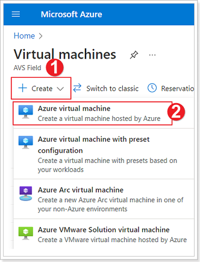
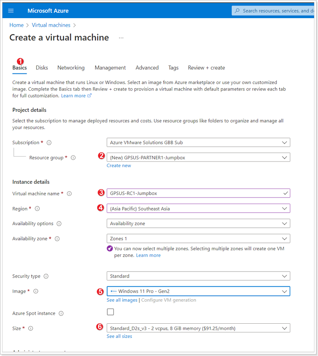
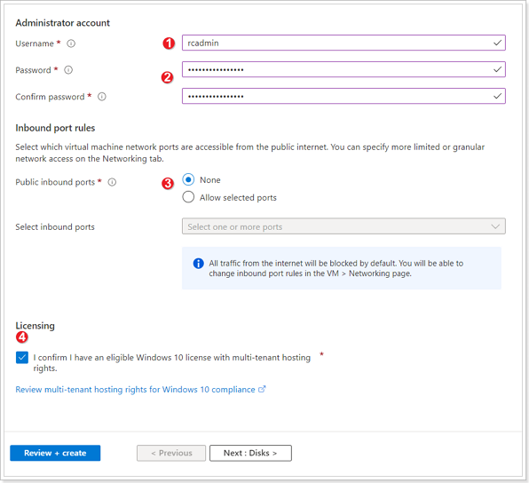
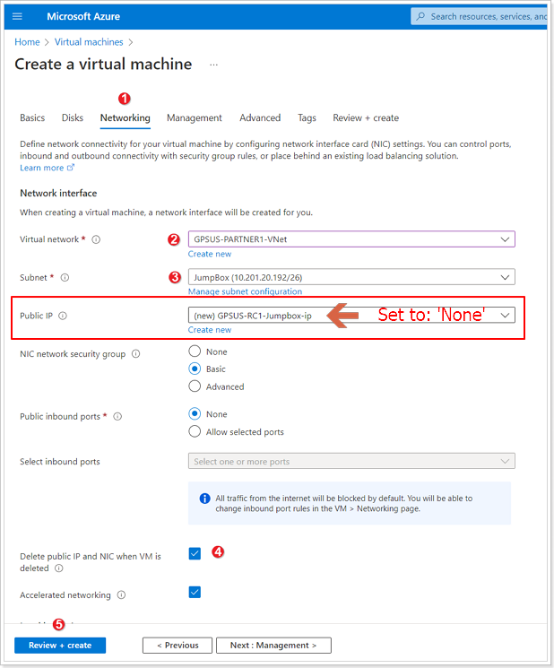
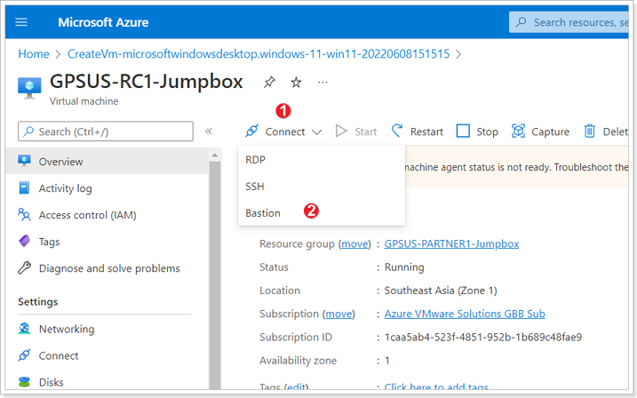

## **Training Environment**

### **Azure Portal Credentials**

> Replace “**\#**” with your group number.

Connect to [https://portal.azure.com](https://portal.azure.com) with the
following credentials:

| **Username** | Group**\#**@vmwaresales101outlook.onmicrosoft.com |
| ------------ | ------------------------------------------------- |
| **Password** | TO BE SUPPLIED                                    |

### **Environment Details**

### **Jumpbox Details**

Your first task should be to create a Jumpbox in your respective Jumpbox
Resource group.

> NOTE: In addition to the instructions below, you can watch [this video](https://youtu.be/LABTkfJZmPc) which will explain the same steps and get you ready for deploying the Jumpbox.

### **Exercise 1: Instructions for Creation of Jumpbox**

#### Step 1: Create Azure Virtual Machine

In the Azure Portal locate the Virtual Machines area.

1. Click **+ Create**.
2. Select **Azure virtual machine**.

#### Step 2: Basic information for Azure Virtual Machine

{}  

The next step, could be confusing and often, a source of mistakes. Please, pay special attention to the notes at the bottom of the image.

- Please notice that **PARTNER1** is just a **PLACEHOLDER** most likely for your organization's name. Reach out to the moderators for guidance 
  
- **Do not create a new resource group**, please use the existing one. See the notes below about the correct resource group to choose from
  
- Also, once you select the correct resource group the **region** will be defaulted (populated) with the right value
{}

1. Select Basics tab.
2. Select the appropriate Resource group per the table below.
3. Give your Jumpbox a unique name you wish.
4. Ensure the appropriate region is selected.
5. Select the type of image.
> Operating System: Windows 10 or Windows 11
6. Ensure the correct Size is selected.
> Size: Standard D2s v3 (2vcpus, 8GiB memory)

Leave other defaults and scroll down on the Basics tab.

1. Enter a user name for your Jumpbox (Anything of your choosing).
2. Enter and confirm a password for your Jumpbox user.
3. Ensure to select "None" for Public inbound ports.
4. Select checkbox for "I confirm I have an eligible Windows 10 license".
Leave all other defaults and jump to **Networking** tab.

#### Step 3: Azure Virtual Machine Networking Information

1. Click on **Networking** tab.
2. Select the appropriate VNet based on the table below.
> NOTE: This is not the VNet that is loaded by default.
3. If the appropriate VNet was selected it should auto-populate the JumpBox subnet.
4. Select "Delete public IP and NIC when VM is deleted" checkbox.
5. Click **Review + Create** -> **Create**.

> **Replace the word 'Name' with Partner name**

| **Group** | **Jumpbox Resource Group** | **Virtual Network/Subnet** |
| --------- | -------------------------- | -------------------------- |
| 1         | GPSUS-Name1-Jumpbox        | GPSUS-Name1-VNet/JumpBox   |
| 2         | GPSUS-Name2-Jumpbox        | GPSUS-Name2-VNet/JumpBox   |
| 3         | GPSUS-Name3-Jumpbox        | GPSUS-Name3-VNet/JumpBox   |
| 4         | GPSUS-Name4-Jumpbox        | GPSUS-Name4-VNet/JumpBox   |

#### Step 4: Connect to your Azure Virtual Machine Jumpbox

Once your Jumpbox finishes creating, go to it and click:
1. Connect
2. Bastion

This should open a new browser tab and connect you to the Jumpbox, enter the Username and Password you specified for your Jumpbox.

## **AVS Environments**

### **vCenter, HCX, and NSX-T URLs**

Please refer to the Identity blade in the Azure portal for AVS vCenter, HCX, and
NSX-T URLs and Login Information.

**PLEASE DO NOT CLICK GENERATE A NEW PASSWORD BUTTON UNDER CREDENTIALS IN AZURE PORTAL**

**Note**: In a real customer environment, the local
[cloudadmin@vsphere.local](mailto:cloudadmin@vsphere.local) account should be
treated as an emergency access account for "break glass" scenarios in your
private cloud. It's not for daily administrative activities or integration with
other services. For more information see
[here](https://docs.microsoft.com/en-us/azure/azure-vmware/concepts-identity)

### **On-Premises VMware Lab Environment**

If you are in a group with multiple participants you will be assigned a participant number.

> **Replace X with your group number and Y with your participant number.**

#### Generic information

| **Group** | **Participant** | **vCenter IP** | **Username**                | **Password** | **Web workload IP** | **App Workload IP** |
| --------- | --------------- | -------------- | --------------------------- | ------------ | ------------------- | ------------------- |
| X         | Y               | 10.X.Y.2       | administrator@avs.lab | MSFTavs1! | 10.X.1Y.1/25        | 10.X.1Y.129/25      |

#### Example for Group **1** with **4** participants

| **Group** | **Participant** | **vCenter IP** | **Username**                | **Password** | **Web workload IP** | **App Workload IP** |
| --------- | --------------- | -------------- | --------------------------- | ------------ | ------------------- | ------------------- |
| 1         | 1               | 10.1.1.2       | administrator@avs.lab | MSFTavs1! | 10.1.11.1/25        | 10.1.11.129/25      |
| 1         | 2               | 10.1.2.2       | administrator@avs.lab | MSFTavs1! | 10.1.12.1/25        | 10.1.12.129/25      |
| 1         | 3               | 10.1.3.2       | administrator@avs.lab | MSFTavs1! | 10.1.13.1/25        | 10.1.13.129/25      |
| 1         | 4               | 10.1.4.2       | administrator@avs.lab | MSFTavs1! | 10.1.14.1/25        | 10.1.14.129/25      |
