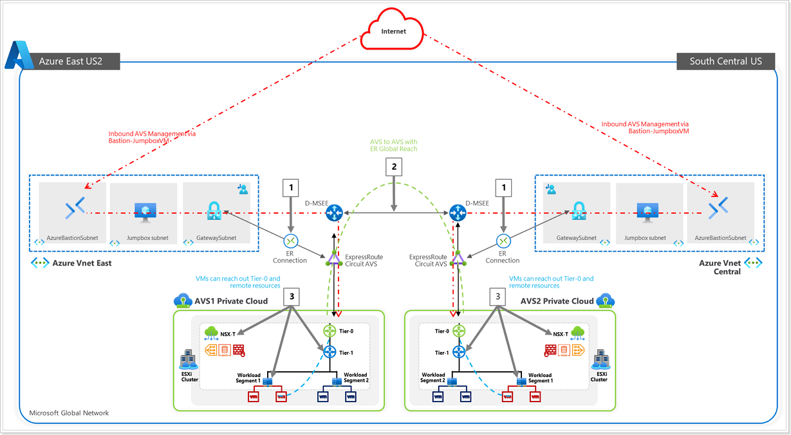

## **Introduction Module 1**

  Azure VMware Solution offers a private cloud environment accessible from On-Premises and Azure-based resources. Services such as Azure ExpressRoute, VPN connections, or Azure Virtual WAN deliver the connectivity.

### **Scenario**

Customer needs to have connectivity between their workloads in AVS, existing services and workloads in Azure, and access to the internet.

### **Connectivity Options for AVS**

This hands-on lab will show you how to configure the Networking components of an Azure VMware Solution for:

-   Connecting Azure VNet’s to AVS over an ExpressRoute circuit **(Preconfigured)**.
-   Peering with remote environments using Global Reach **(Not Applicable in this lab)**.
-   AVS Interconnect Options
-   Configuring NSX-T (check DNS and configure DHCP, Segments, and Gateway) to manage connectivity within AVS.

The lab environment has a preconfigured Azure VMware Solution environment with an Express Route circuit. A nested or embedded VMware environment is configured to simulate an On-Premises environment **(PLEASE DO NOT TOUCH)**. Both environments are accessible through Bastions and JumpBoxes.

After this lab is complete, you will have built out this scenario below:

1.  ExpressRoute, for connectivity between Azure VMware Solution and Azure Virtual Networks.
2.  Configure NSX-T to establish connectivity within the AVS environment.
3. Creation of Test VMs to attach to your NSX-T Network Segments.
4. Explore some advanced NSX-T features like tagging, creation of groups, Distributed Firewall Features.
