## **AVS Connectivity Options**

> **THIS IS FOR REFERENCE ONLY AS IT HAS BEEN PRECONFIGURED FOR THIS LAB.**

### **Section Overview**

In this section you will create a connection between an existing, non-AVS,
Virtual Network in Azure and the Azure VMware Solution environment. This allows
the jumpbox virtual machine you created to manage key components in the VMware management
plane such as vCenter, HCX, and NSX-T. You will also be able to access Virtual
Machines deployed in AVS and allow those VMs to access resources deployed in
the Hub or Spoke VNet’s, such as Private Endpoints and other Azure VMs or
Services.

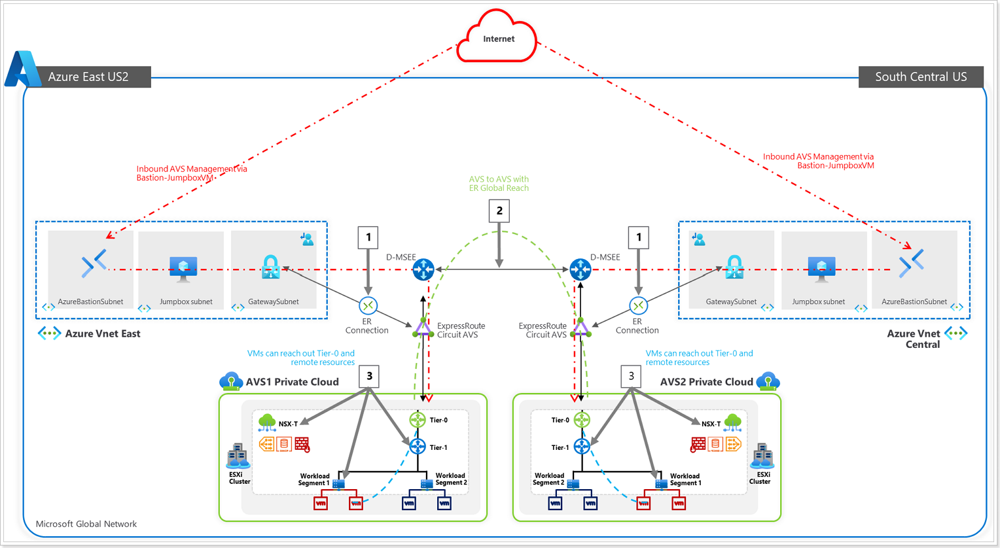

**Summary**: Generate a new Authorization Key in the AVS ExpressRoute settings,
and then create a new Connection from the Virtual Network Gateway in the VNet
where the JumpBox is connected to.

The diagram below shows the respective resource groups for your lab environment.

You will replace Name with Partner Name, for example: GPSUS-Name1-SDDC for partner XYZ would be GPSUS-XYZ1-SDDC.

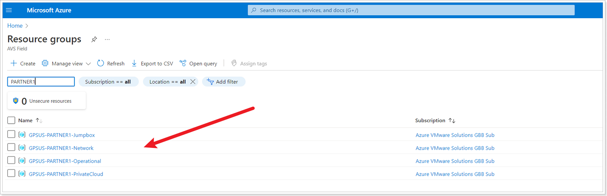

### **Option 1: Internal ExpressRoute Setup from AVS -> VNet**

> **NOTE:** 
> - Since we already have a virtual network gateway, you'll add a connection between it and your Azure VMware Solution private cloud.
> - **The last step of this section is expected to fail, the Connection will be created but it will be in Failed state because another Connection to the same target already exists. This is expected behavior and you can ignore the error.** 

#### Step1: Request an ExpressRoute authorization key

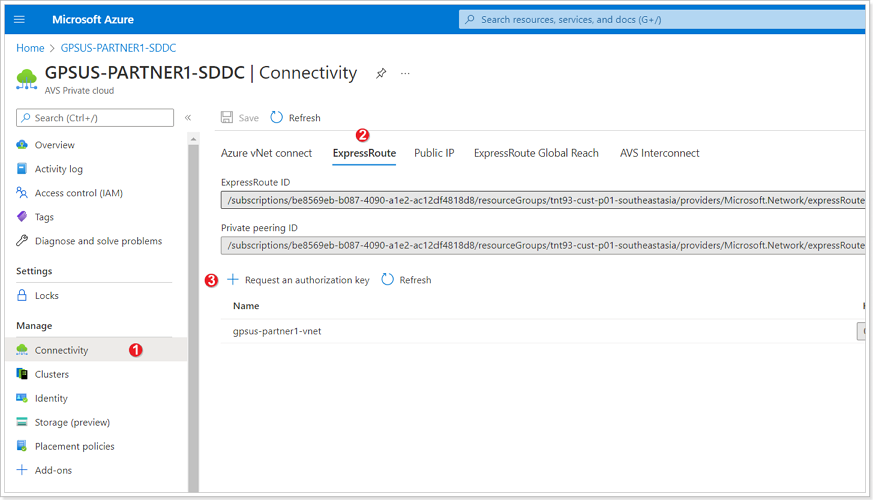

In your AVS Private Cloud:
1. Click **Connectivity**.
2. Click **ExpressRoute** tab.
3. Click **+ Request an authorization key**.

#### Step 2: Name Authorization Key

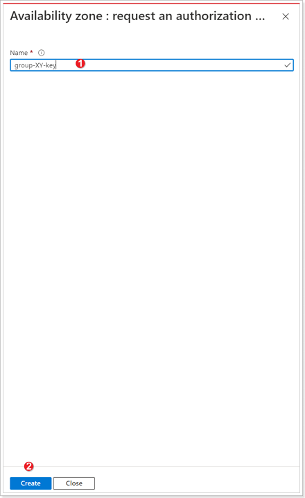

1. Give your authorization key a name: group-XY-key, where X is your group number, and Y is your participant number.
2. Click **Create**. It may take about 30 seconds to create the key. Once created, the new key appears in the list of authorization keys for the private cloud.
Copy the authorization key and ExpressRoute ID and keep it handy. You will need them to complete the peering. The authorization key disappears after some time, so copy it as soon as it appears.

#### Step 3: Create connection in VNet Gateway

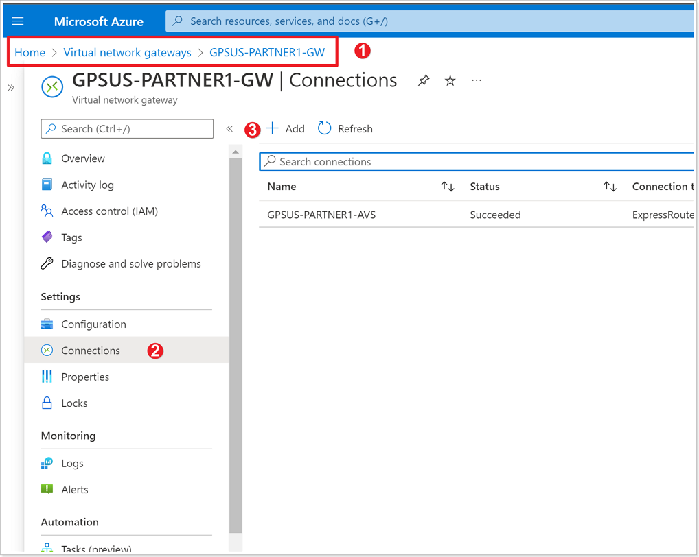

1. Navigate to the **Virtual Network Gateway** named **GPSUS-Name\#-Network** where # is your group number.
2. Click **Connections**.
3. Click **+ Add**.

#### Step 4: Establish VNet Gateway Setup

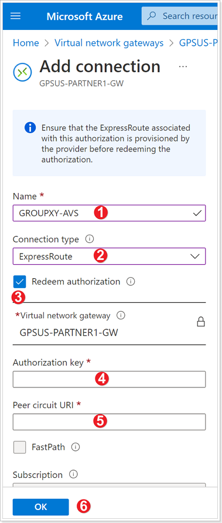

1. Enter a Name for your connection. Use **GROUPXY-AVS** where X is your group number and Y is your participant number.
2. For Connection type select **ExpressRoute**.
3. Ensure the checkbox next to "Redeem authorization" is selected.
4. Enter the **Authorization key** you copied earlier.
5. For **Peer circuit URI** paste the ExpressRoute ID you copied earlier.
6. Click **OK**.

    The connection between your ExpressRoute circuit and your Virtual Network is
    created.

    **Reminder**: It is expected that the connection is in **Failed State** after
    the creation, that is because another connection to the same target already
    exists. Next, delete the connection.

#### Step 5: Delete connection

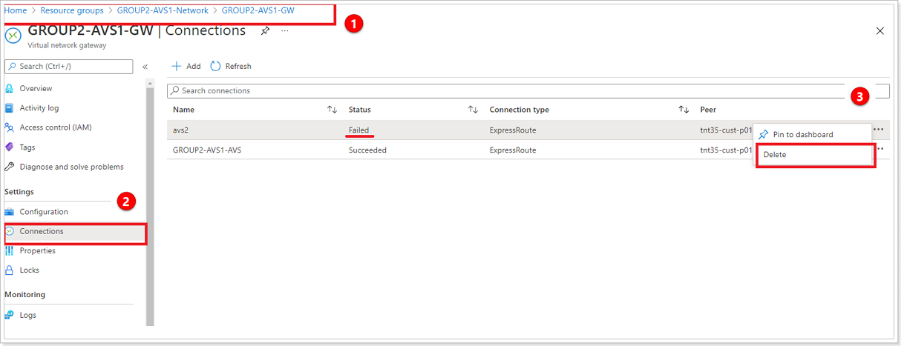

1. Navigate to your Virtual Network Gateway named **GPSUS-NameX-GW where X is your group number.
2. Click **Connections**.
3. Select the 3 ellipses next to the connection with the status of **Failed** and select **Delete**.

### **Option 2: ExpressRoute Global Reach Connection from AVS -> Customer's on-premises ExpressRoute**

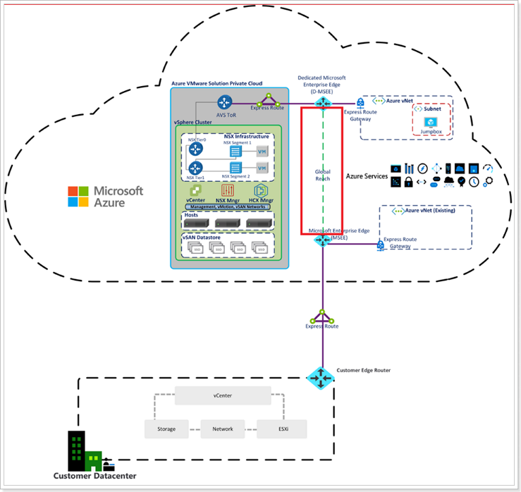

ExpressRoute Global Reach connects your on-premises environment to your Azure VMware Solution private cloud. The ExpressRoute Global Reach connection is established between the private cloud ExpressRoute circuit and an existing ExpressRoute connection to your on-premises environments. [Click here for more information.](https://docs.microsoft.com/en-us/azure/azure-vmware/tutorial-expressroute-global-reach-private-cloud)

#### Step 1: ExpressRoute Circuits in Azure Portal

> NOTE: There are no ExpressRoute circuits setup in this environment. These steps are informational only.

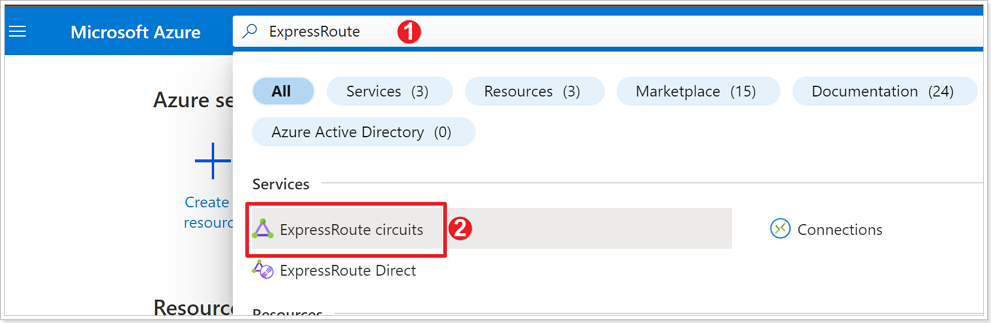

1. In the Azure Portal search bar type **ExpressRoute**.
2. Click **ExpressRoute circuits**.

#### Step 2: Create ExpressRoute Authorization

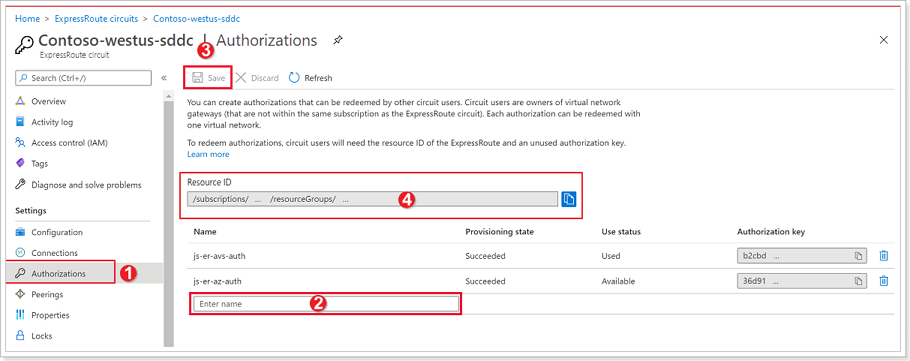

1. From the **ExpressRoute circuits** blade, click **Authorizations**.
2. Give your authorization key a **Name**.
3. Click **Save**. Copy the Authorization Key created and keep it handy.
4. Also copy the **Resource ID** for the ExpressRoute circuit and keep it handy.

#### Step 3: Create Global Reach Connection in AVS

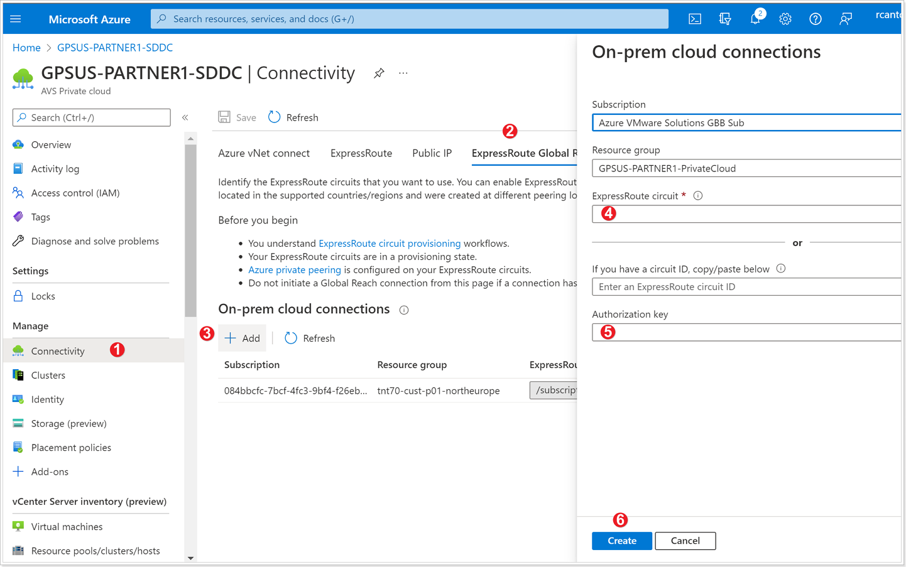

1. From your AVS Private Cloud blade, click **Connectivity**.
2. Click **ExpressRoute Global Reach**.
3. Click **+ Add**.
4. In the **ExpressRoute circuit** box, paste the **Resource ID** copied in the previous step.
5. Paste the **Authorization Key** created in the previous step.
6. Click **Create**.

### **Option 3: AVS Interconnect**

The AVS Interconnect feature lets you create a network connection between two or more Azure VMware Solution private clouds located in the same region. It creates a routing link between the management and workload networks of the private clouds to enable network communication between the clouds. [Click here for more information.](https://docs.microsoft.com/EN-us/azure/azure-vmware/connect-multiple-private-clouds-same-region)

#### Step 1: Establish AVS Interconnect in your AVS SDDC

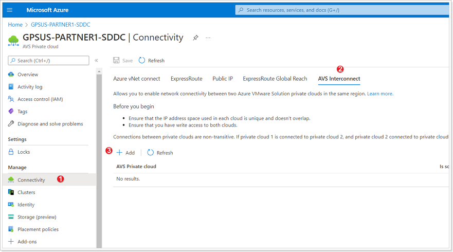

1. In your AVS Private Cloud blade, click **Connectivity**.
2. Click **AVS Interconnect**.
3. Click **+ Add**.

#### Step 2: Add connection to another private cloud

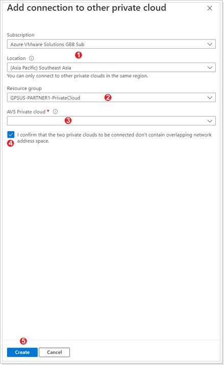

1. **Subscription** and **Location** are automatically populated based on the values of your Private Cloud, ensure these are correct.
2. Select the **Resource group** of the other Private Cloud you would like to connect to.
3. Select the **AVS Private cloud** you wish to connect.
4. Ensure the checkbox next to "I confirm that the two private clouds to be connected don't contain overlapping network address space".
5. Click **Create**.

It takes a few minutes for the connection to complete. Once completed the networks found in both Private Clouds will be able to talk to each other. Feel free to perform this exercise if no one in your group has done it as there is a requirement to connect a second Private Cloud in order to perform the exercises in Module 3 (Site Recovery Manager).

### **Confirm access from Jumpbox**

You can now validate access to your Azure VMware Solution components like vCenter and NSX-T from the Jumpbox you created.

#### Step 1: Obtain AVS Login Credentials

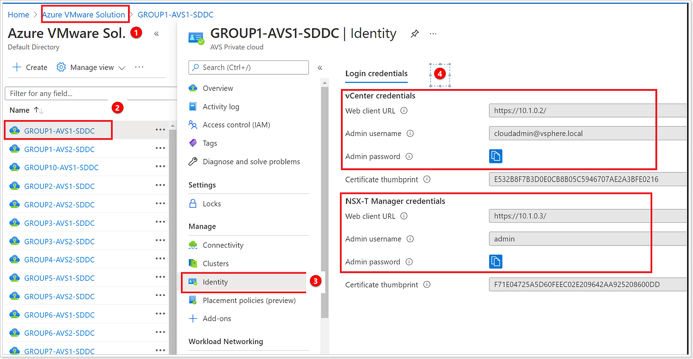

1. Navigate to the Azure VMware Solution blade associated with your group: **GPSUS-Name\#-SDDC**.
2. Click your assigned **AVS SDDC**.
3. Click **Identity**.
4. You will now see the **Login Credentials** for both vCenter and NSX-T. You will need these credentials for the next few steps. You do not need to copy the Certificate thumbprint.
    > **PLEASE DO NOT GENERATE A NEW PASSWORD.**

#### Step 2: Access AVS from Jumpbox

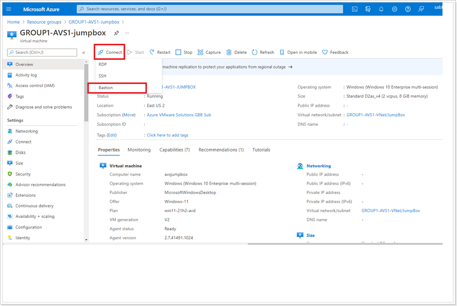

Click **Connect** and **Bastion** from the previously created Jumpbox blade.

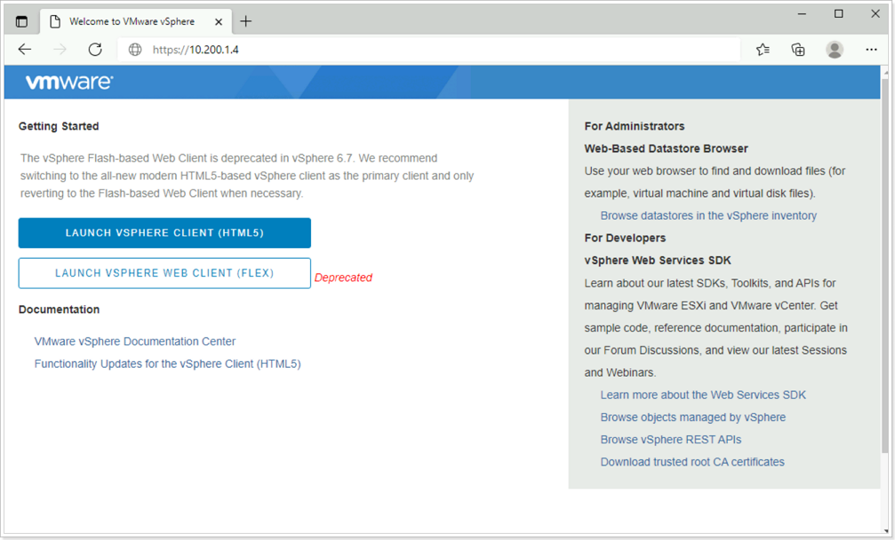

Once connected to your Jumpbox, open a browser and enter the IP Address for AVS vCenter located in a previous step. There might be a secure browser connection message. Click the advanced button and select the option to continue. Then click on **LAUNCH VSPHERE CLIENT (HTML 5)**.

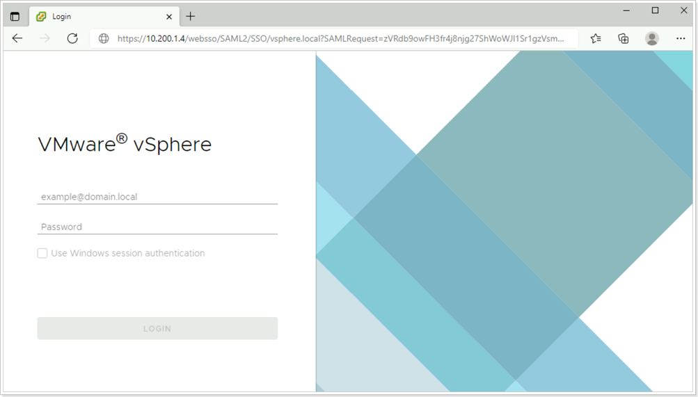

If the **VMware vSphere login page** launches successfully, then everything is working as expected.

You’ve now confirmed that you can access AVS from a remote environment

## **References**

[Tutorial - Configure networking for your VMware private cloud in Azure - Azure
VMware Solution \| Microsoft
Docs](https://docs.microsoft.com/en-us/azure/azure-vmware/tutorial-configure-networking#connect-expressroute-to-the-virtual-network-gateway)

