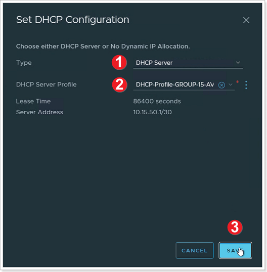

## **NSX-T on AVS**

After deploying Azure VMware Solution, you can configure an NSX-T network
segment from NSX-T Manager or the Azure portal. Once configured, the segments
are visible in Azure VMware Solution, NSX-T Manager, and vCenter.

NSX-T comes pre-provisioned by default with an NSX-T Tier-0 gateway in
Active/Active mode and a default NSX-T Tier-1 gateway in Active/Standby mode.
These gateways let you connect the segments (logical switches) and provide
East-West and North-South connectivity. Machines will not have IP addresses
until statically or dynamically assigned from a DHCP server or DHCP relay.

In this Section, you will learn how to:

-   Create additional NSX-T Tier-1 gateways.

-   Add network segments using either NSX-T Manager or the Azure portal

-   Configure DHCP and DNS

-   Deploy Test VMs in the configured segments

-   Validate connectivity

In your Jumpbox, open a browser tab and navigate to the NSX-T URL found in the AVS Private Cloud blade in the Azure Portal. Login using the appropriate credentials noted in the Identity tab.

### **Exercise 1: Configure DNS Forwarder**

>NOTE: This task is done by default for every new AVS deployment

AVS DNS forwarding services run in DNS zones and enable workload VMs in the zone
to resolve fully qualified domain names to IP addresses. Your SDDC includes
default DNS zones for the Management Gateway and Compute Gateway. Each zone
includes a preconfigured DNS service. Use the DNS Services tab on the DNS
Services page to view or update properties of DNS services for the default
zones. To create additional DNS zones or configure additional properties of DNS
services in any zone, use the DNS Zones tab.

The DNS Forwarder and DNS Zone are already configured for this training but
follow the steps to see how to configure it for new environments.

1. Ensure the **POLICY** view is selected.
2. Click **Networking**.
3. Click **DNS**.
4. Click **DNS Services**.
5. Click the **elipsis button -> Edit** to view/edit the default DNS settings.

1. Examine the settings (do not change anything) and click **CANCEL**.

### **Exercise 2: Add DHCP Profile in AVS Private Cloud**

> **Please ensure to replace X with your group's assigned number, Y with your participant number. For participant 10 please replace XY with 20**

|  **AVS NSX-T Details** |                                 |
|-------------------------|---------------------------------|
| **DHCP Server IP**      | 10.**XY**.50.1/30               |
| **Segment Name**        | WEB-NET-GROUP-**XY**                         |
| **Segment Gateway**     | 10.**XY**.51.1/24               |
| **DHCP Range**          | 10.**XY**.51.4-10.**XY**.51.254 |

A DHCP profile specifies a DHCP server type and configuration. You can use the
default profile or create others as needed.

A DHCP profile can be used to configure DHCP servers or DHCP relay servers
anywhere in your SDDC network.

#### Step 1: Add DHCP Profile

1.  In the NSX-T Console, click **Networking**.
2.  Click **DHCP**.
3.  Click **ADD DHCP PROFILE**.

#### Step 2: Configure DHCP Profile

1. Name the profile as **DHCP-Profile-GROUP-XY-AVS** for your respective group/participant.
2. Ensure **DHCP Server** is selected.
3. Specify the IPv4 **Server IP Address** as **10.XY.50.1/30** and optionally change the **Lease Time** or leave the default.
4. Click **SAVE**.

### **Exercise 3: Create an NSX-T T1 Logical Router**

NSX-T has the concept of Logical Routers (LR). These Logical Routers can perform both distributed or centralized functions. In AVS, NSX-T is deployed and configured with a default T0 Logical Router and a default T1 Logical Router.
The T0 LR in AVS cannot be manipulated by AVS customers, however the T1 LR can be configured however an AVS customer chooses. AVS customers also have the option to add additional T1 LRs as they see fit.

#### Step 1: Add Tier-1 Gateway

1. Click **Networking**.
2. Click **Tier-1 Gateways**.
3. Click **ADD TIER-1 GATEWAY**.

#### Step 2: Configure Tier-1 Gateway

1. Give your T1 Gateway a Name. Use GROUP-**XY**-T1.
2. Select the default T0 Gateway, usually TNT**-T0.
3. Click **SAVE**. Clck **NO** to the question "Want to continue configuring this Tier-1 Gateway?".

### **Exercise 4: Add the DHCP Profile to the T1 Gateway**

1. Click the elipsis next to your newly created T1 Gateway.
2. Click **Edit**.

#### Step 1: Set DHCP Configuration to Tier-1 Gateway

1. Click **Set DHCP Configuration**.
2. After finishing the DHCP Configuration, click to expand **Route Advertisement** and make sure all the buttons are enabled.

1. Ensure **DHCP Server** is selected for Type.
2. Select the **DHCP Server Profile** you previously created.
3. Click **SAVE**. Click **SAVE** again to confirm changes, then click **CLOSE EDITING**.

### **Exercise 5: Create Network Segment for AVS VM workloads**

Network segments are logical networks for use by workload VMs in the SDDC
compute network. Azure VMware Solution supports three types of network segments:
routed, extended, and disconnected.

-   A routed network segment (the default type) has connectivity to other
    logical networks in the SDDC and, through the SDDC firewall, to external
    networks.

-   An extended network segment extends an existing L2VPN tunnel, providing a
    single IP address space that spans the SDDC and an On-Premises network.

-   A disconnected network segment has no uplink and provides an isolated
    network accessible only to VMs connected to it. Disconnected segments are
    created when needed by HCX. You can also create them yourself and can
    convert them to other segment types.

#### Step 1: Add Network Segment

1. Click **Networking**.
2. Click **Segments**.
3. Click **ADD SEGMENT**.

#### Step 2: Configure Network Segment

1. Enter **WEB-NET-GROUP-XY** in the **Segment Name** field.
2. Select the Tier-1 Gateway you created previously **(GROUP-XY-T1)** as the **Connected Gateway**.
3. Select the pre-configured overlay **Transport Zone** (TNTxx-OVERLAY-TZ).
4. In the **Subnets** column, you will enter the IP Address for the **Gateway** of the Subnet that you are creating, which is the first valid IP of the Address Space.
    -   For Example: **10.XY.51.1/24**
5.  Then click **SET DHCP CONFIG**.

#### Step 3: Set DHCP Configuration on Network Segment

1. Ensure **Gateway DHCP Server** is selected for **DHCP Type**.
2.  In the **DHCP Config** click the toggle button to **Enabled**.
3.  Then in the **DHCP Ranges** field enter the range according to the IPs assigned to your group. The IP in in the same network as the Gateway defined above.
    -   Use **10.XY.51.4-10.XY.51.254**
4.  In the DNS Servers, enter the IP **1.1.1.1**.
5. Click **Apply**. Then **SAVE** and finally **NO**.

> **Important**
>The IP address needs to be on a non-overlapping RFC1918 address block, which ensures connection to the VMs on the new segment.

## **References**

-   [Create or Modify a Network Segment
    (vmware.com)](https://docs.vmware.com/en/VMware-Cloud-on-AWS/services/com.vmware.vmc-aws.networking-security/GUID-267DEADB-BD01-46B7-82D5-B9AA210CA9EE.html)

-   [Configure Segment DHCP Properties
    (vmware.com)](https://docs.vmware.com/en/VMware-Cloud-on-AWS/services/com.vmware.vmc-aws.networking-security/GUID-F6D433BE-753E-4B44-82FF-236CEBA17F8B.html)
