## **Create Test VMs**

Now that we have our networks created, we can deploy virtual machines and ensure we can get an IP address from DHCP. Go ahead and Login into your AVS vCenter.

### **Exercise 1: Create a content Library**

#### Step 1: Create vCenter Content Library

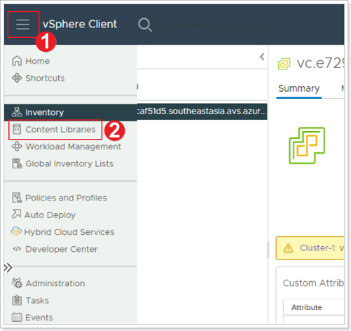

1. From AVS vCenter, click the **Menu** bars.
2. Click **Content Libraries**.

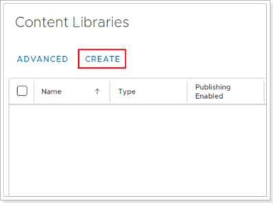

Click **CREATE**

#### Step 2: Give your Content Library a Name and Location

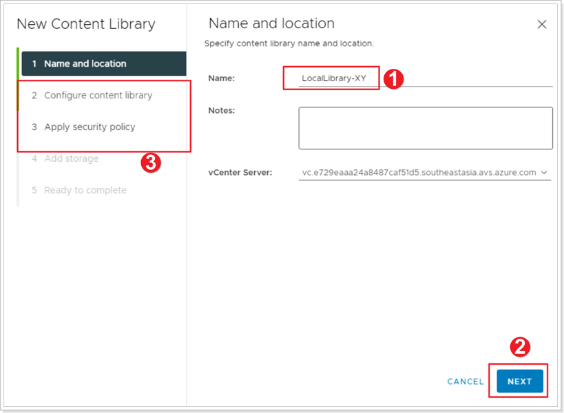

1. Name your Library **LocalLibrary-XY** where X is your group number and Y is your participant number
2. Click **NEXT**
3. Leave the defaults for **Configure content library** and for **Appy security policy**

#### Step 3: Specify Datastore for Content Library

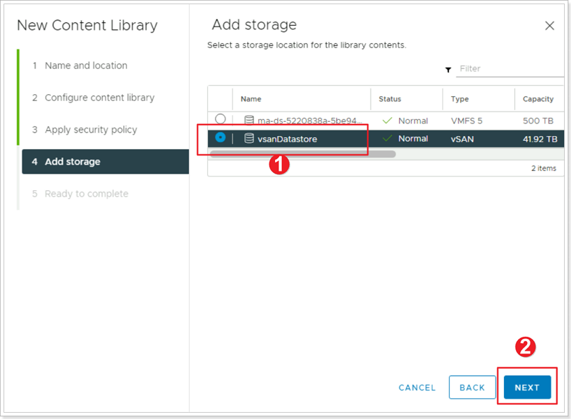

1. For **Add storage** select the**vsanDatastore**
2. Click **NEXT** then **FINISH**

### **Exercise 2: Import Item to Content Library**

#### Step 1: Import OVF/OVA to Content Library

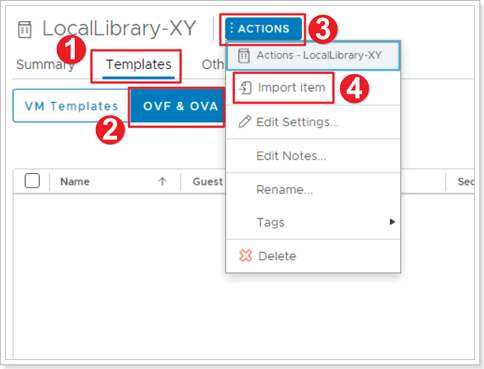

1. Click on your newly created Library and click **Templates**.
2. Click **OVF & OVA Templates**
3. Click **ACTIONS**
4. Click **Import item**

#### Step 2: Specify URL for OVF/OVA

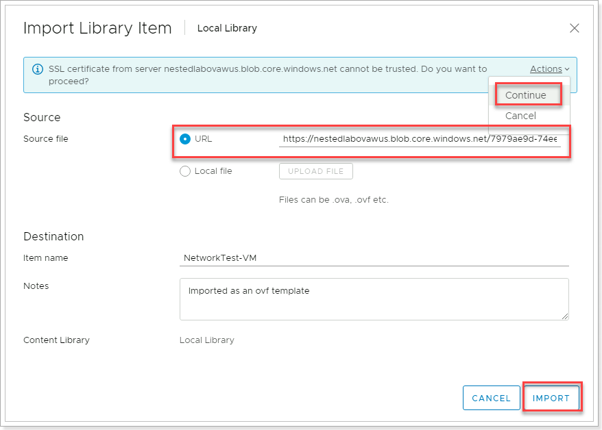

Import using this URL - [Download Link](https://gpsusstorage.blob.core.windows.net/ovas-isos/workshop-vm.ova)

<https://gpsusstorage.blob.core.windows.net/ovas-isos/workshop-vm.ova>

This will now download and import the VM to the library

### **Exercise 3: Create VMs**

#### Step 1: Create VM from Template

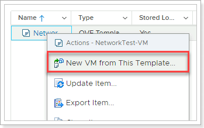

Once downloaded, Right-click the VM Template \> **New VM from This Template**.

#### Step 2: Select a Name and Folder for the VM

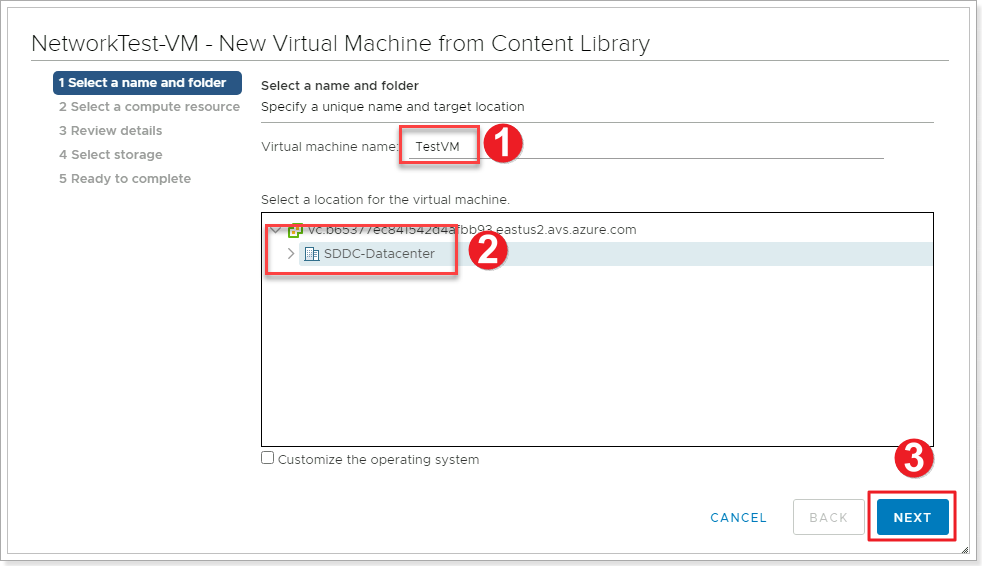

1. Give the VM a name – e.g **VM1-AVS-XY**
2. Select the **SDDC-Datacenter**
3. Click **NEXT**

#### Step 3: Select a Compute Resource

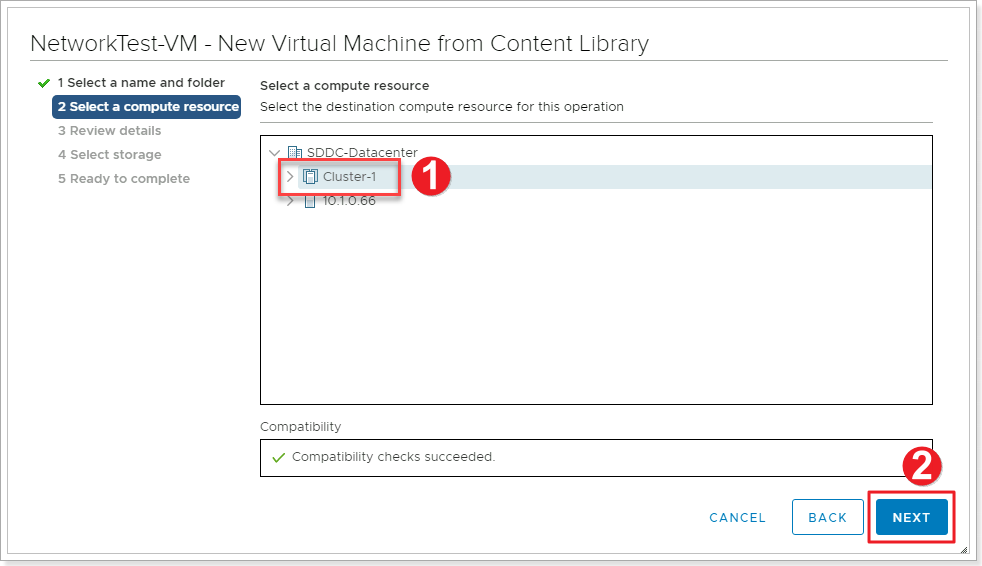

1. Select **Cluster-1**
2. Click **NEXT**

#### Step 4: Review Details, select Datastore

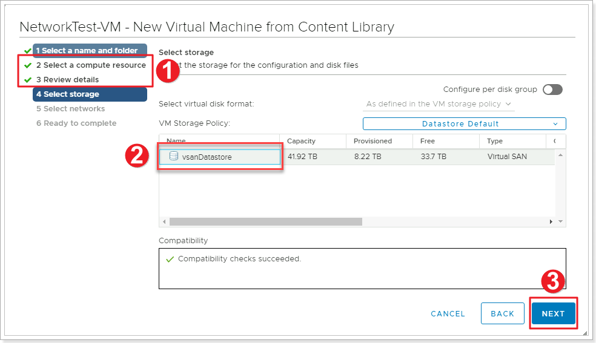

1. Review **Details** and click **NEXT**. Accept the terms and click **NEXT**
2. Confirm the storage as the **vsanDatastore**
3. Click **NEXT**

#### Step 5: Select network for VM

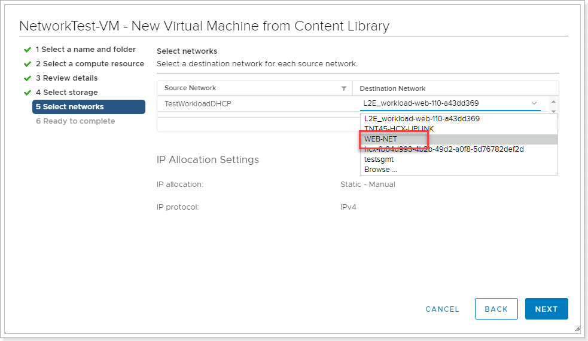

Select the segment that you created previously- **“WEB-NET-GROUP-XY”** and click **NEXT**. Then review and click **FINISH**.

Once deployed, head back to VM’s and Templates and Power On this newly created VM. This VM is provided as a very lightweight Linux machine that will automatically pick up DHCP if configured. Since we have added this to the **WEB-NET-GROUP-XY** segment, it should get an IP address from this DHCP range. This usually takes few seconds. Click the “Refresh” button on vCenter toolbar.

If you see an IP address here, we have successfully configured the VM and it has connected to the segment and will be accessible from the Jumpbox.

We can confirm this by SSH'ing to this IP address from the Jumpbox.

> Username: root

> Password: AVSR0cks!

**YOU MAY BE ASKED TO CHANGE THE PASSWORD OF THE ROOT USER ON THE VM, CHANGE IT TO A PASSWORD OF YOUR CHOOSING, JUST REMEMBER WHAT THAT PASSWORD IS.**

Once you SSH into the VMs, enter these 2 commands to enable ICMP traffic on the VM:

`iptables -A OUTPUT -p icmp -j ACCEPT`

`iptables -A INPUT -p icmp -j ACCEPT`

> PLEASE REPEAT THESE STEPS AND CREATE A SECOND VM CALLED 'VM2-AVS-XY'

