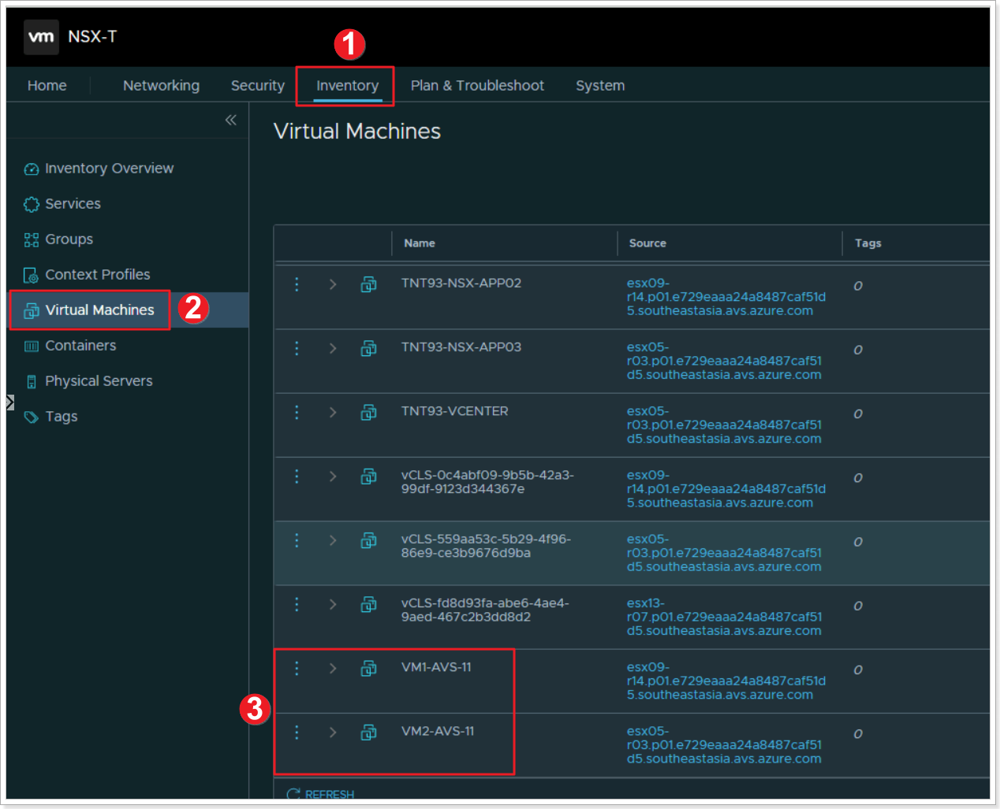
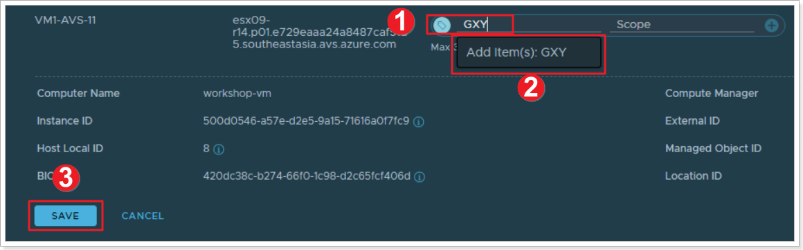
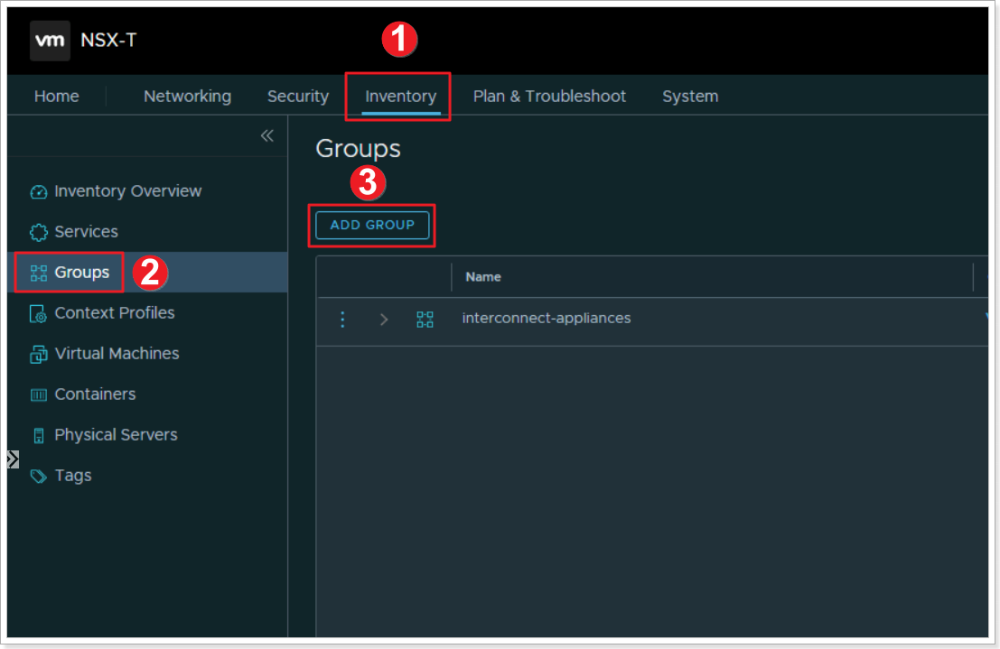
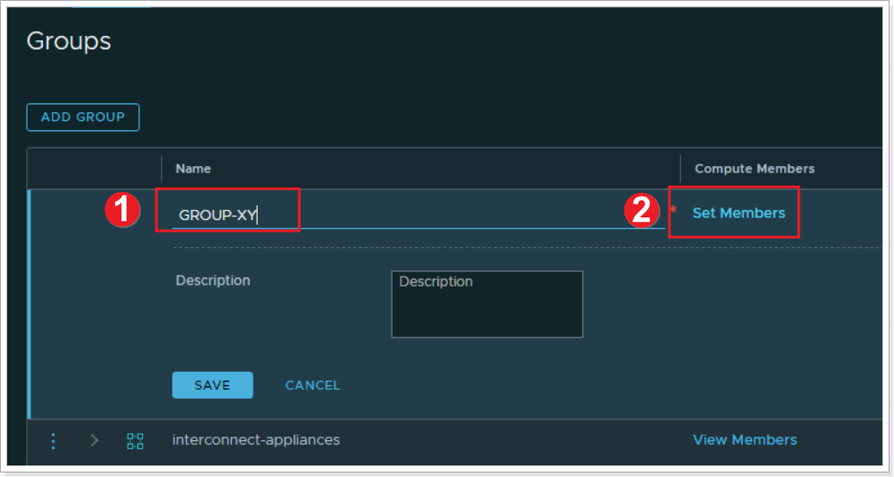
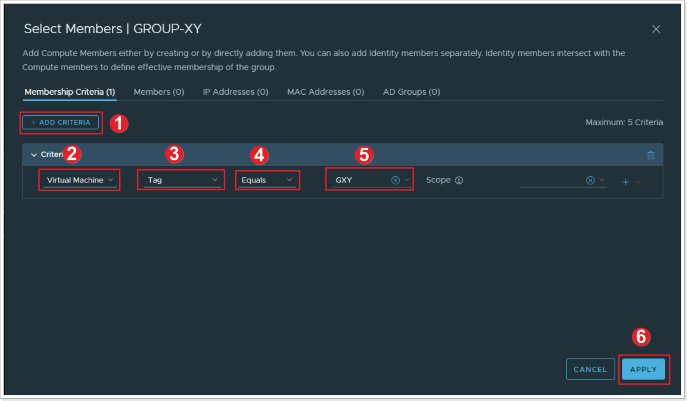
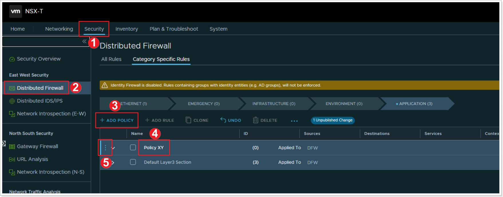
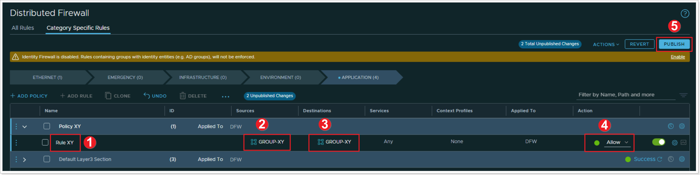
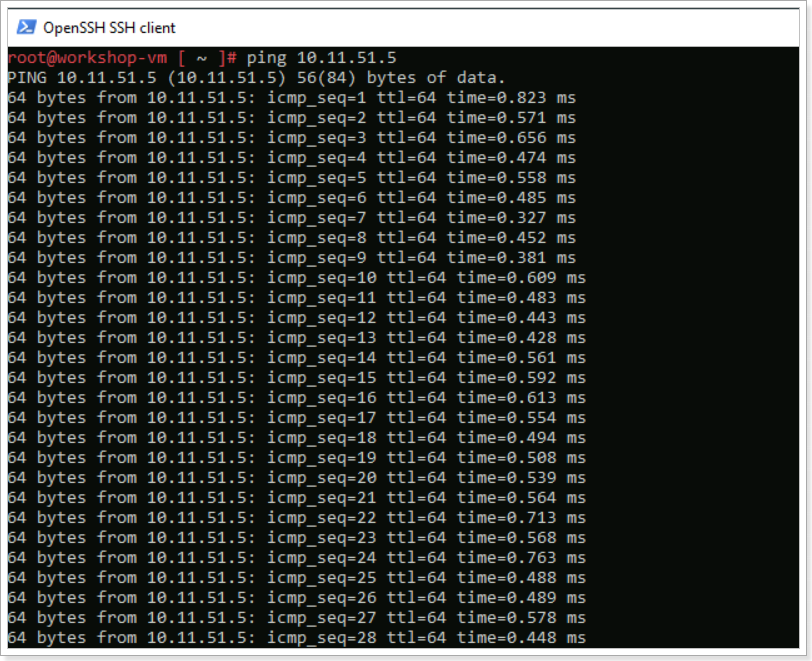
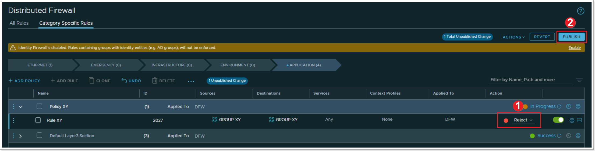
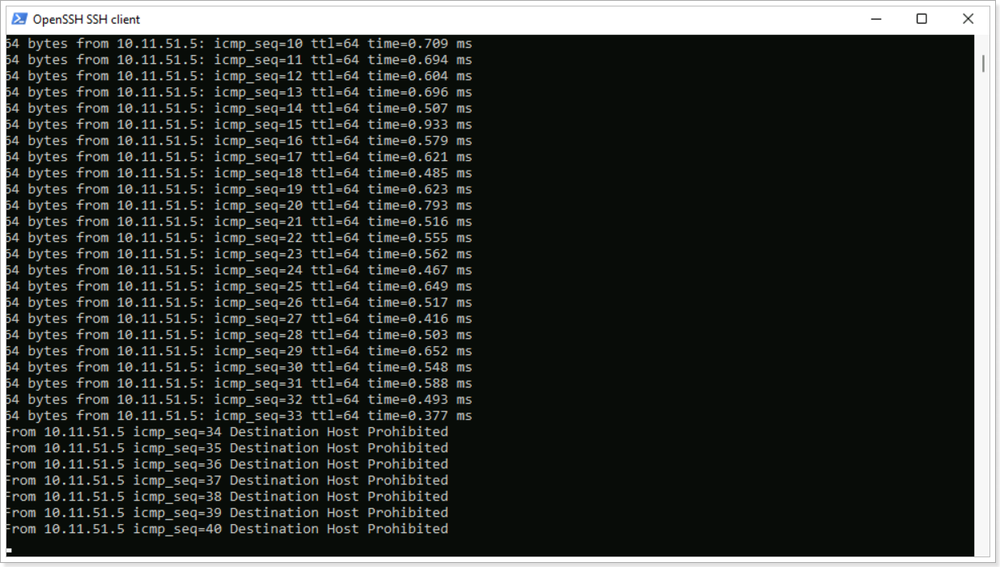

## **Section Overview:**

You can find more information about NSX-T capabilities in VMware's website under [VMware NSX-T Data Center Documentation.](https://docs.vmware.com/en/VMware-NSX-T-Data-Center/index.html)

In this Section, you will learn just a few additional NSX-T Advanced Features. You will learn how to:

-   Create NSX-T tags for VMs

-   Create NSX-T groups based on tags

-   Create Distributed Firewall Rules in NSX-T

## **NSX-T Tags**

NSX-T Tags help you label NSX-T Data Center objects so that you can quickly search or filter objects, troubleshoot and trace, and do other related tasks.

You can create tags using both the NSX-T UI available within AVS and APIs. 

More information on NSX-T Tags can be found here: [VMware NSX-T Data Center Documentation.](https://docs.vmware.com/en/VMware-NSX-T-Data-Center/3.2/administration/GUID-358DF469-75C8-48C4-B0E2-279E55C7BB3E.html#:~:text=Tags%20Tags%20help%20you%20to%20label%20NSX-T%20Data,create%20tags%20using%20both%20the%20UI%20and%20APIs.)

### **Exercise 1: Assign NSX-T Tags to VMs**

#### Step 1: Assign Tags to your VMs

1. From the NSX-T UI, click **Inventory**.
2. Click **Virtual Machines**.
3. Locate your 2 Virtual Machines you created in the previous task, notice they have no tags.

Click the elipsis next to the first VM and click **Edit**.

#### Step 2: Name your VM's tag

1. Type "G**XY**", where X is your group number and Y is your participant number.
2. Click to add G**XY** as a tag to this VM.
3. Click **SAVE**.

**REPEAT THE ABOVE STEPS FOR VM2 USING THE SAME TAG.**

## **NSX-T Groups**

Groups include different objects that are added both statically and dynamically, and can be used as the source and destination of a firewall rule.

Groups can be configured to contain a combination of Virtual Machines, IP sets, MAC sets, segment ports, segments, AD user groups, and other groups. Dynamic including of groups can be based on a tag, machine name, OS name, or computer name.

You can find more information on NSX-T Groups on [VMware's NSX-T Data Center docs.](https://docs.vmware.com/en/VMware-NSX-T-Data-Center/3.2/administration/GUID-9DFF6EE2-2E00-4097-A412-B72472596E4D.html)

### **Exercise 2: Create NSX-T Groups**

#### Step 1: Create an NSX-T Group

Now that we've assigned tags to the VMs, we'll create a group based of those tags.
1. Click **Inventory**
2. Click **Groups**
3. Click **ADD GROUP**

#### Step 2: Name your NSX-T Group and Assign Members

1. Name your group **GROUP-XY** where X is your group number and Y is your participant number
2. Click on **Set Members*

#### Step 3: Set the Membership Criteria for your Group

1. Click **ADD CRITERIA**
2. Select **Virtual Machine**
3. Select **Tag**
4. Select **Equals**
5. Select your previously created group G**XY**
6. Click **APPLY**. Then click **SAVE**

## **NSX-T Distributed Firewall**

NSX-T Distributed Firewall monitors all East-West traffic on your AVS Virtual Machines and allows you to either deny or allow traffic between these VMs even if the exist on the same NSX-T Network Segment. This is the example of your 2 VMs and we will assume they're 2 web servers that should never have to talk to each other. More information can be found here: [Distributed Firewall.](https://docs.vmware.com/en/VMware-NSX-T-Data-Center/3.2/administration/GUID-6AB240DB-949C-4E95-A9A7-4AC6EF5E3036.html)

### **Exercise 3: Create an NSX-T Distributed Firewall Policy**

#### Step 1: Add a Policy

1. Click **Security**
2. Click **Distributed Firewall**
3. Click **+ ADD POLICY**
4. Give your policy a name "Policy **XY**" where X is your group number and Y is your participant number
5. Click the elipsis and select **Add Rule**

#### Step 2: Add a Rule

1. Name your rule "Rule **XY**"
2. Click under **Sources** column and select your newly created "GROUP-**XY**"
3. Click under **Destinations** and also select "GROUP-**XY**"
4. Leave all other defaults, and for now, leave the **Action** set to **Allow**. We will change this later to understand the behavior
5. Click **PUBLISH** to publish the newly created Distributed Firewall Rule

#### Step 3: Reject communication in your Distributed Firewall Rule

Hopefully you still have the SSH sessions open to your 2 VMs you created earlier. If not, just SSH again. From one of the VMs, run a continuous ping to the other VM's IP address like the example below.

1. Change the **Action** in your Rule to **Reject**
2. Click **PUBLISH**

You can notice that after publishing the change to **Reject** on your rule, the ping now displays "Destination Host Prohibited". NSX-T DFW feature is allowing the packet to get from one VM to another but it rejects it once the second VM receives the packet. You can also change this option to **Drop** where the packet is completely dropped by the second VM.

