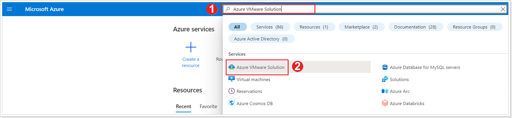
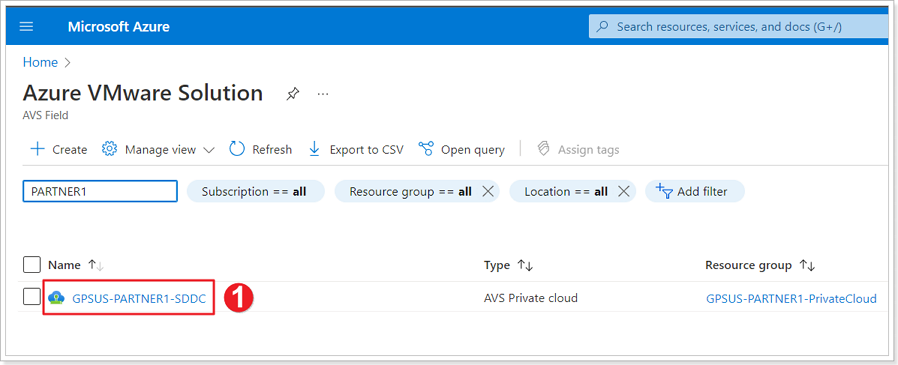
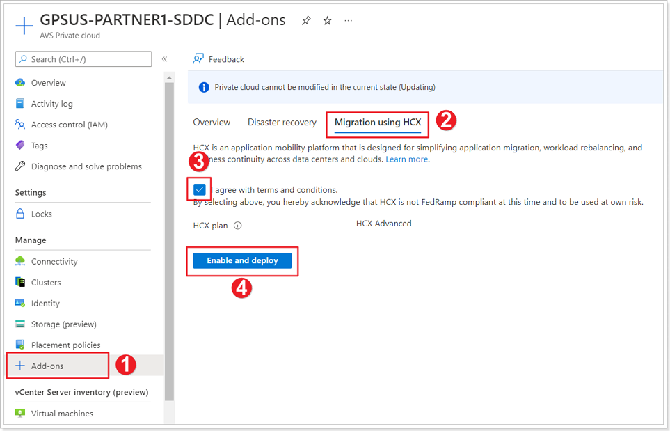

## **Exercise 1: Enable HCX on AVS Private Cloud**

In the following task, we will be installing HCX on your AVS Private Cloud. This is a simple process from the Add-ons section in the Azure Portal, or via Bicep/ARM/PowerShell.

> **NOTE: This task may or may not have been completed for you in your AVS environment. Only one participant per group can enable HCX in the SDDC so if you're not the first participant in the group to enable HCX, just use these instructions for reference.**

### Step 1: Navigate to your SDDC

1.  Navigate to the Azure Portal, search for *Azure VMware Solution* in the search bar.
2.  Click on **Azure VMware Solution**.

### Step 2: Locate your AVS SDDC

1. Select the private cloud assigned to you or your group.

### Step 3: Enable HCX on your AVS Private Cloud

1. From your Private Cloud blade, click on **+ Add-ons**.
2. Click **Migration using HCX**.
3. Select the checkbox to agree with terms and conditions.
4. Click **Enable and deploy**.

HCX will start getting deployed in your AVS Private Cloud and it should take about 10-20 minutes to complete.
