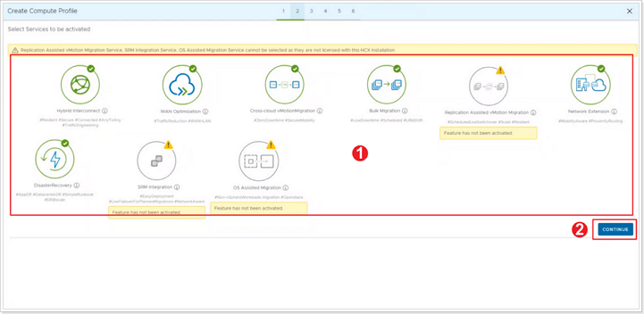

## **HCX Compute Profile**

A compute profile contains the compute, storage, and network settings that HCX uses on this site to deploy the interconnected dedicated virtual appliances when service mesh is added. For more information on compute profile and its creation please refer to [VMware documentation](https://docs.vmware.com/en/VMware-HCX/4.2/hcx-user-guide/GUID-BBAC979E-8899-45AD-9E01-98A132CE146E.html#:~:text=A%20Compute%20Profile%20contains%20the%20compute%2C%20storage%2C%20and,virtual%20appliances%20when%20a%20Service%20Mesh%20is%20added.).

### **Exercise 1: Create Compute Profile**

#### Step 1: Compute Profile Creation

1. In your on-premises HCX installation, click **Interconnect**.
2. Click **Compute Profiles**.
3. Click **CREATE COMPUTE PROFILE**.

#### Step 2: Name Compute Profile

1. Give your Compute Profile a Name. Suggestion: **OnPrem-CP-XY**, where X is your group number and Y is your participant number.
2. Click **CONTINUE**.

#### Step 3: Select Services for Compute Profile

1. Review the selected services. By default all the above services are selected. In a real world scenario, if a customer let's say doesn't need Network Extension, you would unselect that service here. Leave all defaults for the purpose of this workshop.
2. Click **CONTINUE**.

#### Step 4: Select Service Resources

1. Click the arrow next to **Select Resource(s)**.
2. In this on-premises simulation, you only have one Cluster called **OnPrem-SDDC-Datacenter-XY**. In a real world scenario, it's likely your customer may have more than one Cluster. HCX **Service Resources** are resources from where you'd like HCX to either migrate or protect VMs from. Select the top level **OnPrem-SDDC-Datacenter-XY**.
3. Click **OK**.
4. Click **CONTINUE**.

#### Step 5: Select Deployment Resources

1. Click the arrow next to **Select Resource(s)**. Here you will be selecting the **Deployment Resource**, which is where the additional HCX appliances needing to be installed will be placed in the on-premises environment. Select **OnPrem-SDDC-Cluster-XY**.
2. For **Select Datastore** click and select the **LabDatastore** that exists in your simulated on-premises environment. This will be the on-premises Datastore the additional HCX appliances will be placed in.
3. (Optional) click to **Select Folder** in the on-premises vCenter Server where to place the HCX appliances.
4. **Interconnect Appliance Reservation Settings**, here you would set CPU/Memory Reservations for these appliances in your on-premises vCenter Server.
5. Click **CONTINUE**.

#### Step 6: Select Management Network Profile

1. Select the **Management Network Profile** you created in a previous step.
2. Click **CONTINUE**.

#### Step 7: Select Uplink Network Profile

1. Select the **Management Network Profile** you created in a previous step. **DO NOT** select the uplink network profile, this network profile was created to simulate what an on-premises environment might look like, but the only functional uplink network for this lab is the Management Network.
2. Click **CONTINUE**.

#### Step 8: Select vMotion Network Profile

1. Select the **vMotion Network Profile** you created in a previous step.
2. Click **CONTINUE**.

#### Step 9: Select vSphere Replication Network Profile

1. Select the **vSphere Replication Network Profile** you created in a previous step.
2. Click **CONTINUE**.

#### Step 10: Select Network Containers

1. Click the arrow next to **Select Network Containers**.
2. Select the virtual distributed switch you'd like to make eligible for Network Extension.
3. Click **CLOSE**.
4. Click **CONTINUE**.

#### Step 11: Review Connection Rules

1. Review the connection rules.
2. Click **CONTINUE**.

#### Step 12: Finish creation of Compute Profile

Click **FINISH** to create the compute profile.

Your **Compute Profile** is created successfully.

