
You will perform the instructions below from the On-premises VMware Environment


## **HCX Service Mesh Creation**

An HCX Service Mesh is the effective HCX services configuration for a source and destination site. A Service Mesh can be added to a connected Site Pair that has a valid Compute Profile create on both of the sites.

Adding a Service Mesh initiates the deployment of HCX Interconnect virtual appliances on both sites. An interconnect Service Mesh is always created at the source site. 

More information can be found inf VMware's Official Documentation, [Creating a Service Mesh.](https://docs.vmware.com/en/VMware-HCX/4.3/hcx-user-guide/GUID-46AED982-8ED2-4CB1-807E-FEFD18FAC0DD.html)

### **Exercise 1: Create HCX Service Mesh**

**Important Note -** Make sure port UDP 4500 is open between your
On-Premises VMware HCX Connector 'uplink' network profile addresses and the
Azure VMware Solution HCX Cloud 'uplink' network profile addresses.

#### Step 1: Create Service Mesh

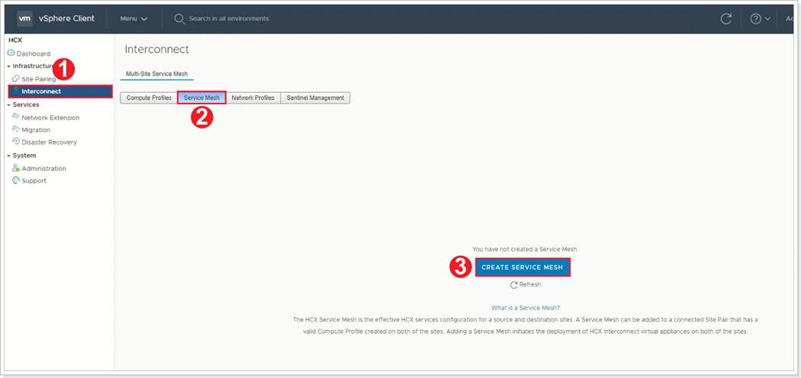

1. Click **Interconnect**.
2. Click **Service Mesh**.
3. Click **CREATE SERVICE MESH**.

#### Step 2: Select Sites

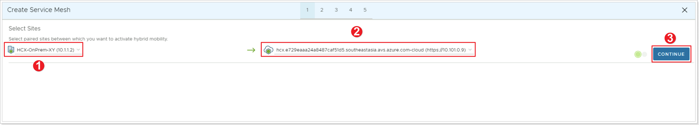

1. Select the source site (on-premises).
2. Select the destination site (AVS).
3. Click **CONTINUE**.

#### Step 3: Select Compute Profiles

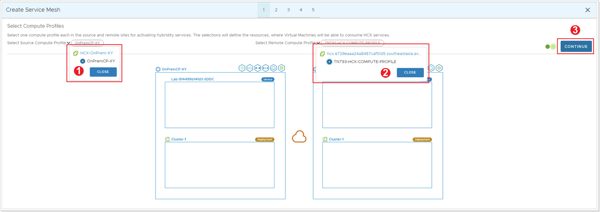

1. Click to select **Source Compute Profile** which you recently created, click **CLOSE**.
2. Click to select **Remote Compute Profile** from AVS side, click **CLOSE**.
3. Click **CONTINUE**.

#### Step 4: Select Services to be Activated

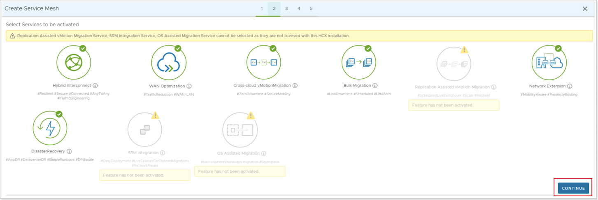

Leave the Default Services and click **CONTINUE**.

#### Step 5: Advanced Configuration - Override Uplink Network Profiles

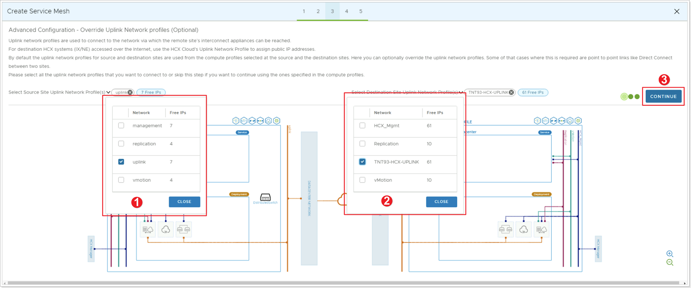

1. Click to select the previously created Source **Management Network Profile**, click **CLOSE**. Even though you created an Uplink Network Profile, for the purpose of this lab, the management network is used for uplink.
2. Click to select the Destination **Uplink Network Profile** (usually TNTXX-HCX-UPLINK), click **CLOSE**.
3. Click **CONTINUE**.

#### Step 6: Advanced Configuration: Network Extension Appliance Scale Out

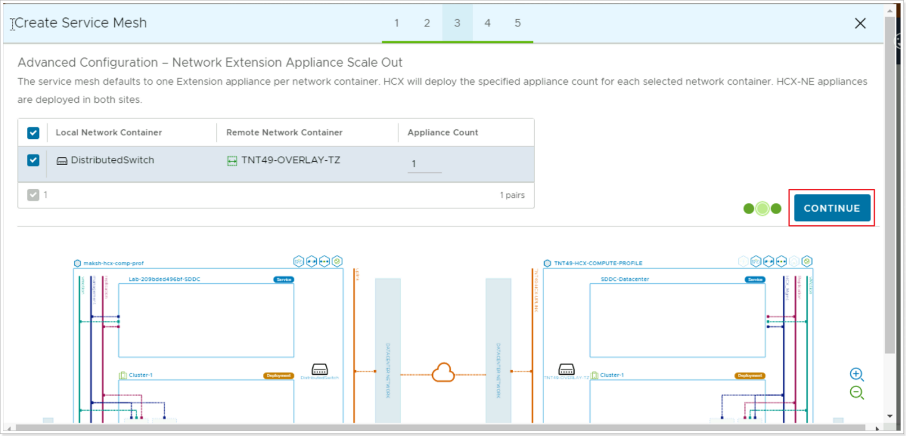

In Advanced Configuration – Network Extension Appliance Scale Out, keep the defaults and then click **CONTINUE**.

#### Step 7: Advanced Configuration - Traffic Engineering

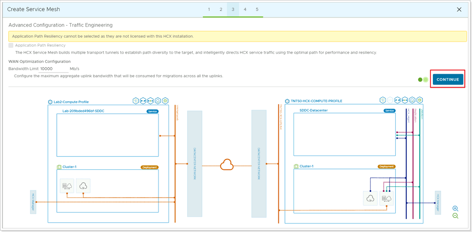

In Advanced Configuration – Traffic Engineering, review, leave the defaults and click **CONTINUE**.

#### Step 8: Review Topology Preview

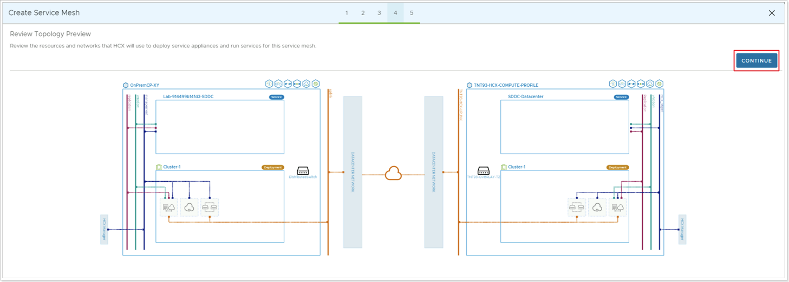

Review the topology preview and click **CONTINUE**. 

#### Step 9: Ready to Complete

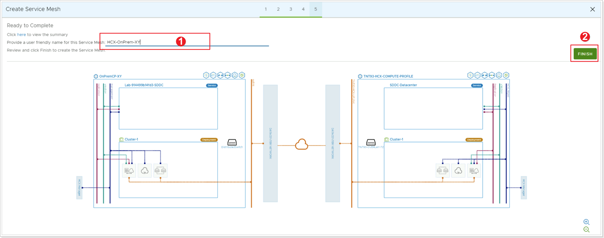

1. Enter a name for your Service Mesh (SUGGESTION: **HCX-OnPrem-XY**, where X is your group number, Y your participant number).
2. Click **FINISH**.

> **Note:** the appliance names are derived from service mesh name (it's the appliance prefix, essentially).

#### Step 10: Confirm Successful Deployment

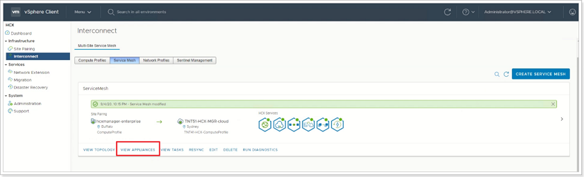

The Service Mesh deployment will take 5-10 minutes to complete. Once successful, you will see the services as green. Click on **VIEW APPLIANCES**.

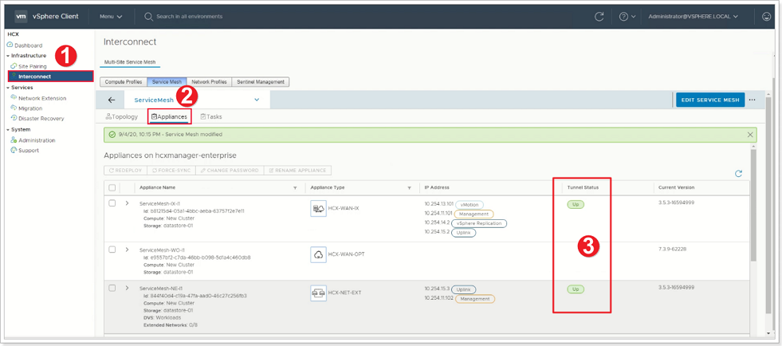

1. You can also navigate by clicking **Interconnect** - Service Mesh.
2. Click **Appliances**.
3. Check for **Tunnel Status = *UP***.

You're ready to migrate and protect on-premises VMs to Azure VMware Solution using VMware HCX. Azure VMware Solution supports workload migrations (with or without a network extension). So you can still migrate workloads in your vSphere environment, along with On-Premises creation of networks and deployment of VMs onto those networks. For more information, see the [VMware HCX Documentation.](https://docs.vmware.com/en/VMware-HCX/index.html)

