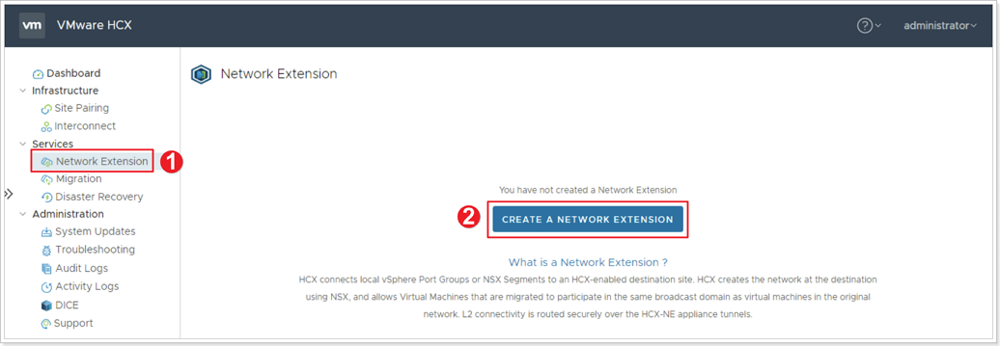
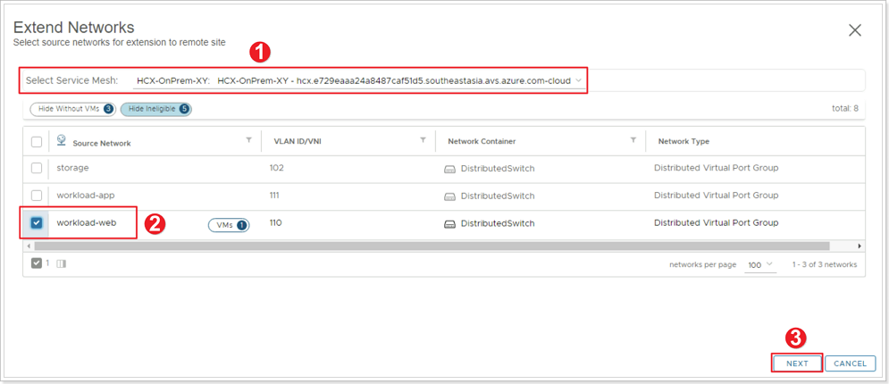
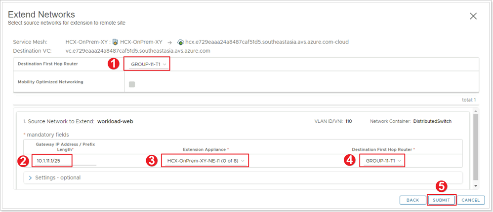
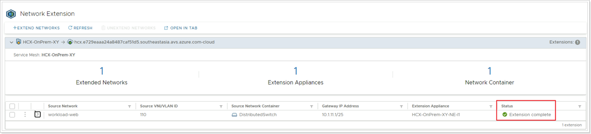


You will perform the instructions below from the On-premises VMware Environment


## **HCX Network Extension**

You can extend networks between and HCX-activated on-premises environment and Azure VMware Solution (AVS) with HCX Network Extension.

With VMware HCX Network Extension (HCX-NE), you can extend a VM's network to a VMware HCX remote site like AVS. VMs that are migrated, or created on the extended network at the remote site, behave as if they exist on the same L2 network segement a VMs in the source (on-premises) environment. With Network Extension from HCX, the default gateway for an extended network is only connected at the source site. Traffic from VMs in remote sites must be routed to a different L3 network will flow through the source site gateway.

With VMware HCX Network Extension you can:

- Retain the IP and MAC addresses of the VMs and honor existing network policies.
- Extend VLAN-tagged networks from a VMware vSphere Distributed Switch.
- Extend NSX segments.

For more information please visit VMware's documentation for [Extending Networks with VMware HCX.](https://docs.vmware.com/en/VMware-HCX/4.3/hcx-user-guide/GUID-DD9C3316-D01C-4088-B3EA-84ADB9FED573.html)

Once the Service Mesh appliances have been deployed, the next important step is to extend the on-premises network(s) to AVS, so that any migrated VM’s will be able to retain their existing IP address.

### Step 1: Network Extension Creation

1. Click **Network Extension**.
2. Click **CREATE A NETWORK EXTENSION**.

### Step 2: Select Source Networks to Extend

1. **Select Service Mesh** - Ensure you select your own Service Mesh you created in an earlier step.
2. Select **OnPrem-workload-X-Y** network.
3. Click **NEXT**.

### Step 3: Configure Network Extension

1. **Destination First Hop Router**
    * If applicable, ensure your own NSX-T T1 router you created earlier is selected.
    * Otherwise, select the **TNT\*\*-T1** router.
2. Enter the **Gateway IP Address / Prefix Length** for the **OnPrem-workload-X-Y** network. You can find this information in the [On-Premises Lab Environment](../../#on-premises-vmware-lab-environment) section.
    * Example: 10.**X**.1**Y**.129/25, where **X** is your group number and **Y** is your participant number.
3. Ensure your own **Extension Appliance** is selected.
4. Confirm your own T1 is selected under **Destination First Hop Router**.
5. Click **SUBMIT**.

> It might take 5-10 minutes for the Network Extension to complete.

### Step 4: Confirm Status of Network Extension

Confirm the status of the Network Extension as **Extension complete**.
