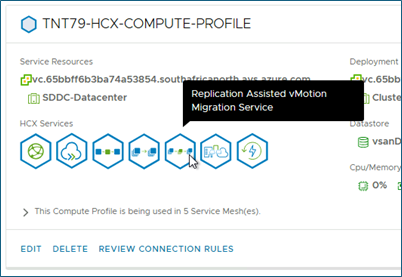
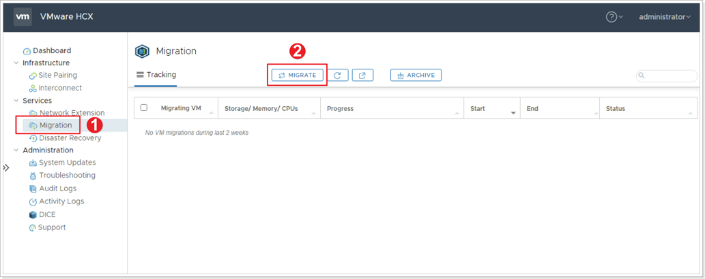
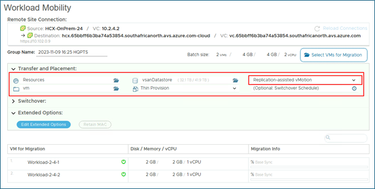
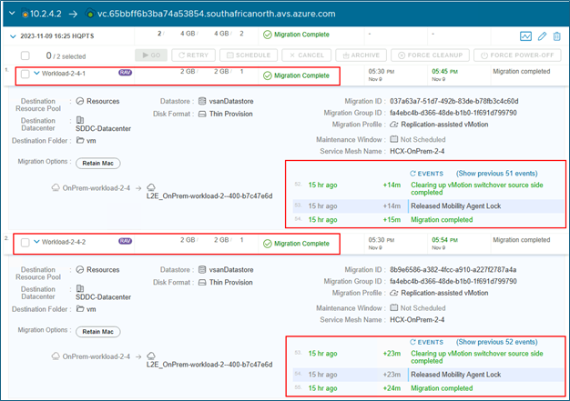
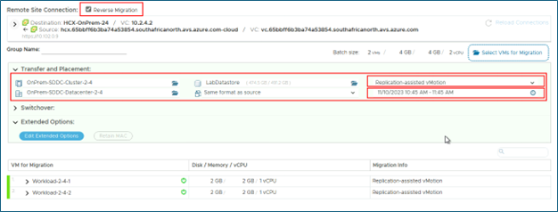
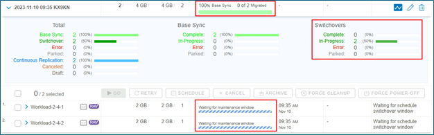
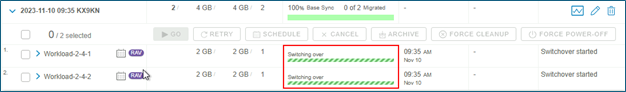
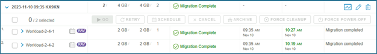


You will perform the instructions below from the On-premises VMware Environment


HCX Replication Assisted vMotion (RAV) uses the HCX along with replication and vMotion technologies to provide large scale, parallel migrations with zero downtime.

HCX RAV provides the following benefits:
*	**Large-scale live mobility**: Administrators can submit large sets of VMs for a live migration.
* **Switchover window**: With RAV, administrators can specify a switchover window.
*	**Continuous replication**: Once a set of VMs is selected for migration, RAV does the initial syncing, and continues to replicate the delta changes until the switchover window is reached.
*	**Concurrenc**y: With RAV, multiple VMs are replicated simultaneously. When the replication phase reaches the switchover window, a delta vMotion cycle is initiated to do a quick, live switchover. Live switchover happens serially.
*	**Resiliency**: RAV migrations are resilient to latency and varied network and service conditions during the initial sync and continuous replication sync.
*	**Switchover larger sets of VMs with a smaller maintenance window**: Large chunks of data synchronization by way of replication allow for smaller delta vMotion cycles, paving way for large numbers of VMs switching over in a maintenance window.

[HCX RAV Documentation](https://docs.vmware.com/en/VMware-HCX/4.7/hcx-user-guide/GUID-741F47D5-A3C9-4D74-9672-E54D8791D8F0.html)

## **Migrate a VM using HCX vMotion**

As you are more comfortable now with HCX components, some steps will be less documented to provide you with the opportunity to discover new side of this tool by yourself.

### Prerequisites

First thing, we need to check that Replication Assisted vMotion Migration feature is enabled on **each of the following**:
*	AVS HCX Manager Compute Profile
*	On premises Compute Profile
*	On premises Service Mesh

For example:

If not enabled on one of the previous items, you need to:
1. Edit the component
2. Enable the **Replication Assisted vMotion Migration** capability
3. Continue the wizard up to the **Finish** button (no other change is required)
4. Click on **Finish** button to validate.

> Note: Changes to the service mesh will require a few minutes to complete. You can look at Tasks tab to monitor the progress.

### **Exercise 1: Migrate VMs to AVS**

#### Step 1: Initiate VMs migration

1. From the HCX interface click **Migration** in the left pane.
2. Click **MIGRATE**.

#### Step 2: Select VMs for Migration

1. Search for the location of your VM.
2. Click the checkbox to select your VM named **Workload-X-Y-1** and **Workload-X-Y-2**.
3. Click **ADD**.

#### Step 3: Transfer and Placement of VM on Destination Site

Use the following values for these options:

|       Option        |    Value                   |
|---------------------|----------------------------|
| Compute Container   | Cluster-1                  |
| Destination Folder  | Discovered virtual machine |
| Storage             | vsanDatastore              |
| Format              | Same format as source      |
| Migration Profile   | **Replication-assisted vMotion** |
| Switchover Schedule | N/A                        |

Click either **GO** or **VALIDATE** button. Clicking **VALIDATE** will validate that the VM can be migrated (This will not migrate the VM). Clicking **GO** will both validate and migrate the VM.

#### Step 4: Monitor VM Migration

As you monitor the migration of your VM, keep an eye on the following areas:
1. Percentage status of VM migration.
2. Sequence of events as the migration occurs.
3. **Cancel Migration** button (*do not use*).

#### Step 5: Verify completion of VM Migration

Ensure your VM was successfully migrated. You can also check for the VM in your AVS vCenter to Ensure it was migrated.

### Exercice 2: Migration rollback

#### Step 1: Reverse Migration with switchover scheduling

VMware HCX also supports **Reverse Migration**, migrating from AVS back to on-premises. 


All migrations, including reverse migrations must be initiated from the on-premises site.


1. Click **Reverse Migration** checkbox.
2. Select the **Discovered virtual machine** folder.
3. Select your same virtual machines to migrate back to on-premises.
4. Click **ADD**.

Use the following values for these options:

|       Option        |    Value                   |
|---------------------|----------------------------|
| Compute Container   | OnPrem-SDDC-Cluster-X-Y    |
| Destination Folder  | OnPrem-SDDC-Datacenter-X-Y |
| Storage             | LabDatastore               |
| Format              | Same format as source      |
| Migration Profile   | **Replication-assisted vMotion** |
| Switchover Schedule | **Specify a 1hr maintenance window** timeframe starting at least 15 minutes from now. |

The rest of the steps are similar to what you did on Step 5.

#### Step 2: Monitor a scheduled VM migration

After few minutes, *Replication-assisted vMotion* will start replicating virtual disks of the virtual machines to the destination.

When ready, the switchover will not happen before entering the maintenance window timeframe provided in the migration wizard. VM is still running on the source side. In the interval, replication will continue to synchronize disk changes to the target side.

When the switchover scheduling is reached, the VM computation runtime, storage and network attachments will switch to the destination and the migration will complete with no downtime for the VM.

> Note: The switchover may not happen as soon as we reach the maintenance window timeframe: it may take a few minutes to start.

After the switchover is completed, VM should be running in the destination.

