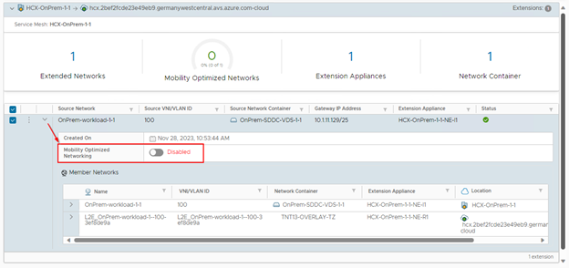
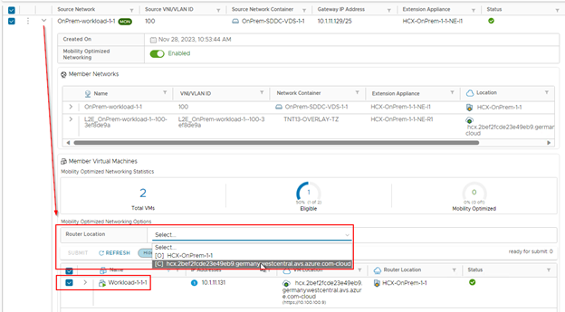


You will perform the instructions below from the On-premises VMware Environment


HCX L2 extended networks are virtual networks that span across different sites, allowing VMs to keep their IP addresses and network configuration when migrated or failed over.

HCX provides:
*	**HCX Network Extension**: This service creates an overlay tunnel between the sites and bridges the L2 domains, enabling seamless communication and mobility of VMs.
*	**HCX Mobility Optimized Networking (MON)**: Improves network performance and reduces latency for virtual machines that have been migrated to the cloud on an extended L2 segment. MON provides these improvements by allowing more granular control of routing to and from those virtual machines in the cloud.

## Observe the effects of extended L2 networks with and without MON

### Prerequisites

Please migrate one of the workload VM to AVS side. You can select the migration method of your choice.

The VM needs to be migrated and powered-on to continue the Lab Task.

#### Assess the current routing path

From workstation, run a **traceroute** to get a view on current routing path.

From a windows command line, run: `tracert IP_OF_MIGRATED_VM`

```cmd
Last network hop before the VM should be the On Prem routing device: 10.X.1Y.8.
Tracing route to 10.1.11.130 over a maximum of 30 hops
  1    23 ms    23 ms    22 ms  10.100.199.5
  2     *        *        *     Request timed out.
  3    23 ms    23 ms    23 ms  10.100.100.65
  4     *        *        *     Request timed out.
  5     *        *        *     Request timed out.
  6     *        *        *     10.1.1.8    # <------- On Premises router
  7    25 ms    24 ms    24 ms  10.1.11.130 # <------- Migrated VM
```

### Step 1: Enable Mobility Optimized Networking on existing network extension

From HCX console, select the **Network Extension** menu and expand the existing extended network.

Then activate the **Mobility Optimized Networking button**.



Accept the change by clicking on **Enable** when prompted for.

> The change will take a few minutes to complete.

### Step 4: Assess the current routing path after MON enablement

You can re-run a **traceroute** from jump server but no change to the routing path should be effective yet.

### Step 5: Enable MON for the migrated VM

MON is effective at VM level, and so should be activated per VM (in an extended network where MON is already setup).

1. From the Network Extension, and the expanded MON-enabled network, select the migrated VM.
1. Select AVS side router location.
1. Click on **Submit**.



### Step 6: Configure MON Policy routes
By default, MON redirect all the flow from the migrated VM to On Prem if they are matching RFC1918 subnets.

*	**In the Lab setup**, this is also a reason for the migrated VM to be unreachable at this stage if we do not customize Policy Routes.
*	**In a real world scenario**, not configuring Policy Routes, is often a reason of asymmetric traffic as incoming and outgoing traffic for/from the migrated VM could be not using the same path.

We will customize the Policy Routes to ensure that traffic for `10.0.0.0/8` will use the AVS side router location.

From the HCX console:

1. Select the Network Extension menu, then the Advanced menu and the Policy Routes item.
2. In the popup, remove the `10.0.0.0/8` network and validate the change.
3. Wait a minute for the change to propagate.

### Step 7: Assess the current routing path after MON enablement at VM level

You can re-run a **traceroute** from workstation and analyze the result:

```cmd
Tracing route to 10.1.11.130 over a maximum of 30 hops
  1    23 ms    23 ms    22 ms  10.100.199.5
  2     *        *        *     Request timed out.
  3    23 ms    23 ms    23 ms  10.100.100.65
  4     *        *        *     Request timed out.
  5     *        *        *     Request timed out.
  6    24 ms    23 ms    23 ms  10.1.11.130 # <------- Migrated VM
```

There should be no `10.X.1Y.8` (as last hop) anymore as flow is directly routed by NSX to the target AVS VM with the help of a `/32` static route set by HCX at the NSX-T T1 GW level.
