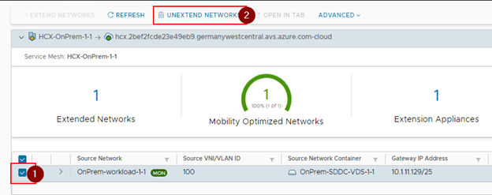
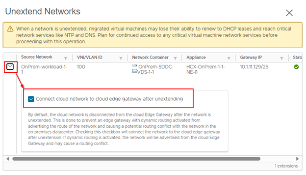
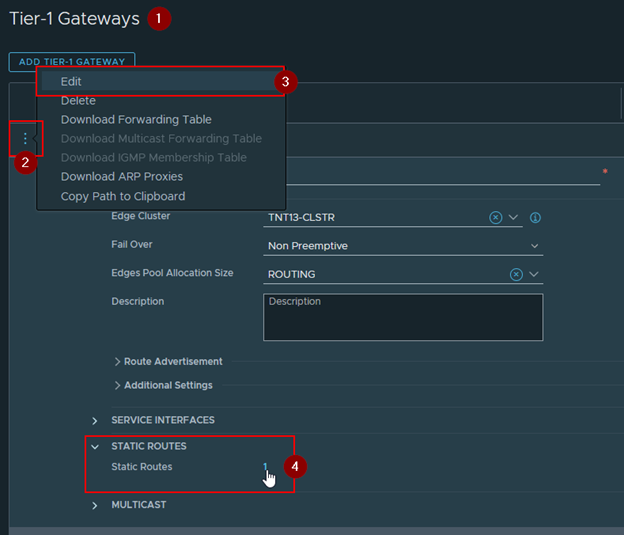
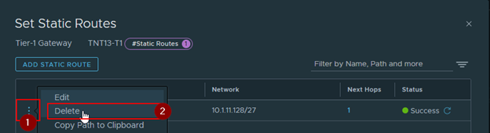


You will perform the instructions below from the On-premises VMware Environment


In a migration strategy, HCX L2 extended networks can be used to facilitate the transition of workloads from one site to another without changing their IP addresses or disrupting their connectivity. This can reduce the complexity and risks associated with reconfiguring applications, firewalls, DNS, and other network-dependent components.

Once a subnet is free from other resources On Premises, this is important to consider the last phase of the migration project: the network extension cutover.

This operation will provide a direct AVS connectivity for migrated workload, only relying on NSX-T components, and not anymore on the combination of HCX and On Premises network components.

In a large migration project, the cutover can be done network by network, based on the rhythm of workload migrations. When a subnet is free from On Premises resources, and firewall policies effective on AVS side, the cutover operation can be proceeded.

## Achieving a migration project milestone by cutting-over network extension

### Exercice 1: Perform a network extension cutting-over

#### Step 1: Migrate remaining workload to AVS

Ensure that all the On Premises workload attached to the extended network are migrated on AVS, except the router VM and the HCX-OnPrem-X-Y-NE-I1 appliance(s).

If not: migrate the VM to AVS.

> Note: You can keep or remove MON on the extended network for the current exercice. It should not affect the end result.

#### Step 2: Start the network extension removal process

From HCX console, select the Network Extension menu. Select the Extended network and click on **Unextend network**.

In the next wizard, ensure that the Cloud Edge Gateway will be connected at the end of removal operation. Then **submit**.

You can proceed to the next step while the current operation is running.

#### Step 3: Shutdown On Premises network connectivity to the subnet

For the current lab setup, the On Premises connectivity to the migrated subnet is handled by a **Static Route** set on an NSX-T T1 gateway. We will remove this rule to simulate the end of BGP route advertising from On Premises. 

On a real-world scenario, the change could be to shutdown a virtual interface on a router or a Firewall device to achieve the end of BGP route advertising for the subnet.

1. Connect to **NSX-T Manager** console by using credentials from AVS SDDC Azure UI.
1. Click on **Networking** tab, then **Tier-1 Gateways** section.
1. Select the **TNTXX-T1** gateway and start the edition of the component.

4. From the edit pane, click on the **Static Routes** link to edit this section (the number will vary depending on the number of effectives routes).
1. Remove the **route associated with your Lab** based on its name and the target network.

6. **Validate** the change.
7. Monitor the process of the network extension removal on HCX.

#### Step 5: Network connectivity checks

When operation is ended, check the network connectivity to one of the migrated VM on the subnet.

> You can use a ping from your workstation up to the VM IP address.

The connectivity should be ok.

### Exercice 2: Rollback **if needed!**

> Note: The following content is only there to provide guidance in case you need or choose to roll back the network setup to its previous configuration. 

#### Step 1: Roll back changes

Running this step is not part of the Lab, except if you are facing issues.

If needed, network extension can be recreated, with same settings (especially the network prefix), and the route recreated to roll back a change.

To recreate the network extension, refer to the settings of [Task 12](/workshop-guide/module-2/module-2-task-12/).

If you need to recreate the **static route on NSX-T**, specify the following settings:

|       Option              |    Value             |
|---------------------------|----------------------|
| Name                      | Nested-SDDC-Lab-X-Y  |
| Network                   | 10.X.1Y.128/27       |
| Next hop / IP address     | 10.X.Y.8             |
| Next hop / Admin Distance | 1                    |
| Next hop / Scope          | Leave empty          |

After the route re-creation, the connectivity via On Premises routing device should be restored to reach your workloads on the extended segment. You can roll back VM to On Premises too if needed.

