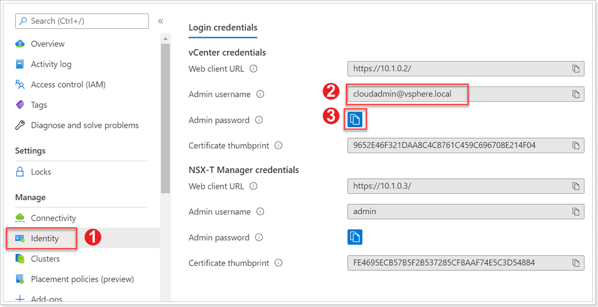
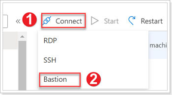
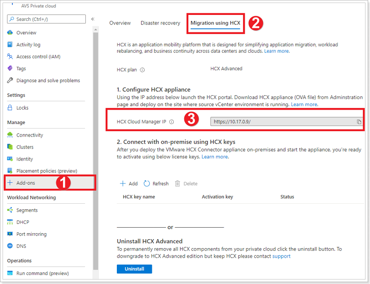
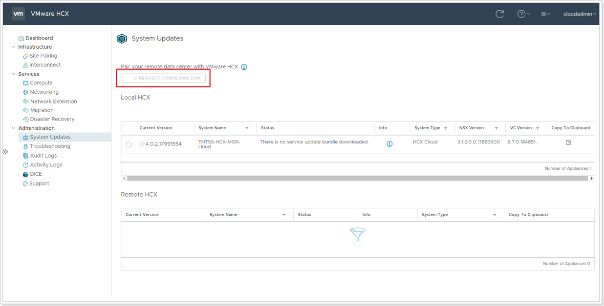


You will perform the instructions below from AVS VMware Environment


## **Exercise 1: Download HCX OVA for Deployment of HCX on-premises**

The next step is to download HCX onto our On-Premises VMware environment, this will allow us to setup the connectivity to AVS and allow us to migrate. The HCX appliance is provided by VMware and has to be requested from within the AVS HCX Manager.

### Step 1: Locate AVS SDDC Identity Information

1. Obtain the AVS vCenter credentials by going to your AVS Private Cloud blade in the Azure portal, select **VMware credentials**.
2. cloudadmin@vsphere.local is the local vCenter user for AVS, keep this handy.
3. You can copy the Admin password to your clipboard and keep it handy as well.

> Please access your own Jumpbox VM created at the beginning of the exercises.

> Navigate to the Azure portal and connect to your Jumpbox.

### Step 2: Connect to your Azure Jumpbox

1. Click **Connect**.
2. Click **Bastion**.

> Enter the credentials you created for your Jumpbox.

### Step 3: Locate HCX Cloud Manager IP

1. In your AVS Private Cloud blade, click **+ Add-ons**.
2. Click **Migration using HCX**.
3. Copy the **HCX Cloud Manager IP** URL, open a new browser tab and paste it, and enter the cloudadmin credentials obtained above.

### Step 4: Request HCX OVA Download Link

The screenshot below is from AVS VMware Environment

The Request Download Link button will be grayed out initially but will be live after a minute or two. Do not navigate away from this page. Once available, you will have an option to Download the OVA or Copy a Link. This link is valid for 1 week.
