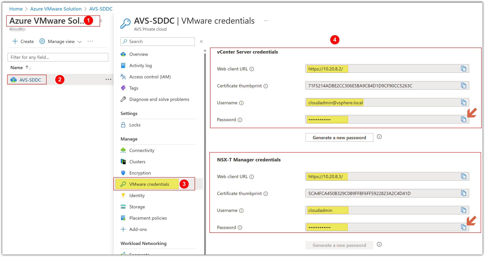

## **Install HCX in your on-premises vCenter Server**

In this step we will import the HCX appliance into the on premises vCenter.

You can choose to do this Task in 2 different ways:

### **Option 1: Download and deploy HCX OVA to on-premises vCenter**

#### Step 1: Obtain your AVS vCenter Server credentials

1. In your AVS Private Cloud blade click **Identity**.
2. Locate and save both vCenter admin username **cloudadmin@vsphere.local** and password.

#### Step 2: Locate HCX Cloud Manager IP

1. Click on **+ Add-ons**.
2. Copy the **HCX Cloud Manager IP**.

#### Step 3: Log in to HCX Cloud Manager IP


You will perform the instructions below from AVS VMware Environment


From your Jumpbox, open a browser tab and paste the **HCX Cloud Manager IP** and enter the credentials obtained in the previous step.

#### Step 4: Request Download Link for HCX OVA

1. In the left pane click **System Updates**.
2. Click **REQUEST DOWNLOAD LINK**, please keep in mind that the button might take a couple of minutes to become enabled.

1. Click **VMWARE HCX** to download the HCX OVA to complete this option.
2. You can also click **COPY LINK** if you will install HCX with Option 2.

## **Option 2: Deploy HCX from a vCenter Content Library**


You will perform the instructions below from the On-premises VMware Environment


### Step 1: Access Content Libraries from on-premises vCenter

From the Jumpbox, browse to the on-premises vCenter URL, See [Getting Started](../_index.md/#on-premises-vmware-lab-environment) section for more information and login details.

1. From your on-premises vCenter click **Menu**.
2. Click **Content Libraries**.

### Step 2: Create a new Content Library

Create a new content library if one doesn’t exist by clicking the **+** sign.

### Step 3: Import Item to Content Library

1. Click **ACTIONS**.
2. Click **Import Item**.

1. Enter the HCX URL copied in a previous step.
2. Click **IMPORT**.

Accept any prompts and actions and proceed. The HCX OVA will download to the library in the background.

