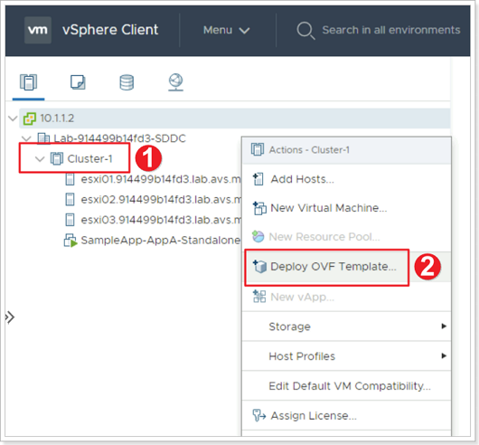
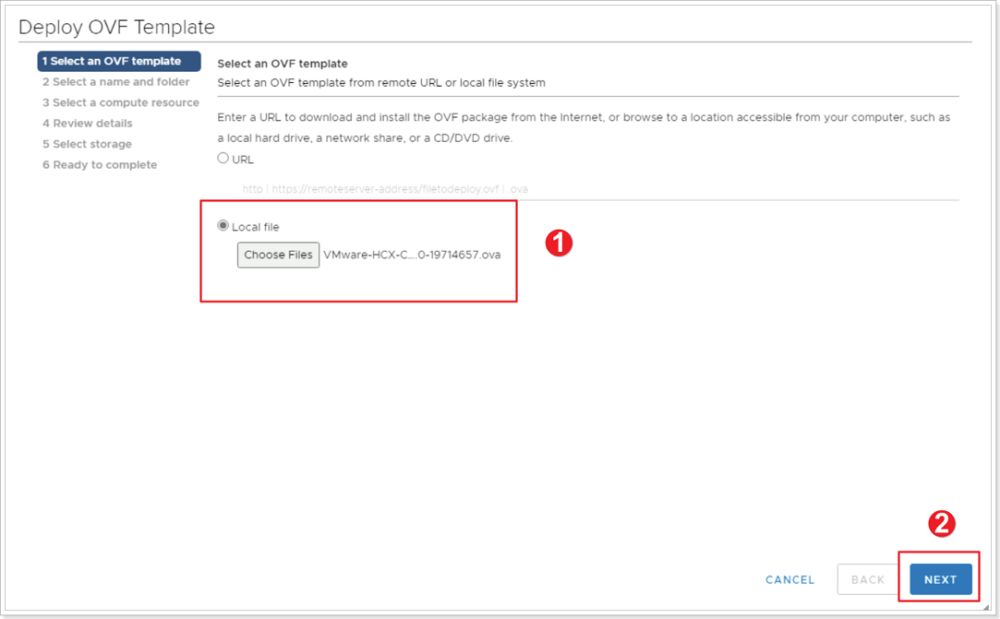
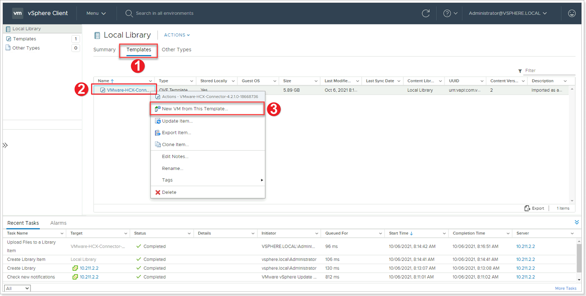
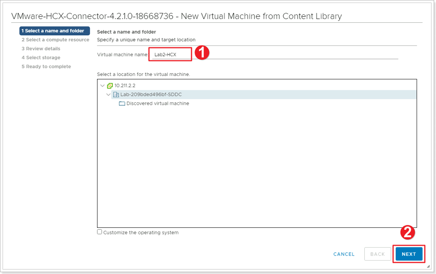
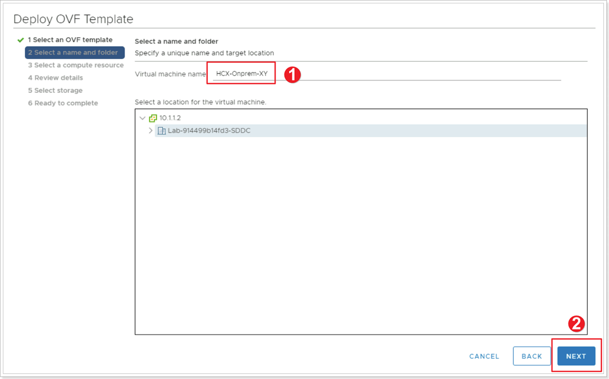
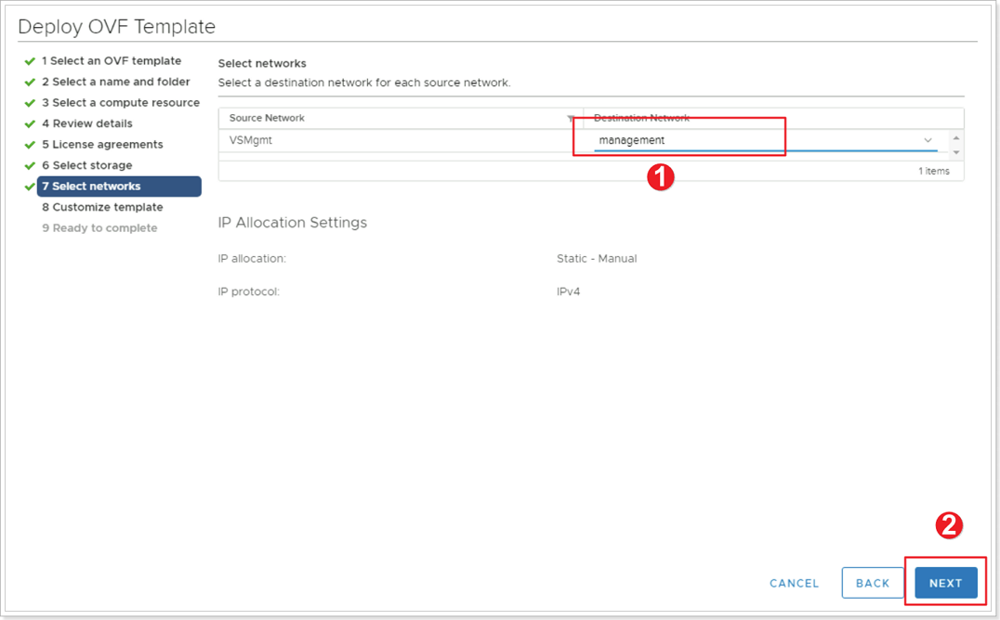
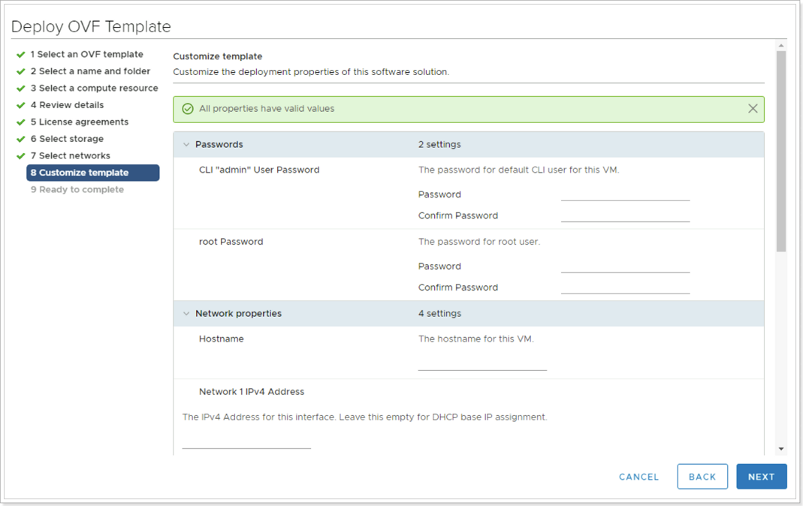

## **Deploy HCX OVA**

In this step, we will deploy the HCX VM with the configuration from the [On-Premises VMware Lab Environment](/docs/#on-premises-vmware-lab-environment) section.


You will perform the instructions below from the On-premises VMware Environment


### Step 1: Deploy HCX connector VM

#### **If Option 1**: Deploy OVA from download.

1. Right-click **Cluster-1**.
1. Click **Deploy OVF Template**.

3. Click the button to point to the location of the downloaded OVA for HCX.
1. Click **NEXT**.

#### **If Option 2**: Deploy HCX from Content Library

1. Once the import is completed from the previous task, click **Templates**.
1. Right Click the imported HCX template.
1. Click **New VM from This Template**.

4. Give your HCX Connector a name: **HCX-OnPrem-X-Y**, where X is your group number and Y is your participant number.
1. Click **NEXT**.

### Step 2: Name the HCX Connector VM

1. Give your HCX Connector a name: **HCX-OnPrem-X-Y**, where X is your group number and Y is your participant number.
2. Click **NEXT**.

### Step 3: Assign the network to your HCX Connector VM

Keep the defaults for:
- Compute Resource
- Review details
- License agreements (Accept)
- Storage (LabDatastore)

1. Click to select **management** network.
2. Click **NEXT**.

### Step 4: Customize template

| **Property**                            | **Value**                                                                                                              |
|-----------------------------------------|------------------------------------------------------------------------------------------------------------------------|
| Hostname                                | Suggestion: HCX-OnPrem-**X**-**Y**) **Note: Do not leave a space in the name as this causes the webserver to fail)** |
| CLI "admin" User Password/root Password | MSFTavs1!                                                                                                           |
| Network 1 IPv4 Address                  | 10.**X**.**Y**.9                                                                                                         |
| Network 1 IPv4 Prefix Length            | 27                                                                                                                     |
| Default IPv4 Gateway                    | 10.**X**.**Y**.1                                                                                                         |
| DNS Server list                         | 1.1.1.1                                                                                                                |

### Step 5: Validate deployment

Once done, navigate to Menu \> **VM's and Templates** \> **Power on** the newly created HCX Manager VM. 

> The boot process may take 10-15 minutes to complete.