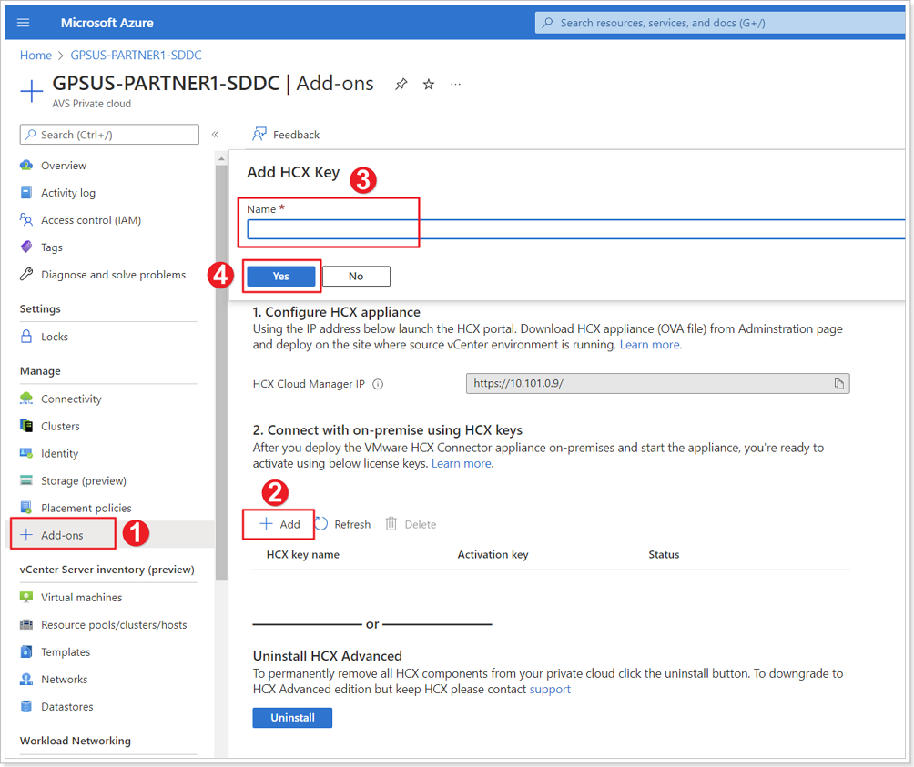

## **Obtain HCX License Key**

While the HCX installation runs, we will need to obtain a license key to activate HCX. This is available from the AVS blade in the Azure Portal.

### Step 1: Create HCX Key from Azure Portal

1. Click **+ Add-ons**.
2. Click **+ Add**.
3. Give your HCX Key a name: **HCX-OnPrem-X-Y**, where X is your group number and Y your participant number.
4. Click **Yes**.

Save the key, you will need it to activate it in your on-premises setup.
