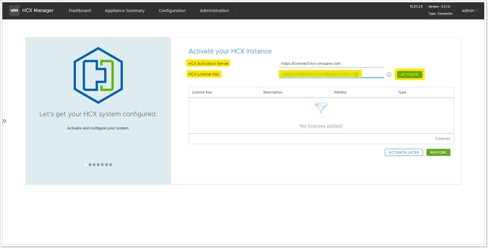


You will perform the instructions below from the On-premises VMware Environment


## **Activate VMware HCX**

In this task, we will activate the On-Premises HCX appliance that we just deployed in Task 4.

### Step 1: Log in to HCX Appliance Management Interface

1. Browse to the On-Premises HCX Manager IP specified in Task 4 on port 9443 IP and login (Make sure you use **https://** in the address bar in the browser).
    * Example: <https://10.X.Y.9:9443>
2. Login using the **HCX Credentials** specified in Task 4.
    * **Username**: `admin`
    * **Password**: `MSFTavs1!` (Specified earlier in Task 4).

### Step 2: Enter HCX Key

Once logged in, follow the steps below.

1. Don't change the **HCX Activation Server** field. Please keep as is.
1. In **HCX License Key** field, please enter your key for **HCX Activation Key** that you obtains from AVS blade in Azure Portal.
1. Lastly, select **Activate**. Please keep in mind that this process can take several minutes.

### Step 3: Enter Datacenter Location, System Name

In **Datacenter Location**, provide the nearest biggest city to your location for installing the VMware HCX Manager On-Premises. Then select **Continue**. In **System Name**, modify the name to **HCX-OnPrem-X-Y** and click **Continue**.

> Note: The city location does not matter in this lab. It's just a named location for visualization purposes.

### Step 4: Continue to complete configuration

Click “**YES, CONTINUE”** for completing next task. After a few minutes HCX should be successfully activated.
