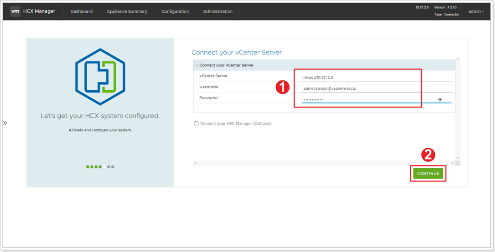
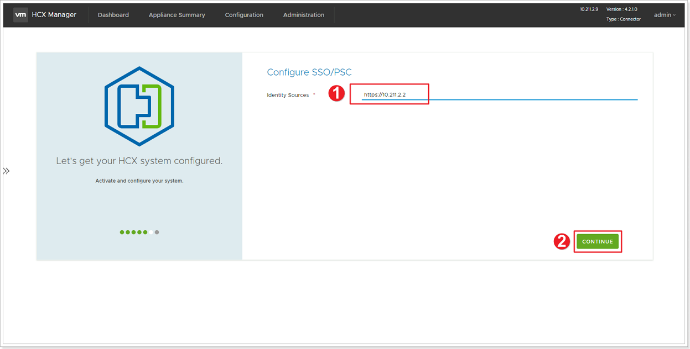
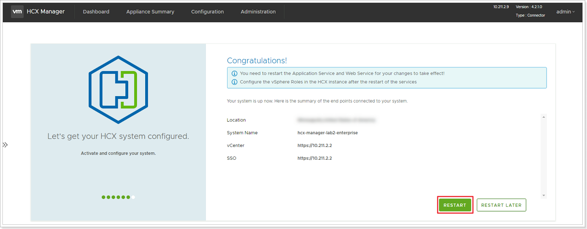
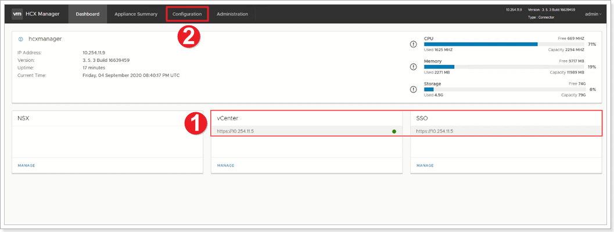
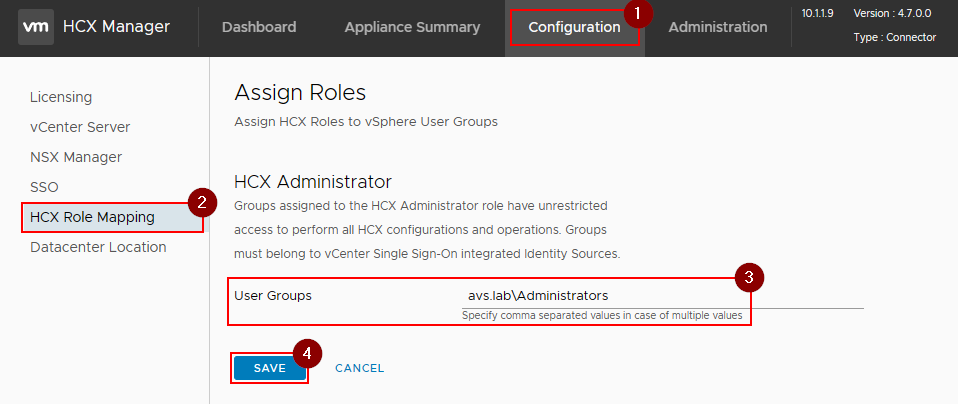


You will perform the instructions below from the On-premises VMware Environment


## Configure On-Premises HCX

In this section, we will integrate and configure HCX Manager with the On-Premises vCenter Server.

### Step 1: Connect vCenter Server

1. In **Connect your vCenter**, provide the FQDN or IP address of on-premises vCenter server and the appropriate credentials.
    * vCenter IP: <https://10.X.Y.2>
    * Username: `administrator@avs.lab`
    * Password: `MSFTavs1!`
2. Click **CONTINUE**.

### Step 2: Configure SSO/PSC

1. In **Configure SSO/PSC**, provide the same vCenter IP address: <https://10.X.Y.2>
2. Click **CONTINUE**.

### Step 3: Restart HCX Appliance

Verify that the information entered is correct and select **RESTART**.

{}  
The reboot process might take between 10 to 15 minutes. Keep checking every 3-4 minutes to ensure you can get to HCX Manager.
{}

1. After the services restart, you'll see vCenter showing as **Green** on the screen that appears. Both vCenter and SSO must have the appropriate configuration parameters, which should be the same as the previous screen.
2. Next, click on Configuration to complete the HCX configuration.

1. Click **Configuration**.
2. Click **HCX Role Mapping**.
3. Click **Edit**.
4. Change User Groups value to match lab SSO configuration: `avs.lab\Administrators`
5. **Save** changes.

> Please note that by default HCX assigns the HCX administrator role to "vsphere.local\Administrators". In real life, customers will have a different SSO domain than **vsphere.local** and needs to be changed. This is the case for this lab and this needs to be changed to **avs.lab**.

{}  
It may take an additional 5-10 minutes for the HCX plugins to be installed in vCenter, log back out and log back in if it does not show up automatically.
{}