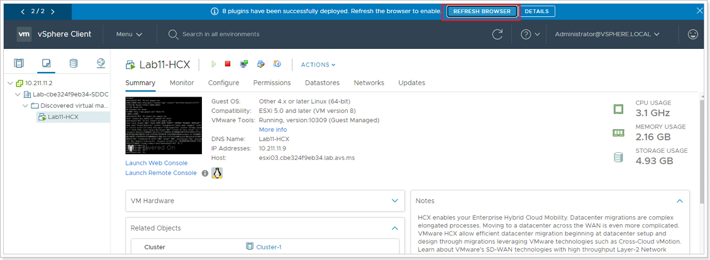
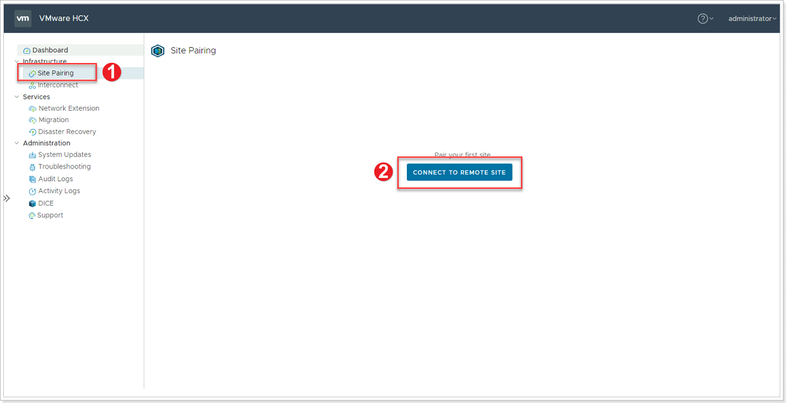
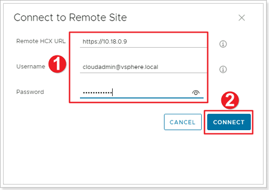
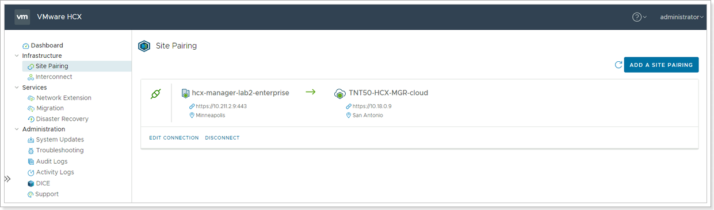


You will perform the instructions below from the On-premises VMware Environment


## **HCX Site Pairing**

In this task, we will be creating the Site Pairing to connect the On-Premises HCX appliance to the AVS HCX appliance.

### **Exercise 1: Pair On-Premises HCX to AVS HCX**

#### Step 1: Access On-Premises HCX

There are 2 ways to access HCX:
1. Through the vCenter server plug-in. Click **Menu** -> **HCX**.
2. Through the stand-alone UI. Open a browser tab and go to your local HCX Connector IP: <https://10.X.Y.9>
In either case, log in with your vCenter credentials:
- Username: administrator@avs.lab
- Password: MSFTavs1!

> **NOTE**: If working through vCenter Server, you may see a banner item to Refresh the browser, this will load the newly installed HCX modules. If you do not see this, log out and log back into vCenter.

#### Step 2: Connect to Remote Site

1. Click **Site Pairing** in the left pane.
2. Click **CONNECT TO REMOTE SITE**.

#### Step 3: Enter Remote (AVS) HCX Information

1. Enter credentials for your AVS vCenter found in the Azure Portal. The Remote HCX URL is found under the **Add-ons** blade and it is NOT the vCenter URL.
2. Click **CONNECT**.

> **NOTE**: Ideally the identity provided in this step should be an AD based credential with delegation instead of the cloudadmin account.

Accept certificate warning and Import. Connection to the remote site will be established.

