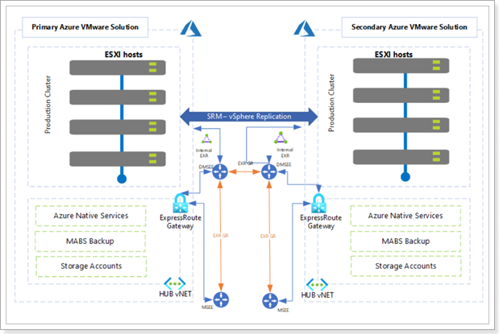
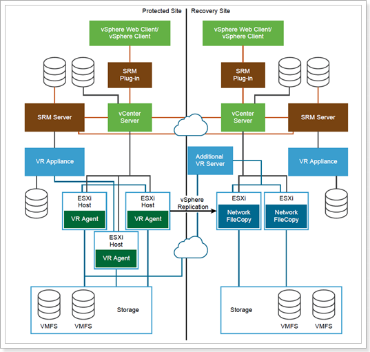
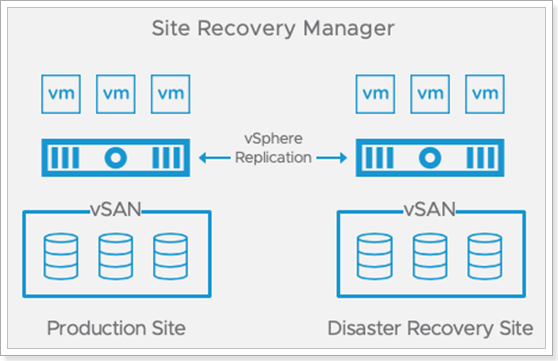
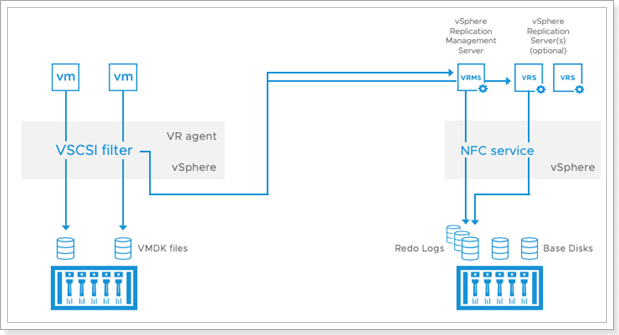

## **Site Recovery Manager**

VMware Site Recovery Manager (SRM) for Azure VMware Solution (AVS) is an add-on that customers can purchase to protect their virtual machines in the event of a disaster. SRM for AVS allows customers to automate and orchestrate the failover and failback of VMs between an on-premises environment and AVS, or between two AVS sites.

For more information on VMware Site Recovery Manager (SRM), visit VMware's official documentation for [Site Recovery Manager.](https://www.vmware.com/products/site-recovery-manager.html)

This module walks through the implementation of a disaster recovery solution for Azure VMware Solution (AVS), based on VMware Site Recovery Manager (SRM). 

Click [here](https://www.youtube.com/watch?v=ZH-2z0R4FB4) if you'd like to see 10 minutes [**demo**](https://www.youtube.com/watch?v=ZH-2z0R4FB4) for SRM on AVS.

### What you will learn

In this module, you will learn how to:

- Install Site Recovery Manager in an AVS Private Cloud.
- Create a site pairing between two AVS Private Clouds in different Azure regions.
- Configure replications for AVS Virtual Machines.
- Configure SRM protection groups and recovery plans.
- Test and execute recovery plans.
- Re-protect recovered Virtual Machines and execute fail back.

### Prerequisite knowledge

- AVS Private Cloud administration (Azure Portal).
- AVS network architecture, including connectivity across private clouds in different regions based on Azure ExpressRoute Global Reach.
- Familiarity with disaster recovery DR concepts such as Recovery Point Objective (RPO) and Recovery Time Objective (RTO).
- Basic concepts of Site Recovery Manager and vSphere Replication.

### Module scenario

In this module, two AVS Private Clouds are used. VMware Site Recovery Manager will be configured at both sites to replicate VMs in the protected site to the recovery site.

> Group **X** is your original assigned group, Group **Z** is the group you will be using as a Recovery site, for example, Group 1 will be using Group 2's SDDC as a Recovery site.

For Example:

| Private Cloud Name | Location     | Role               |
| ------------------ | ------------ | ------------------ |
| GPSUS-PARTNER**X**-SDDC    | Brazil South | **Protected** Site |
| GPSUS-PARTNER**Z**-SDDC    | Brazil South | **Recovery** Site  |

> The two private clouds should have been already interconnected with each other in Module 1, using ExpressRoute Global Reach or AVS Interconnect. The diagram below depicts the topology of the lab environment.

## **VMware Site Recovery Manager Information**

### **Recovery Types with SRM** 

VMware Site Recovery Manager (SRM) is a business continuity and disaster recovery solution that helps you plan, test, and run the recovery of virtual machines between a protected vCenter Server site and a recovery vCenter Server site. You can use Site Recovery Manager to implement different types of recovery from the protected site to the recovery site:

#### Planned Migration

- **Planned migration**: The orderly evacuation of virtual machines from the protected site to the recovery site. Planned migration prevents data loss when migrating workloads in an orderly fashion. For planned migration to succeed, both sites must be running and fully functioning.

#### Disaster Recovery

- **Disaster recovery**: Similar to planned migration except that disaster recovery does not require that both sites be up and running, for example if the protected site goes offline unexpectedly. During a disaster recovery operation, failure of operations on the protected site is reported but is otherwise ignored.

Site Recovery Manager orchestrates the recovery process with VM replication between the protected and the recovery site, to minimize data loss and system down time. At the protected site, Site Recovery Manager shuts down virtual machines cleanly and synchronizes storage, if the protected site is still running. Site Recovery Manager powers on the replicated virtual machines at the recovery site according to a recovery plan. A recovery plan specifies the order in which virtual machines start up on the recovery site. A recovery plan specifies network parameters, such as IP addresses, and can contain user-specified scripts that Site Recovery Manager can run to perform custom recovery actions on virtual machines.

Site Recovery Manager lets you test recovery plans. You conduct tests by using a temporary copy of the replicated data in a way that does not disrupt ongoing operations at either site.

Site Recovery Manager supports both hybrid (protected site on-prem, recovery site on AVS) and cloud-to-cloud scenarios (protected and recovery sites on AVS, in different Azure regions). This lab covers the cloud-to-cloud scenario only.

Site Recovery Manager is installed by deploying the **Site Recovery Manager Virtual Appliance** on an ESXi host in a vSphere environment. The Site Recovery Manager Virtual Appliance is a preconfigured virtual machine that is optimized for running Site Recovery Manager and its associated services. After you deploy and configure Site Recovery Manager instances on both sites, the Site Recovery Manager plug-in appears in the vSphere Web Client or the vSphere Client. The figure below shows the high-level architecture for a SRM site pair.

### **vSphere Replication**

SRM can work with multiple replication technologies: Array-based replication, vSphere (aka host-based) replication, vVols replication and a combination of array-based and vSphere replication ([learn more](https://docs.vmware.com/en/Site-Recovery-Manager/8.3/com.vmware.srm.admin.doc/GUID-35BBE965-ADC3-4E6E-A094-3D0037DA8528.html)).

AVS Private Clouds run on hyperconverged physical infrastructure powered by VMware’s first-party storage virtualization software, vSAN. As such, **the only replication technology that can be used with SRM in AVS is vSphere replication, which does not require storage arrays**. With vSphere replication, the storage source and target can be any storage device. vSphere Replication is configured on a per-VM basis, allowing you to control which VMs are duplicated.

vSphere Replication requires a virtual appliance to be deployed from an Open Virtualization Format (OVF) file using the vSphere Web Client. The first virtual appliance deployed at each site is referred to as the **vSphere Replication Management Server**. It contains the necessary components to receive replicated data, manage authentication, maintain mappings between the source virtual machines and the replicas at the target location and provide support for Site Recovery Manager. Additional vSphere Replication appliances can be deployed to support larger-scale deployments and topologies with multiple target locations. These additional virtual appliances are referred to as **vSphere Replication Servers**.

The components that transmit replicated data (the **vSphere Replication Agent** and a **vSCSI filter**) are built into vSphere. They provide the plug-in interfaces for configuring and managing replication, track the changes to VMDKs, automatically schedule replication to achieve the RPO for each protected virtual machine, and transmit the changed data to one or more vSphere Replication virtual appliances. There is no need to install or configure these components, further simplifying vSphere Replication deployment.

When the target is a vCenter Server environment, data is transmitted from the source vSphere host to either a vSphere Replication management server or vSphere Replication server and is written to storage at the target location.

vSphere Replication begins the initial full synchronization of the source virtual machine to the target location, using TCP port 31031. A copy of the VMDKs to be replicated can be created and shipped to the target location and used as **seeds,** reducing the time and network throughput. Changes to the protected virtual machine are tracked and replicated on a regular basis. The transmissions of these changes are referred to as **lightweight delta syncs.** Their frequency is determined by the RPO that was configured for the virtual
machine. A lower RPO requires more-frequent replication and network bandwidth consumed by the initial full synchronization.

The replication stream can be encrypted. As data is being replicated, the changes are first written to a file called a redo log, which is separate from the base disk. After all changes for the current replication cycle have been received and written to the redo log, the data in the redo log is consolidated into the base disk. This process helps ensure the consistency of each base disk so virtual machines can be recovered at any time, even if replication is in progress or network connectivity is lost during transmission.

### **Site Recovery Manager Concepts**

#### Inventory Mappings

- **Inventory Mappings.** For array-based protection and vSphere Replication protection, Site Recovery Manager applies inventory mappings to all virtual machines in a protection group when you create that group. Inventory mappings provide default objects in the inventory on the recovery site for the recovered virtual machines to use when you run recovery. Site Recovery Manager cannot protect a virtual machine unless it has valid inventory mappings. However, configuring site-wide inventory mappings is not mandatory for array-based replication protection groups and vSphere Replication protection groups. If you create vSphere Replication protection group without having defined site-wide inventory mappings, you can configure each virtual machine in the group individually. You can override site-wide inventory mappings by configuring the protection of the virtual machines in a protection group. You can also create site-wide inventory mappings after you create a protection group, and then apply those site-wide mappings to that protection group.

#### Protection Groups

- **Protection Groups**. A protection group is a collection of virtual machines that Site Recovery Manager protects together. After you create a vSphere Replication protection group, Site Recovery Manager creates placeholder virtual machines on the recovery site and applies the inventory mappings to each virtual machine in the group. If Site Recovery Manager cannot map a virtual machine to a folder, network, or resource pool on the recovery site, Site Recovery Manager sets the virtual machine to the Mapping Missing status, and does not create a placeholder for it.

#### Recovery Plan

- **Recovery Plan.** A recovery plan is like an automated run book. It controls every step of the recovery process, including the order in which Site Recovery Manager powers on and powers off virtual machines, the network addresses that recovered virtual machines use, and so on. Recovery plans are flexible and customizable. A recovery plan includes one or more protection groups. You can include a protection group in more than one recovery plan. For example, you can create one recovery plan to handle a planned migration of services from the protected site to the recovery site for the whole organization, and another set of plans per individual departments. **You can run only one recovery plan at a time to recover a particular protection group.**

#### Reprotection

- **Reprotection.** After a recovery, the recovery site becomes the primary site, but the virtual machines are not protected yet. If the original protected site is operational, you can reverse the direction of protection to use the original protected site as a new recovery site to protect the new protected site. Manually re-establishing protection in the opposite direction by recreating all protection groups and recovery plans is time consuming and prone to errors. **Site Recovery Manager provides the reprotect function, which is an automated way to reverse protection.** Reprotect uses the protection information that you established before a recovery to reverse the direction of protection. You can initiate the reprotect process only after recovery finishes without any errors. You can conduct tests after a reprotect operation completes, to confirm that the new configuration of the protected and recovery sites is valid.

