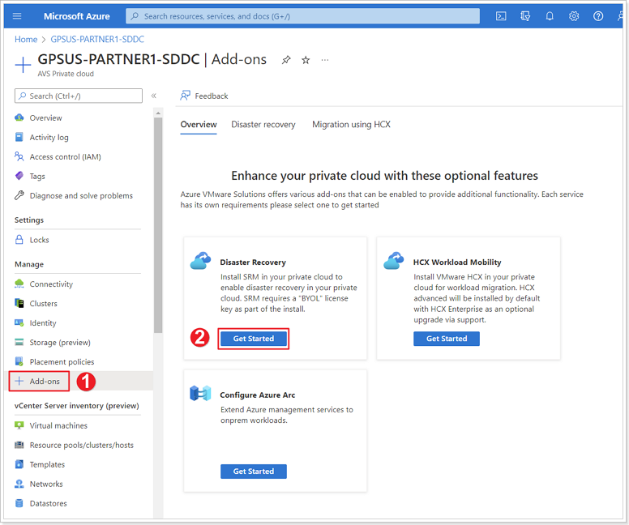
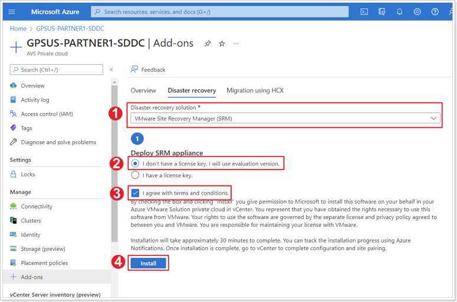
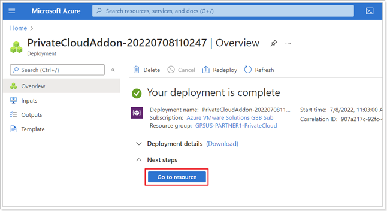
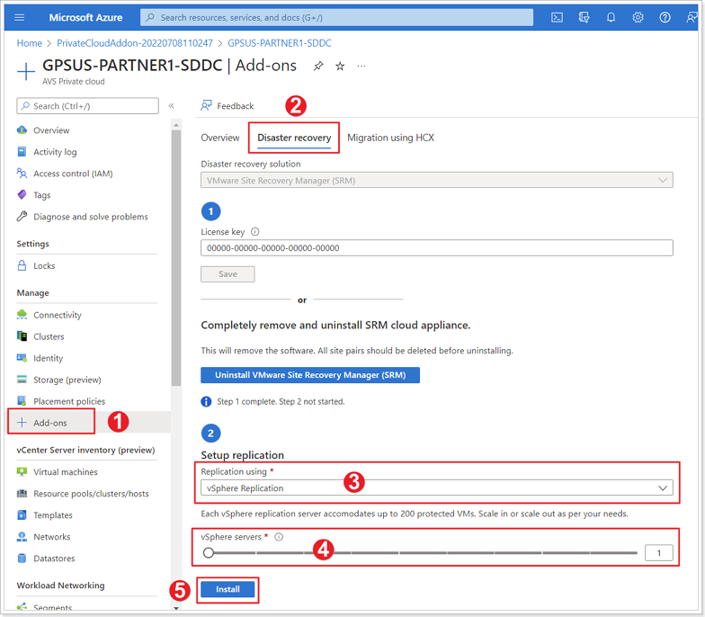
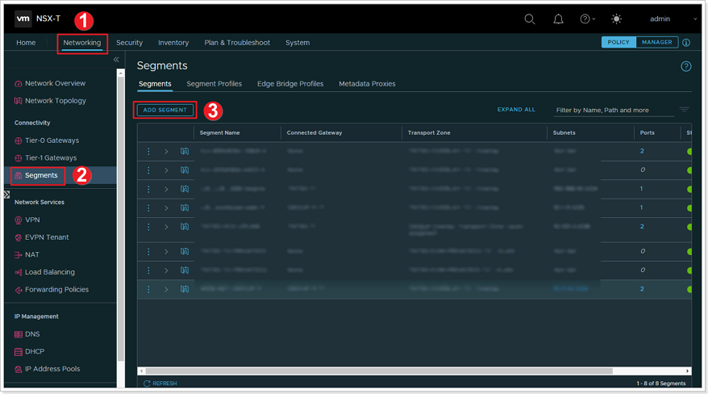
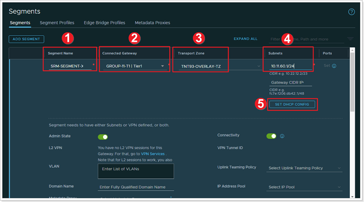
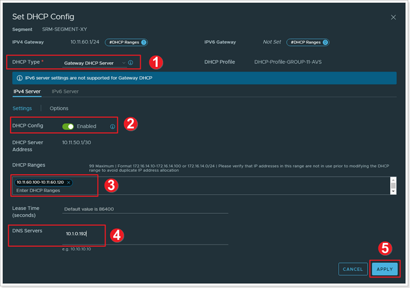
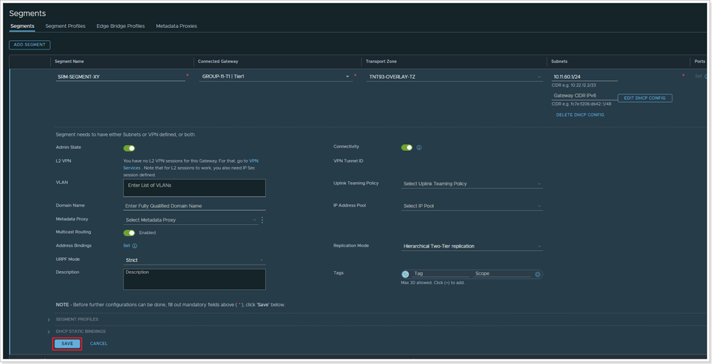

## **Configure Protected Site**

> **IMPORTANT** - Some of these exercises can only be done by one person in the group. If you find that someone in your group has already performed some of the Tasks/Exercises, please only use them as reference.

### **Exercise 1: Enable SRM in your AVS Private Cloud**

#### Step 1: Private Cloud SRM Installation

1. In your AVS Private Cloud blade, click **+ Add-ons**.
2. Click **Get Started** under **Disaster Recovery**.

#### Step 2: Deploy SRM Appliance

1. Select **VMware Site Recovery Manager (SRM) from the drop down box.
2. Select **I don't have a license key. I will use evaluation version.**.
3. Click the checkbox next to **I agree with terms and conditions.**
4. Click **Install**.

> It may take between 10-20 minutes for installation to completed. 

Monitor the progress of your deployment. When deployment completes click on **Go to resource**.

#### Step 3: Setup vSphere Replication

1. Click **+ Add-ons**.
2. Click **Disaster recovery**.
3. Select **vSphere Replication** from the drop down box.
4. Move the slider for **vSphere servers** to **1**.
5. Click **Install**.

> It may take between 10-20 minutes for installation to completed. 

**IMPORTANT - These steps may need to also be completed on your Recovery site (The AVS Private Cloud you'll be paired with). Either ask someone on that group to go through these steps or perform them yourself in the other AVS Private Cloud.**

### **Exercise 2:  Create NSX-T Segment in Protected Site**

> Remember X is your group number, Y is your participant number, Z is the SDDC you've been paired with.

In this exercise you will create a network segment in the production site and deploy a test VM to be protected with VMware Site Recovery Manager (SRM).

> This task requires a DHCP profile to be available in the private cloud. DHCP profiles have been configured in Module 1 for both GPSUS-PARTNER**X**-SDDC and GPSUS-PARTNER**Z**-SDDC (The other group should have configured this). If you did not complete the corresponding steps in Module 1, please go back to it and configure DHCP profiles before proceeding. [Add DHCP Profile in AVS Private Cloud.](/docs/module-1/module-1-task-2/#exercise-2-add-dhcp-profile-in-avs-private-cloud)

#### Step 1: Create NSX-T Network Segment

1. Log in to your AVS Private Cloud NSX-T interface, click on **Networking**.
2. Click **Segments**.
3. Click **ADD SEGMENT**.

#### Step 2: Configure NSX-T Network Segment

1. Give your network segment a name: **SRM-SEGMENT-XY**, where **X** is your group number and **Y** is your participant number.
2. **Connected gateway**: Select your T1 gateway you created in a previous module.
3. **Transport Zone**: Select your private cloud's default transport zone, should read **TNT\*\*-OVERLAY-TZ**.
4. **Gateway CIDR IPv4**: Enter 10.**XY**.60.1/24.
- For Participant 10 use 21 for group 1, 22 for group 2, 23 for group 3, etc. in lieu of **XY**.
5. Click on **SET DHCP CONFIG**.

#### Step 3: Set DHCP Config on NSX-T Network Segment

1. Under **DHCP Type**, ensure **Gateway DHCP Server** is selected.
2. Ensure the **DHCP Config** toggle is set to **Enabled**.
3. For **DHCP Ranges** enter: 10.**XY**.60.100-10.**XY**.60.120.
4. For **DNS Servers** enter: 10.1.0.192.
5. Click **APPLY**.

#### Step 4: Save your NSX-T Network Segment

Scroll down and click **SAVE** to save your NSX-T Network Segment. Click **NO** to close the configuration window. Confirm the segment is successfully configured by checking that it appears in the segments list.
