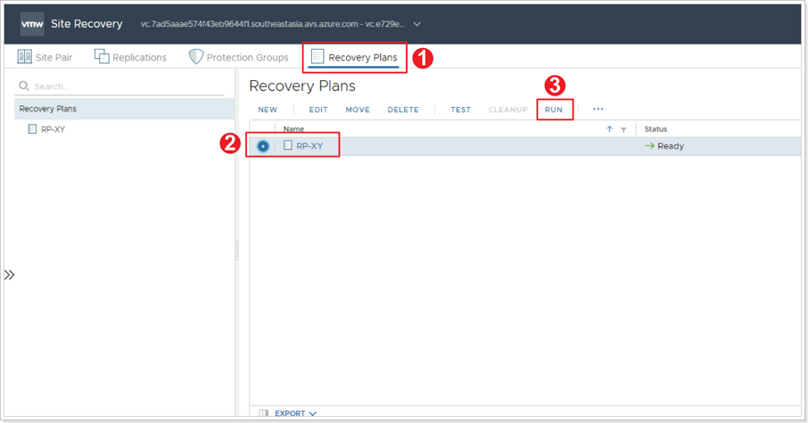
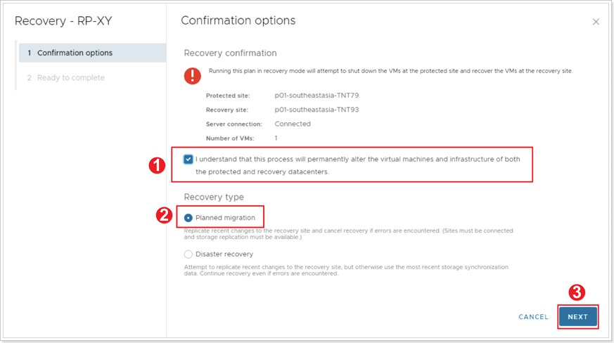

## **Failback Recovery Plan**

In this task, you will move the test VM back to the original protected site. This task can be performed either from the protected site’s or the recovery site’s SRM console. The steps are identical in both cases.

### **Exercise 1: Run Recovery Plan**

#### Step 1: Run Failback Recovery Plan

1. In either the recovery or protected site's SRM interface, click **Recovery Plans**. You may need to re-authenticate to the other site.
2. Select your Recovery Plan.
3. Click **RUN**.

#### Step 2: Failback Recovery Confirmation Options

1. Ensure the checkbox is selected for **I understand that this process will permanently alter the virtual machines and infrastructure of both the protected and recovery datacenters.**
2. Since you're performing a planned failback to the original protected site, select **Planned migration** as the recovery type.
3. Click **NEXT**, then click **FINISH**.

Monitor progress. When the recovery plan run completes, go to the primary site’s vCenter Server and confirm that the test VM is back online and attached to its original network segment.

Now that the test VM is running in the protected site, you need to also restore replication towards the recovery site. This is done by reprotecting the VM again. Repeat the steps you followed in the previous task for **Reprotecting a VM**.

This completes the lab for VMware SRM Disaster Recovery scenario.
