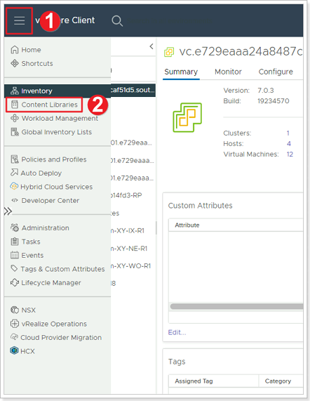
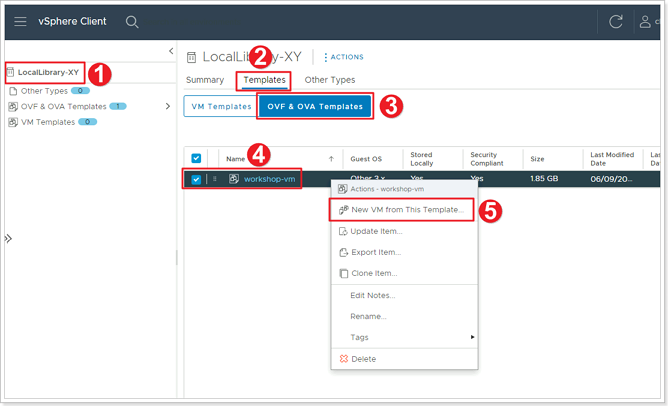
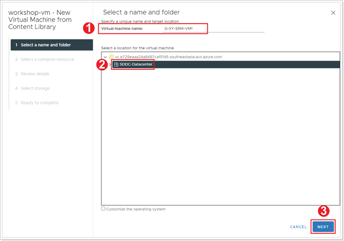
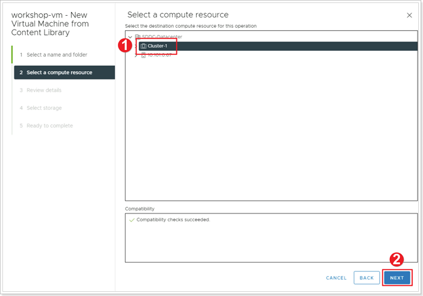
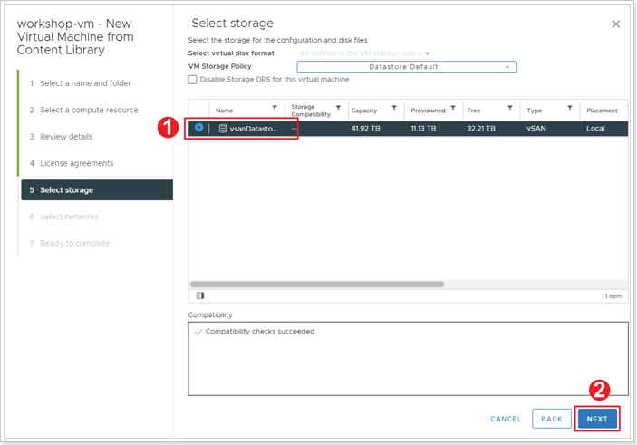
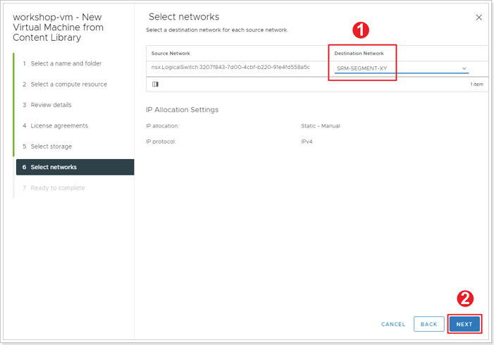
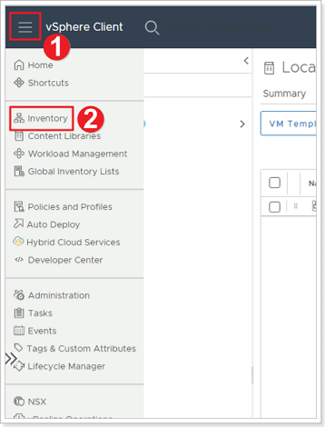
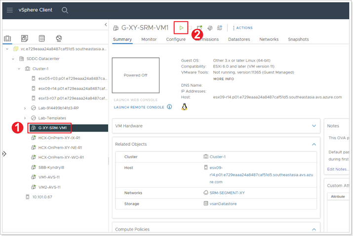
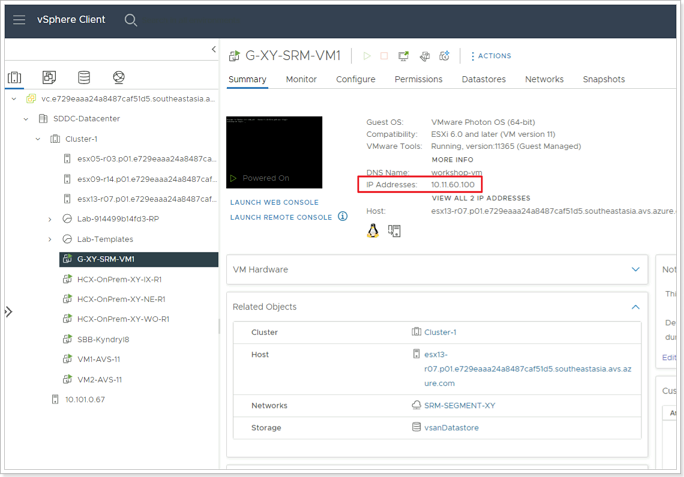

## **Create a VM in Protected Site**

>Remember X is your group number, Y is your participant number, Z is the SDDC you've been paired with.

In this task you will create a test VM in the protected site.

This task requires a VM template file to be available in the private cloud. A template has been added to the private cloud’s Local Library in Module 1. If you did not complete the corresponding steps in Module 1, please go back to it and add a template to your protected site’s Local Library.

### **Exercise 1: Create VM fron Content Library**

#### Step 1: Access Content Library

1. Log into the AVS vCenter Server for the protected site GPSUS-PARTNER**X**-SDDC. Click the Menu bar.
2. Select **Content Libraries**.

#### Step 2: Create VM from Template

1. Select the Content Library you created earlier: LocalLibrary-**XY**.
2. Click **Templates**.
3. Click **OVF & OVA Templates**.
4. Right-click on **workshop-vm** template which added to this library earlier.
5. Select **New VM from This Template**.

#### Step 3: Select Name and Folder for your VM

1. Set your VM's name to **G-XY-SRM-VM1**, where **X** is your group number and **Y** is your participant number.
2. Select **SDDC-Datacenter** as the location.
3. Click **NEXT**.

#### Step 4: Select a compute resource for your VM

1. Select **Cluster-1**.
2. Click **NEXT**.

#### Step 5: Select Storage for your VM

Click **NEXT** on **Review details** and agree to **License agreements**.

1. Select **vsanDatastore**.
2. Click **NEXT**.

#### Step 6: Select Network for your VM

1. For **Destination Network** select your previously created **SRM-SEGMENT-XY** network.
2. Click **NEXT**.

In the **Ready to Complete** page, click **FINISH**.

#### Step 7: Power-on VM

1. Click on the Menu Bar.
2. Select **Inventory**.

1. Select your newly created VM **G-XY-SRM-VM1**.
2. Click the play button to power your VM on.

#### Step 8: Ensure IP Address has been assigned to VM

