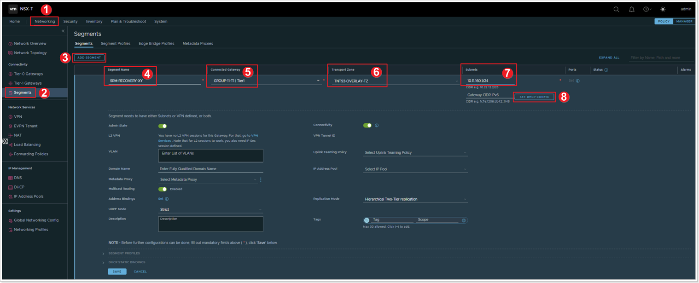
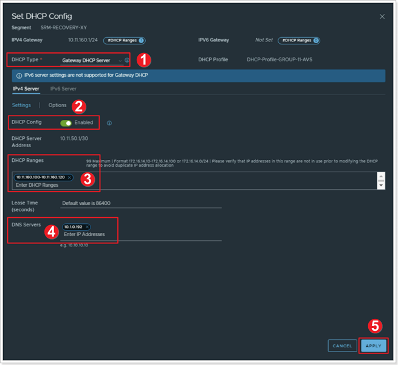

## **Recovery Site**

>Remember X is your group number, Y is your participant number, Z is the SDDC you've been paired with.

In this task you will configure the recovery site GPSUS-PARTNER**Z**-SDDC with a network segment for the VMs moved by SRM from the primary site. In this lab, we focus on a basic scenario where the VMs protected by SRM do not need to retain their IP address when moved to the recovery site. A DHCP service is used both in the protected and in the recovery site to assign IP addresses to VMs when they boot.

> This task requires a DHCP profile to be available in the recovery private cloud. DHCP profiles have been configured in Module 1 for both GPSUS-PARTNER**X**-SDDC and GPSUS-PARTNER**Z**-SDDC. If you did not complete the corresponding steps in Module 1, please go back to it and configure DHCP profiles before proceeding.

Log into NSX-T for the recovery site GPSUS-PARTNER**Z**-SDDC. Please note that, because of the AVS Interconnect connectivity that has been configured in Module 1 between the protected and the recovery private clouds, you can access vCenter and NSX-T for both from the same jump-box.

### **Exercise 1: Add Network Segment in Recovery Site**

#### Step 1: Add Segment

1. In the Recovery Site NSX-T interface click **Networking**.
2. Click **Segments**.
3. Click **ADD SEGMENT**.
4. Give the segment a name: **SRM-RECOVERY-XY**.
5. Select the appropriate T1 **Connected Gateway**. Use the default TNT**-T1 gateway in the recovery site.
6. Select the appropriate **Transport Zone** overlay - **TNT\*\*-OVERLAY-TZ**.
7. For **Subnets** add 10.**XY**.160.1/24.
8. Click **SET DHCP CONFIG**.

#### Step 2: Set DHCP Configuration

1. Ensure the **DHCP Type** is set to **Gateway DHCP Server**.
2. Ensure the **DHCP Config** toggle button is set to **Enabled**.
3. For **DHCP Ranges** enter: 10.**XY**.160.100-10.**XY**.160.120.
4. For **DNS Servers** enter **10.1.0.192**.
5. Click **APPLY**, then **SAVE** the network segment configuration, click **NO** for the next question.

