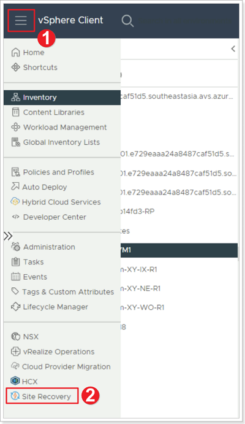
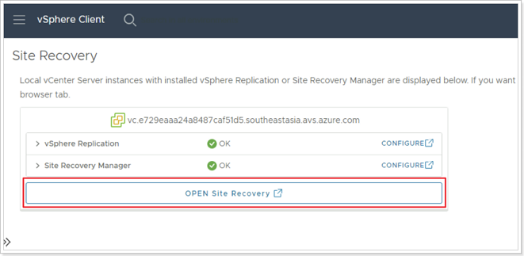
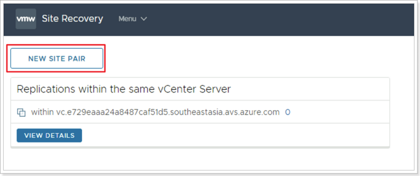
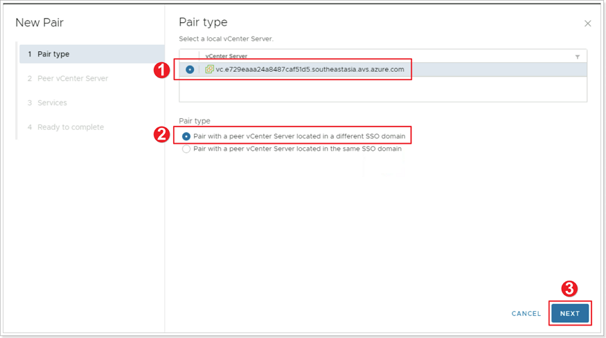
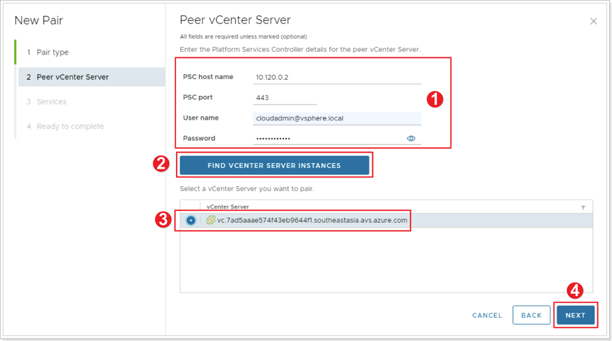
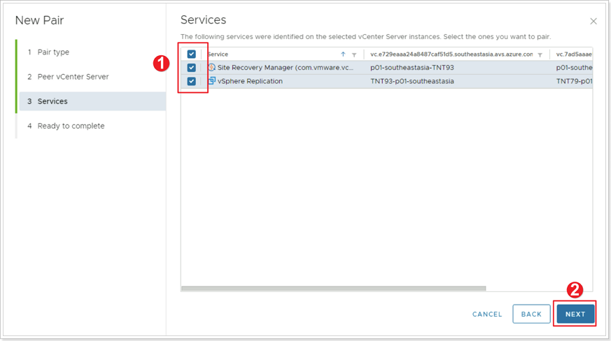
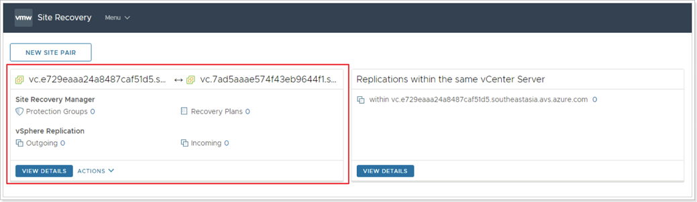

## **SRM Site Pairing**

>Remember X is your group number, Y is your participant number, Z is the SDDC you've been paired with.

In this task you will pair the protected site GPSUS-PARTNER**X**-SDDC and the recovery site GPSUS-PARTNER**Z**-SDDC.

### **Exercise 1: Site Pairing**

Site pairing can be configured from vCenter on either the primary or the recovery private cloud. You will work on the primary site’s vCenter.

#### Step 1: Access Site Recovery Manager from vCenter Server

1. Log into vCenter Server in the primary AVS private cloud GPSUS-PARTNER**X**-SDDC and click the menu bat.
2. Select **Site Recovery** from the main menu.

Click **OPEN Site Recovery**.

#### Step 2: Create New Site Pair

Click **NEW SITE PAIR**.

#### Step 3: Select local vCenter Server

1. Ensure your local vCenter Server is selected.
2. Ensure **Pair with a peer vCenter Server located in a different SSO domain** is selected.
3. Click **NEXT**.

#### Step 4: Peer vCenter Server

1. Enter the vCenter Server information for the Recovery site. This should be GPSUS-PARTNER**Z**-SDDC.
2. Click **FIND VCENTER SERVER INSTANCES**. If a warning shows up click **CONNECT**.
3. Select your peer vCenter Server.
4. Click **NEXT**.

#### Step 5: Select services identified

1. Select the top checkbox to select all services.
2. Click **NEXT**. Then click **FINISH**.

#### Step 6: Confirm Site Pairing Completes

When the configuration process completes, the SRM main page displays the new site pairing.
