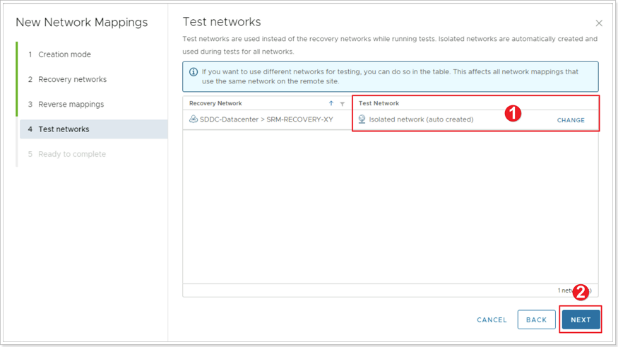
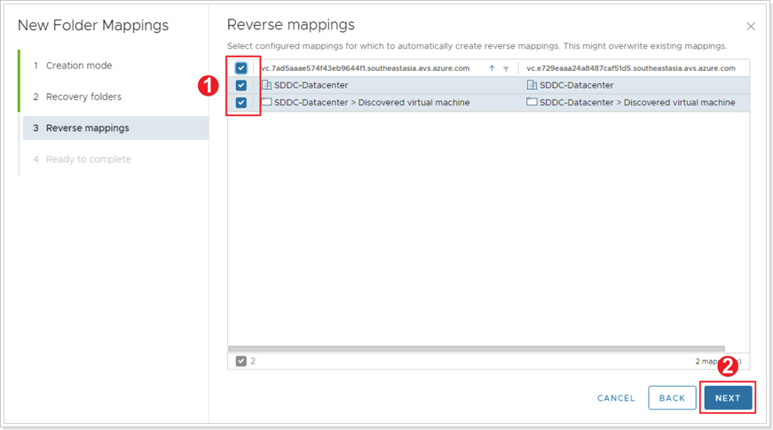
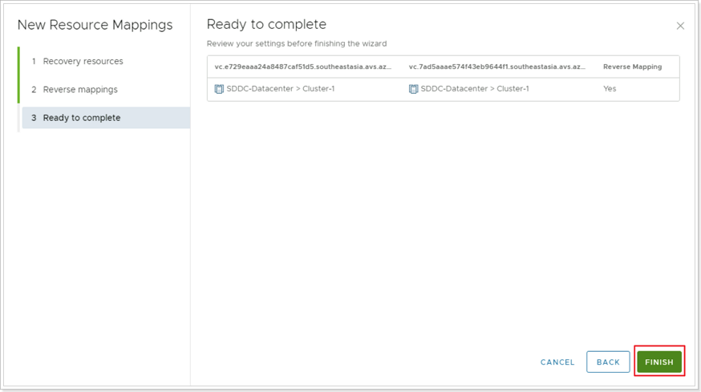

## **SRM Inventory Mappings**

>Remember X is your group number, Y is your participant number, Z is the SDDC you've been paired with.

In this task you will configure inventory mappings, which define the resources (networks, folders, compute resources, storage policies) that VMs must use when moved to the recovery site. It is also possible to define reverse mappings,
which control resource allocation for failback processes.

### **Exercise 1: Network mappings**

#### Step 1: Log in to Site Recovery Manager

In the **Site Recovery** interface, click the **VIEW DETAILS** button on the paired sites.

#### Step 2: Authenticate to Recovery Site

You may need to re-authenticate to the recovery site. Enter those credentials and click **LOG IN**.

#### Step 3: Create New Network Mapping

1. Click **Network Mappings** in the left pane.
2. Click **NEW**.

#### Step 4: Network Mappings Creation Mode

1. Click to select **Prepare mappings manually**.
2. Click **NEXT**.

#### Step 5: Configure Recovery Network Mappings

1. Select first the SRM Protected Segment created earlier called **SRM-SEGMENT-XY**.
2. On the right side select **SRM-REcOVERY-XY**.
3. Click **ADD MAPPINGS** button.
4. Click **NEXT**.

#### Step 6: Configure Reverse Mappings

1. Select the checkbox to set the reverse mappings for the network.
2. Click **NEXT**.

#### Step 7: Test Networks

1. Define a **Test Network**. SRM allows you to specify a test network your recovered VMs will connect to when performing a DR test or you can let SRM auto create the test networks. For the purposes of this workshop leave the default of auto created.
2. Click **NEXT**.

#### Step 8: Complete Network Mappings

To complete the network mappings setup click **FINISH**.

### **Exercise 2: Folder Mappings**

#### Step 1: New Folder Mappings

1. Click **Folder Mappings**.
2. Click **NEW**.

#### Step 2: Folder Mappings Creation Mode

1. Ensure **Automatically prepare mappings for folders with matching names** is selected.
2. Click **NEXT**.

#### Step 3: Configure Recovery Folders

1. Select **SDDC-Datacenter** on both sides.
2. Click **ADD MAPPINGS**.
3. Click **NEXT**.

#### Step 4: Folder Reverse Mappings

1. Select all checkboxes to create the folder reverse mappings.
2. Click **NEXT**.

#### Step 5: Complete Folder Mappings

Click **FINISH** button to complete Folder Mappings.

### **Exercise 3: Resource Mappings**

#### Step 1: Create New Resource Mapping

1. Click **Resource Mappings**.
2. Click **NEW**.

#### Step 2: Configure Recovery Resource Mappings

1. Expand **SDDC-Datacenter** on both sides and select **Cluster-1**.
2. Click **ADD MAPPINGS**.
3. Click **NEXT**.

#### Step 3: Reverse Mappings

1. Select all checkboxes to create the resource reverse mappings.
2. Click **NEXT**.

#### Step 4: Complete Resource Mappings

Click **FINISH** button to complete Resource Mappings.

### **Exercise 4: Storage Policy Mappings**

#### Step 1: Create New Storage Policy Mappings

1. Click **Storage Policy Mappings**.
2. Click **NEW**.

#### Step 2: Storage Policy Creation Mode

1. Ensure **Automatically prepare mappings for storage policies with matching names** is selected.
2. Click **NEXT**.

#### Step 3: Configure Recovery Storage Policy Mappings

1. Click and select **vSAN Default Storage Policy** on both sides.
2. Click **ADD MAPPINGS**.
3. Click **NEXT**.

#### Step 4: Reverse Mappings

1. Select all checkboxes to create the Storage Policy Reverse Mappings.
2. Click **NEXT**.

#### Step 5: Complete Storage Policy Mappings

Click **FINISH** button to complete the Storage Policy Mappings.

### **Placeholder Datastores**

For this exercise there's no need to create a Placeholder Datastore. If there's no Placeholder Datastore, you are free to go and create one, just select the **vsanDatastore**.

