## **SRM Protection Groups**

In this task you will configure vSphere replication for the test VM created in Task 2 as well as a Protection Group for this VM and a recovery plan to protect it. This task is performed from the primary site’s vCenter Server.

### **Exercise 1: Create Protection Group**

#### Step 1: Create New Protection Group

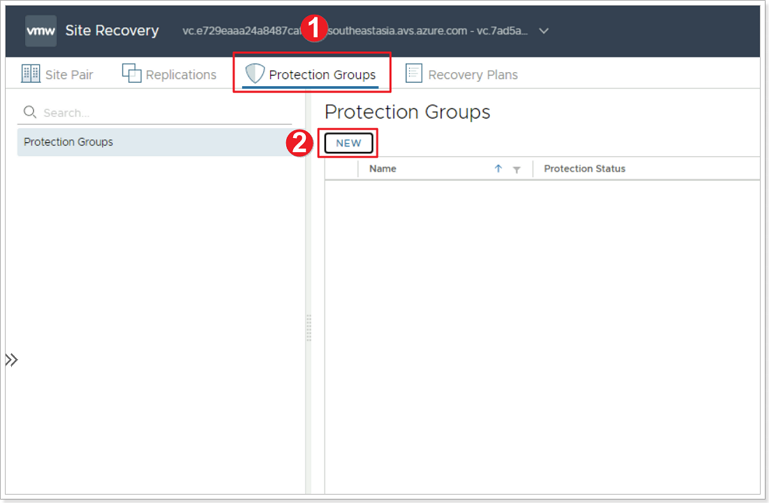

1. Click **Protection Groups**.
2. Click **NEW**.

#### Step 2: Name and Direction for Protection Group

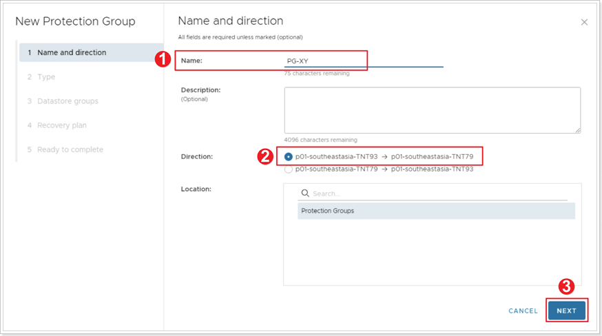

1. Give your Protection Group a name: **PG-XY**, where **X** is your group number and **Y** is your participant number.
2. Select the direction for your Protection Group (leave the default).
3. Click **NEXT**.

#### Step 3: Select the Type of Protection Group

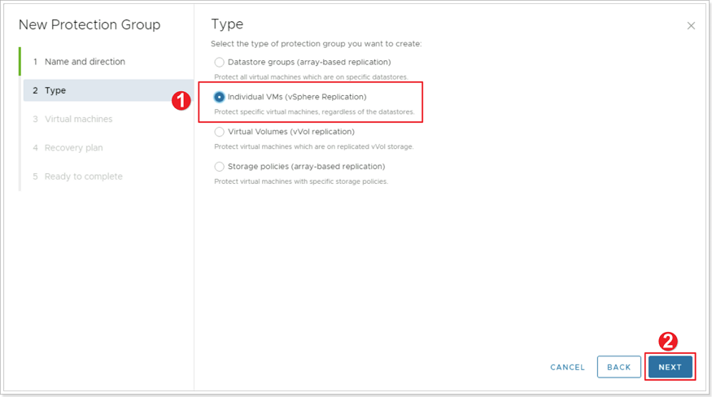

1. Select **Individual VMs (vSphere Replication)**.
2. Click **NEXT**.

#### Step 4: Virtual Machines

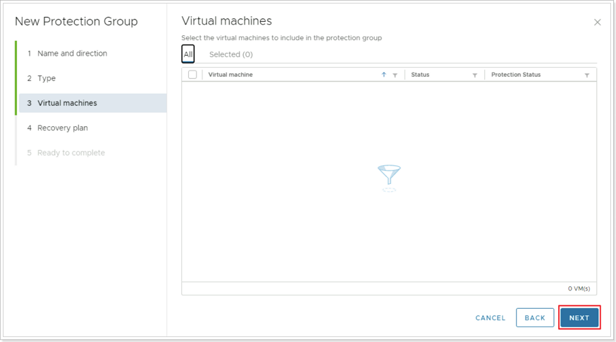

Click **NEXT** and do not include any Virtual Machines in the protection group yet.

#### Step 5: Recovery Plan

1. Select **Do not add to recovery plan now**.
2. Click **NEXT**.

#### Step 6: Complete Protection Group

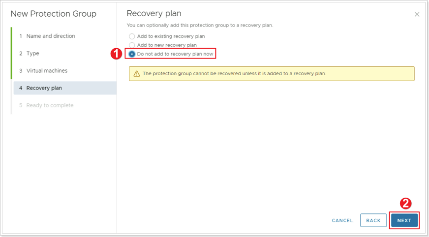

Click **FINISH** to complete the creation of your Protection Group.

### **Exercise 2: Protect Virtual Machine with SRM**

#### Step 1: Configure Replication

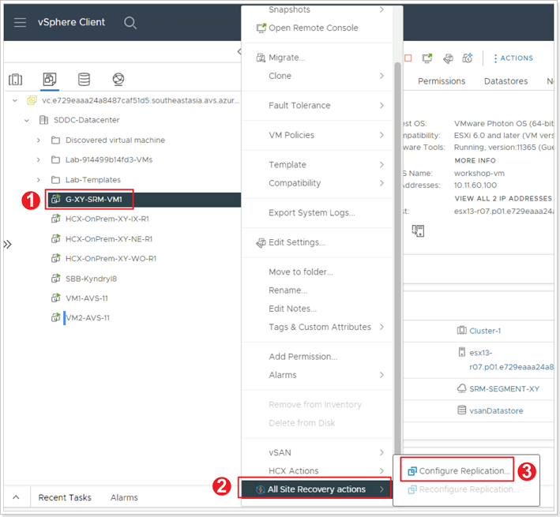

> Make sure to disable pop-ups in your browser for this step.

1. From your Protected vCenter Server locate the VM you created earlier, right-click.
2. Select **All Site Recovery actions**.
3. Click **Configure Replication**.

#### Step 2: Configure Target Site

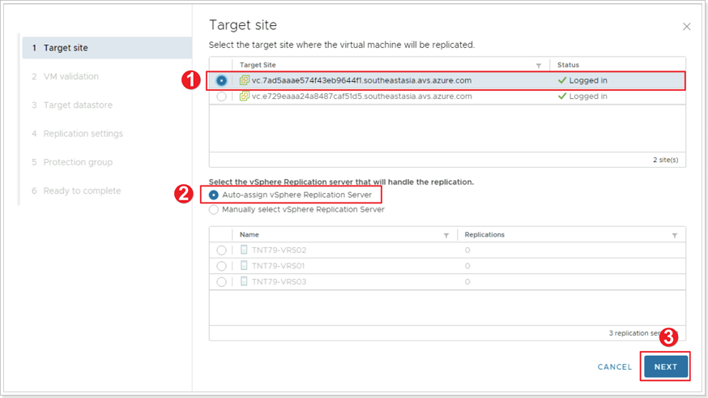

1. Select the target site to replicate the VM to.
2. Ensure **Auto-assign vSphere Replication Server** is selected.
3. Click **NEXT**.

#### Step 3: VM Validation

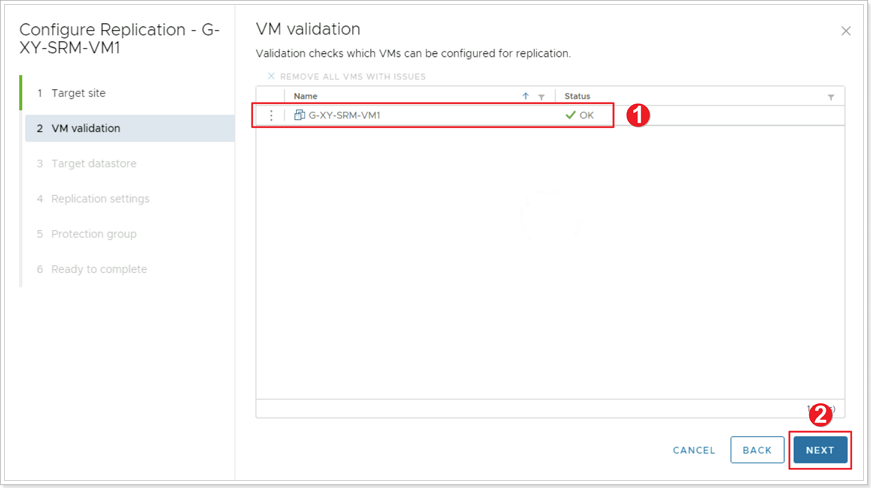

1. Ensure the status of the VM validation is **OK**.
2. Click **NEXT**.

#### Step 4: Target Datastore

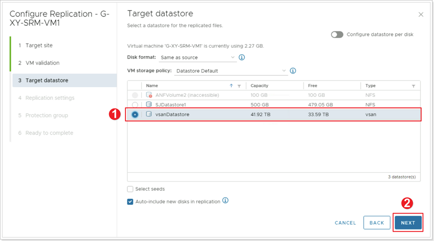

1. Select **vsanDatastore** as the location for the replicated files. Leave all other defaults.
2. Click **NEXT**.

#### Step 5: VM Replication Settings

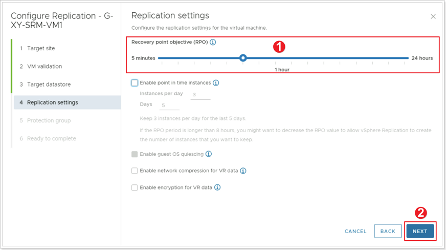

1. Leave all defaults, **Recovery point objective (RPO)** should be set to **1 hour**.
2. Click **NEXT**.

#### Step 6: Assign to Protection Group

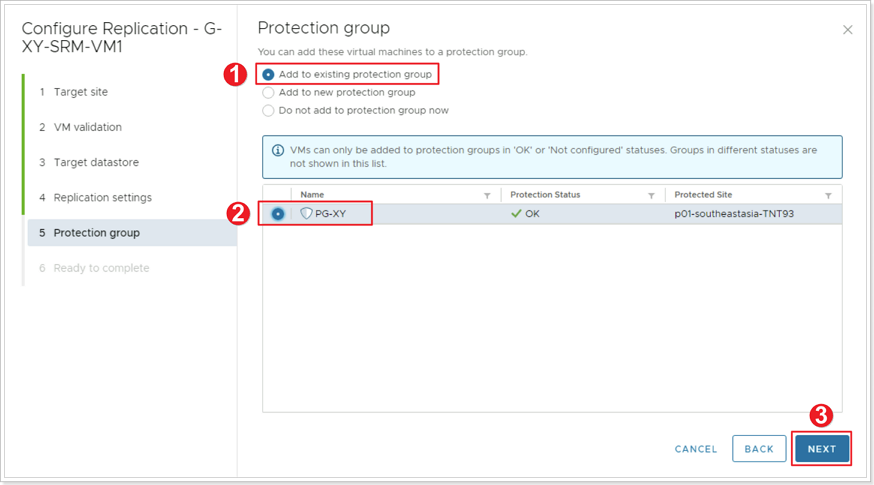

1. Ensure **Add to existing protection group** is selected.
2. Select the **PG-XY** Protection Group you recently created.
3. Click **NEXT**.

#### Step 7: Complete Configuring Replication

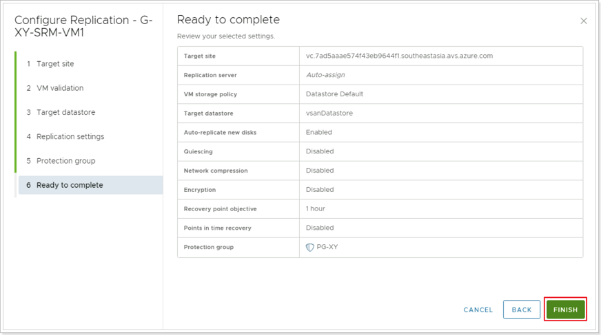

Click **FINISH** to complete the configuration of the replication for the VM.

### **Exercise 3: Recovery Plans**

#### Step 1: Name and Direction for Recovery Plan

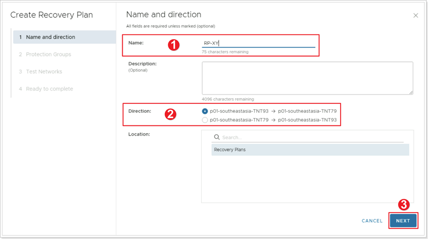

1. Give your Recovery Plan a name: **RP-XY**, where **X** is your group number and **Y** is your particpant number.
2. Ensure the **Direction** of the Recovery Plan is correct.
3. Click **NEXT**.

#### Step 2: Add Protection Group to Recovery Plan

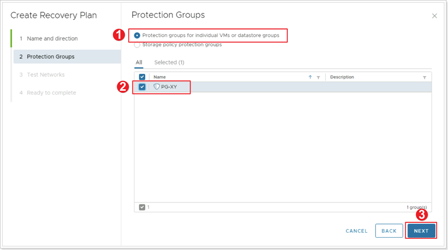

1. Ensure **Protection groups for individual VMs or datastore groups** is selected.
2. Select your **PG-XY** Protection Group you created earlier.
3. Click **NEXT**.

#### Step 3: Test Networks

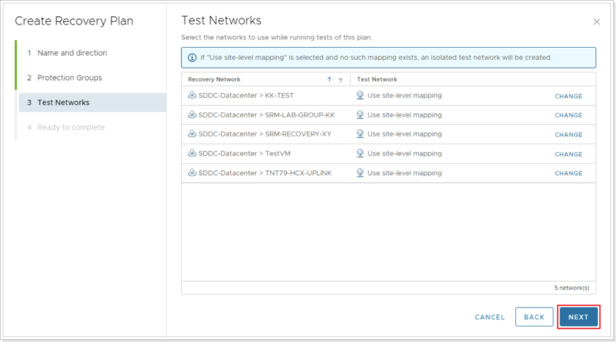

Leave the defaults for **Test Networks** and click **NEXT**.

#### Step 4: Complete Creation of Recovery Plan

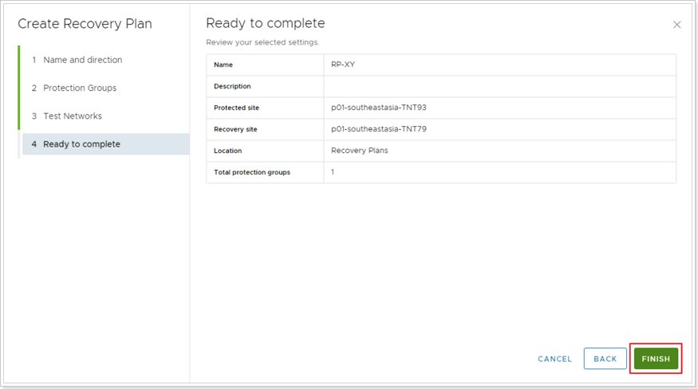

Click **FINISH** to complete the creation of your Recovery Plan.

### **Confirm Placeholder VM in Recovery Site**

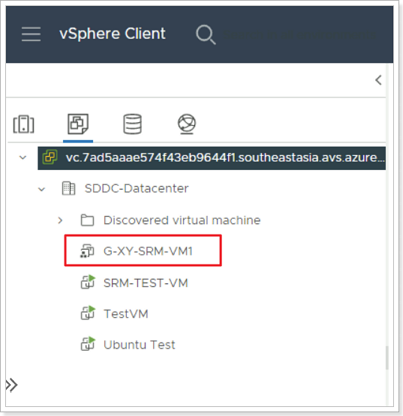

Log in to your Recovery Site vCenter Server and locate the Placeholder VM created by SRM.
