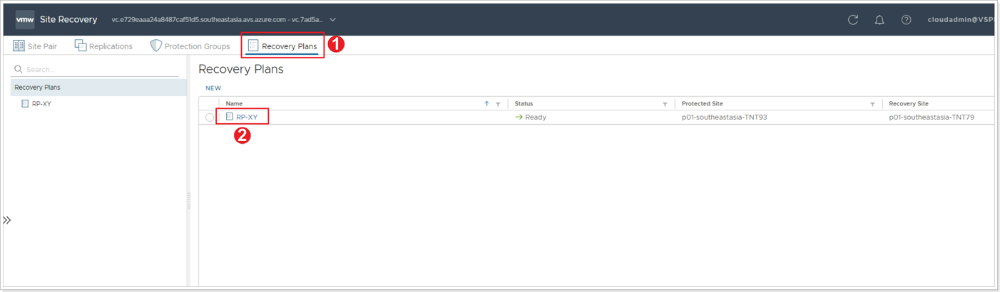
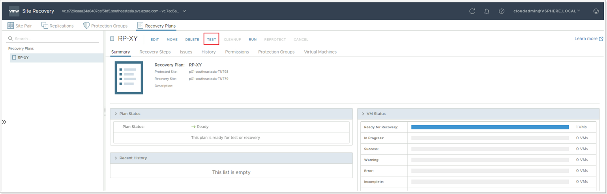
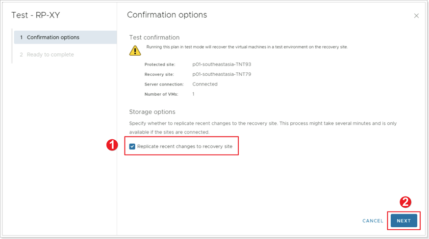
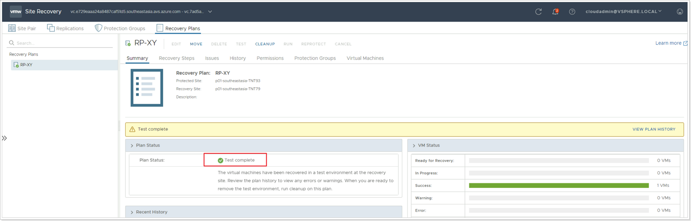
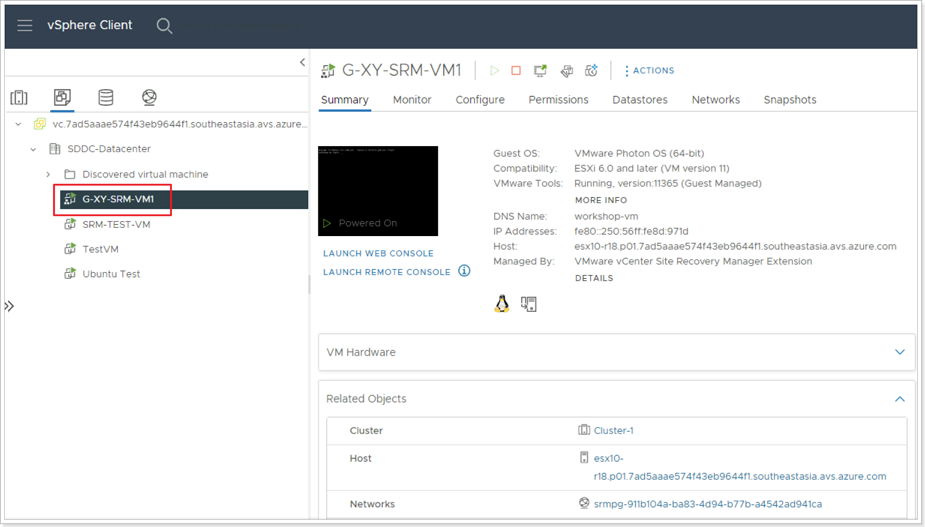
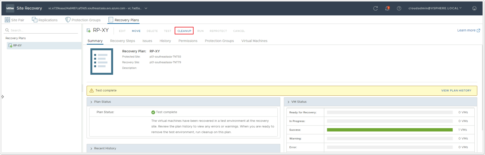
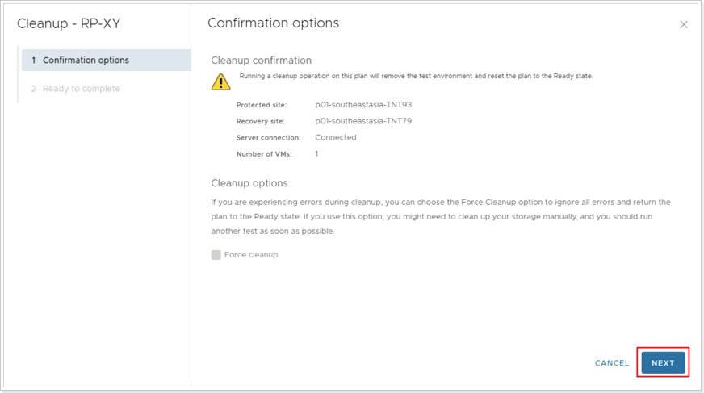

## **Recovery Plan Testing**

In this task you will test the recovery plan created in the previous step.

### **Exercise 1: Test Recovery Plan**

#### Step 1: Initiate Test

1. In the protected site’s SRM console, click **Recovery Plans**.
2. Click the Recovery Plan you created earlier.

Click on **TEST** to intiate the test of your Recovery Plan.

#### Step 2: Confirmation Options

1. Review the confirmation options, especifically, if you'd like to **Replicate recent changes to recovery site**.
2. Click **NEXT**. Then click **FINISH**.

#### Step 3: Monitor Plan Status

Monitor the plan status until it reads **Test complete**.

#### Step 4: Confirm Recovery of VM in Recovery vCenter Server

Log in to the Recovery vCenter Server's and confirm the VM you created earlier and protected has been successfully powered on at the Recovery Site. 

Since this was a recovery plan **test**:
-   The VM in the protected site has NOT been shut down.
-   The VM in the recovery site has been attached to an isolated network segment, as per the configuration you created in a previous task.

#### Step 5: Cleanup

You can now complete your recovery plan testing process by cleaning up the recovery site. In the SRM console, click on the **CLEANUP** button.

Under **Confirmation options** click **NEXT**, then click **FINISH**.

This process cleans up (powers off) the VM and returns everything to the previous state for protection.
