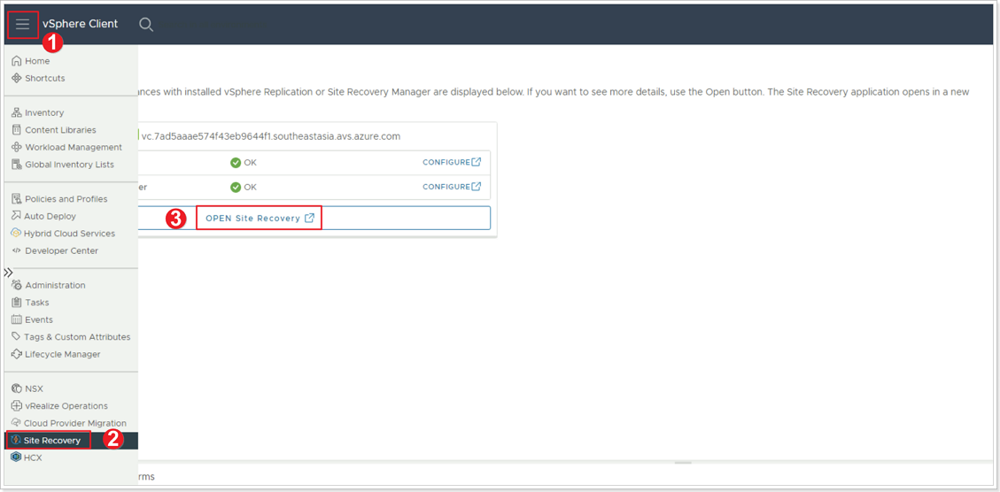
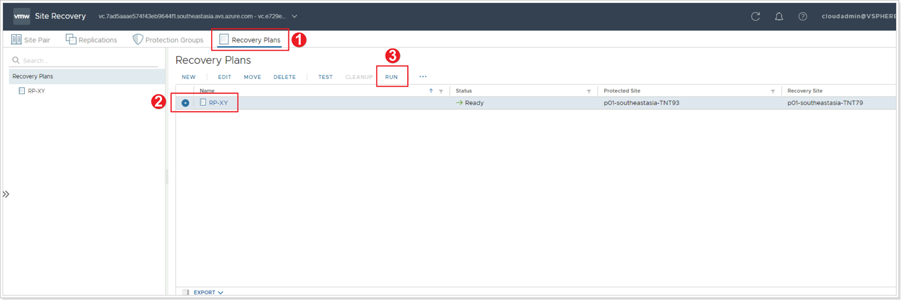
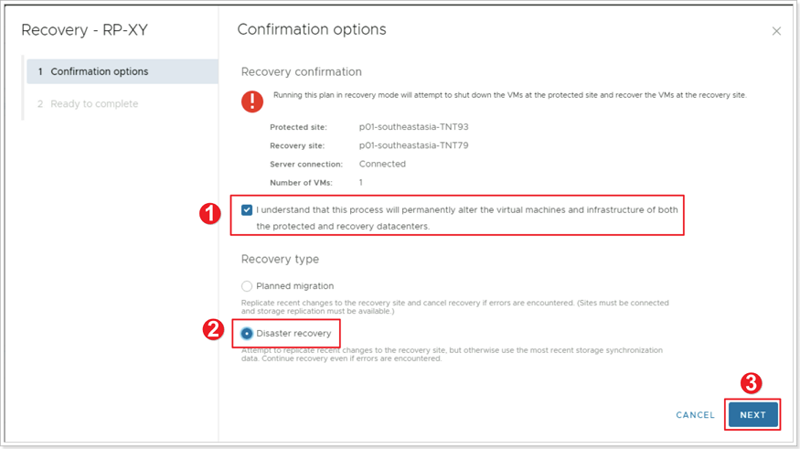
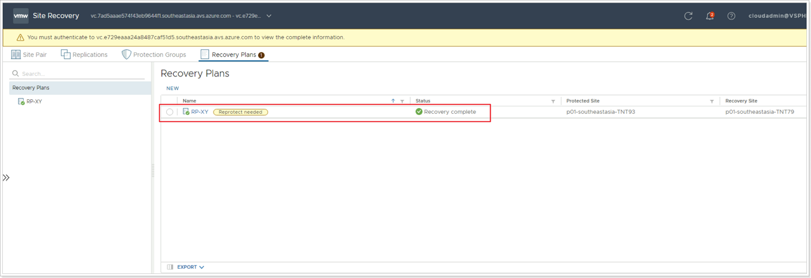

## **Run Failover Recovery Plan**

In this task you will execute the recovery plan you configured in the previous tasks. For planned migrations, a recovery plan can be run from either the primary or the protected site. In case of an actual disaster at the protected site, it must be triggered from the recovery site (the only one that is still online). The steps to run a recovery plan are the same in both cases. In this task, we will run a recovery plan from the recovery site to simulate a disaster recovery scenario.

### **Exercise 1: Run Recovery Plan from Recovery Site**

#### Step 1: Access Site Recovery in Recovery Site

1. Log into the recovery site’s vCenter Server, click the menu bar.
2. Select **Site Recovery** from the main menu.
3. Click on the **OPEN SITE RECOVERY** button.

In the SRM console, open the already configured site pair by clicking on the **VIEW DETAILS** button.

#### Step 2: Run Recovery Plan

When prompted for the credentials to log into the protected site, click on the **CANCEL** button – we are assuming that the protected site is no longer online, because of a disaster.

1. Click on **Recovery Plans**.
2. Select the Recovery Plan you previously created.
3. Click **RUN**.

#### Step 3: Confirm Options for Recovery Plan

1. Click the checkbox that reads **I understand that this process will permanently alter the virtual machines and infrastructure of both the protected and recovery datacenters.**
2. Select **Disaster recovery**.
3. Click **NEXT**, then click **FINISH**.

#### Step 4: Monitor Recovery until Completion

Monitor progress in the SRM console until it shows **Recovery complete**. Also note the **Reprotect needed** label.

#### Step 5: Confirm Recovery

When the recovery process is marked complete, go to the recovery site’s vCenter Server and verify that the test VM you created earlier is powered on (1) and attached to the network segment also created earlier (2).
