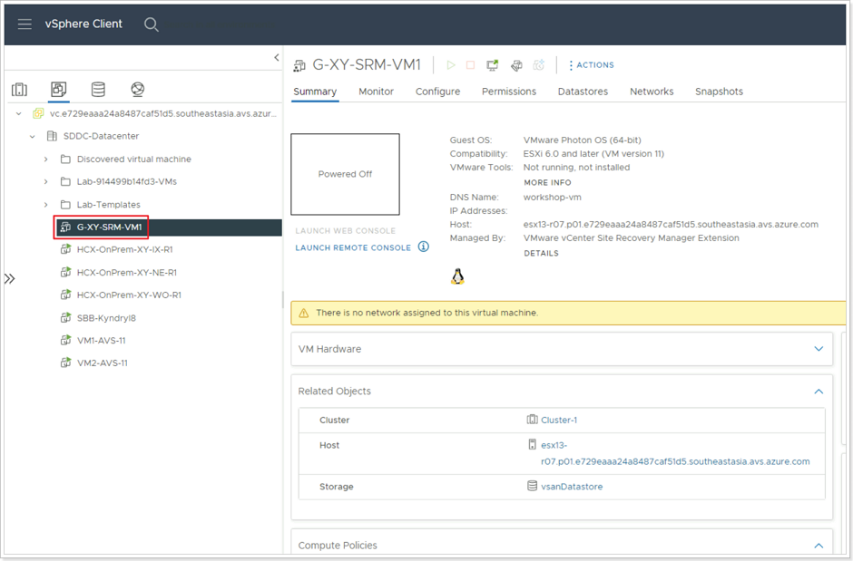

## **Reprotection of Recovered VM**

In this task, we assume that the primary site has been brought back online. Reprotection is the SRM feature that allows migrated VMs in the recovery site to be synchronized back to the protected site.

### **Exercise 1: Reprotect VM**

#### Step 1: Execute Recovery Plan Reprotection

1. Remember that your primary (Protected) site was assumed to be offline. You will need to login to it now that it's back up, so clcik the **LOGIN** button and enter the credentials for your protected site.
2. Go to **Recovery Plans**.
3. Select your recovery plan.
4. Click the 3 dots.
5. Click **Reprotect**.

#### Step 2: Reprotect Confirmation Options

1. Ensure the checkbox is checked for **I understand that this operation cannot be undone.**
2. Click **NEXT**, then click **FINISH**.

#### Step 3: Confirm Successful Reprotection

Go to the protected site’s vCenter Server and confirm that a placeholder VM has been created. Because your VM in the Recovery site is ahead of the original VM on premises, roles have been reversed and the VM in the Recovery site is being replicated to the Protected (primary) site.
