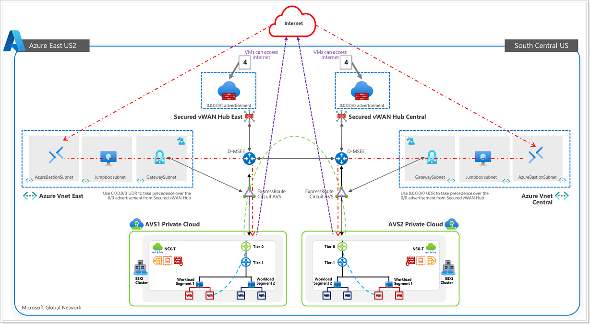

> **This module is being updated**. Some of the instructions and screenshots may not be applicable anymore. However, the concept is still valid and can be applied.

## Introduction

Now that the Tier-0 and Tier-1 routers are configured, it’s time to see if
workloads can access the internet. The key takeaway here is to setup a Secured
vWAN Hub to allow internet egress and ingress (if necessary) for the VMs on AVS.

In this section you will learn how to:

-   Create a secure VWAN hub

-   Configure Azure Firewall with a public IP

-   Configure Azure Firewall

Before we start the steps, let’s validate if the AVS VMs can access internet. In
the previous section, you accessed VM1 from the vCenter portal. Verify that from
VM1 that you can not

-   Access [www.google.com](http://www.google.com) by name. On the server,
    type:     
    `wget www.google.com`

-   Access [www.google.com](http://www.google.com) by IP. On the server, type:

    `wget https://142.250.9.101`

You may also use utilities such as ping or nslookup to validate.

