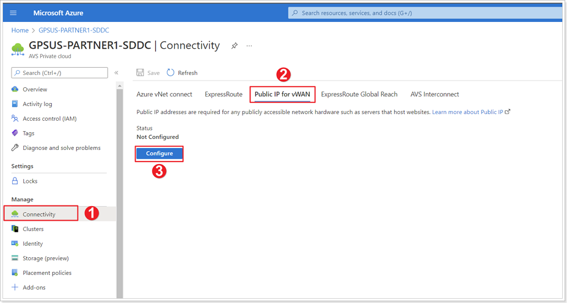
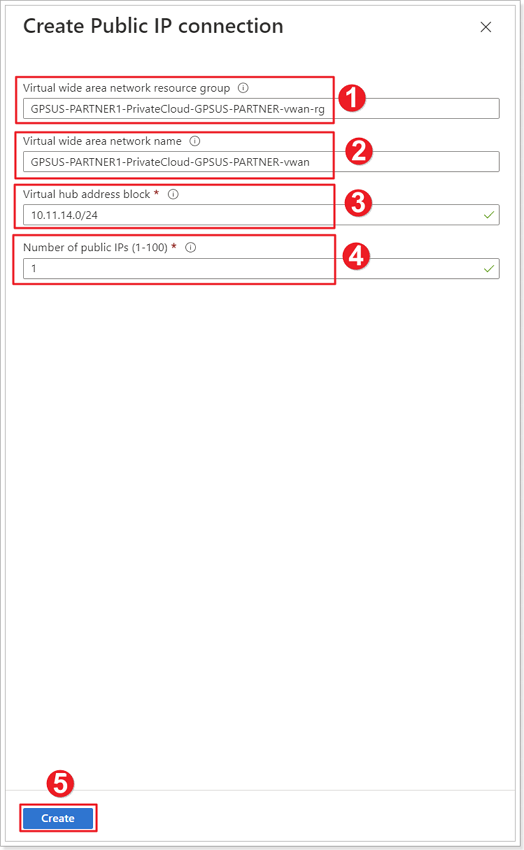
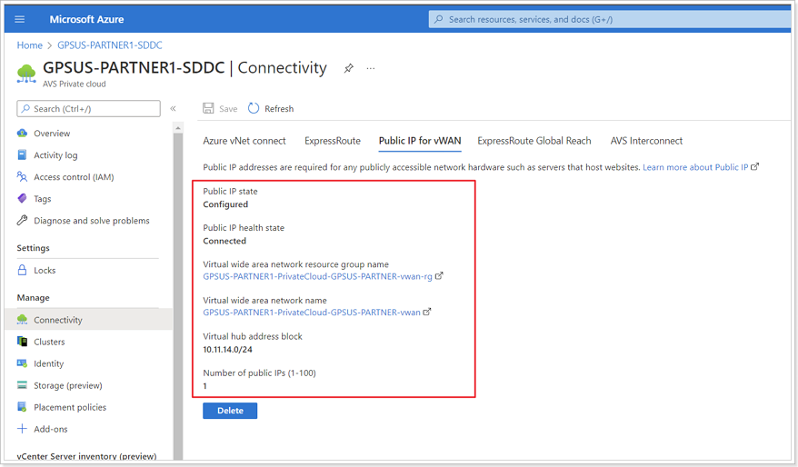

## **Public IP for vWAN**

### **Exercise 1: Configure vWAN in AVS Private Cloud**

#### Step 1: Configure Public IP for vWAN

1. In the Azure portal, in your AVS Private Cloud blade, click **Connectivity**.
2. Click **Public IP for vWAN**.
3. Click **Configure**.

#### Step 2: Create Public IP Connection

1. **Virtual wide area network resource group** is auto-populated and cannot be modified in the portal.
2. **Virtual wide area network name** is also auto-populated.
3. **Virtual hub address block** - Use the following value: 10.**XY**.4.0/24, where **X** is your group number and **Y** is your participant number.

> It takes about an hour to complete the deployment of all components. This deployment only must occur once to support all future public IPs for this Azure VMware Solution environment.

#### Step 3: Confirm Successful Deployment

Ensure your deployment succeeds.

