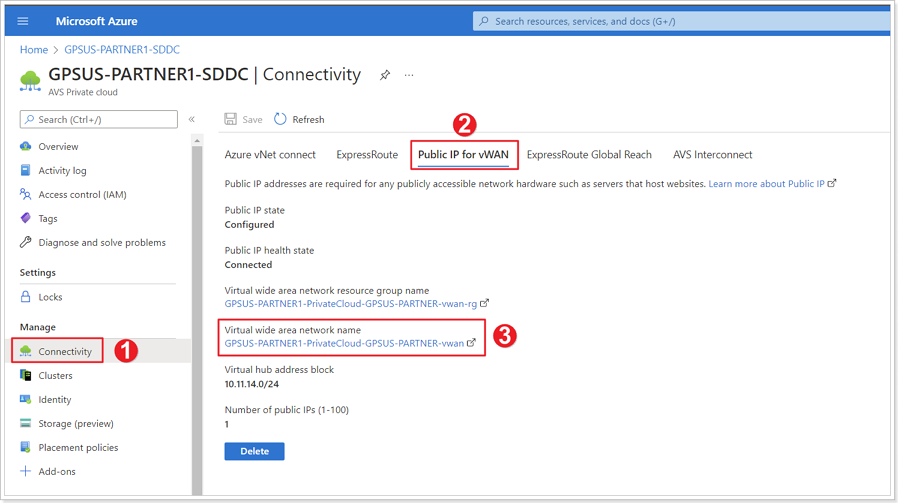
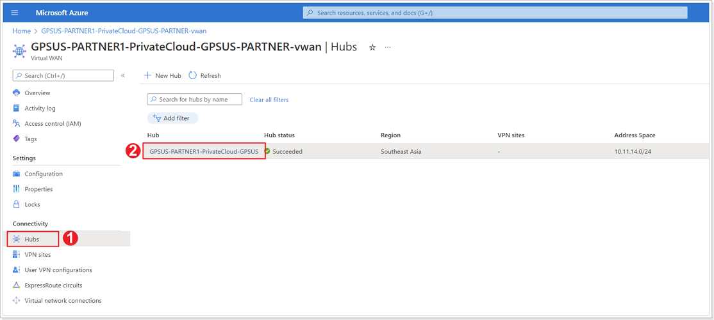
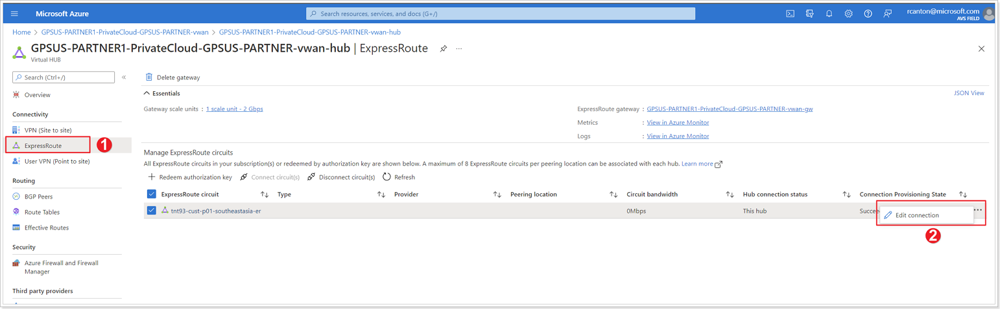
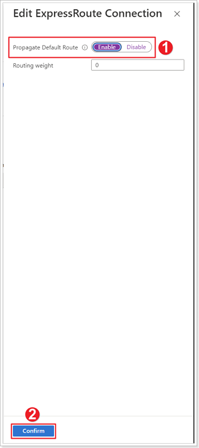

## **Propagate Default Route**

### ***Exercise 1: Default Route Propagation to Virtual WAN**

#### Step 1: Access Virtual WAN

1. In your AVS Private Cloud blade click **Connectivity**.
2. Click **Public IP for vWAN**.
3. Click your newly created **Virtual wide area network**.

#### Step 2: Access Hub in Virtual WAN

1. Click **Hubs**.
2. Click the name of your newly created virtual WAN.

#### Step 3: Edit ExpressRoute Connection

1. Click **ExpressRoute**.
2. Click on the elipsis then click **Edit connection**.

#### Step 4: Enable Propagate Default Route

1. Ensure the **Enable** button is enabled for **Propagate Default Route**.
2. Click **Confirm**.
