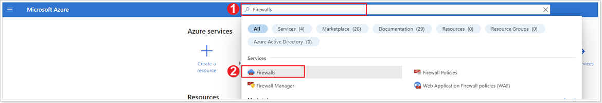
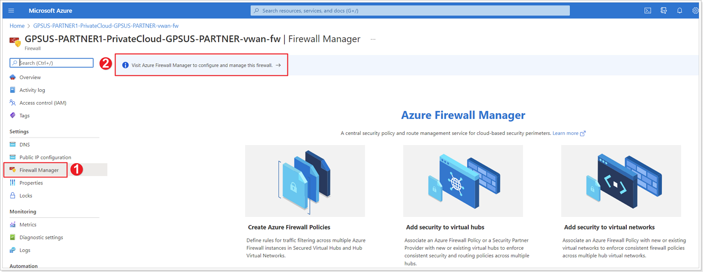
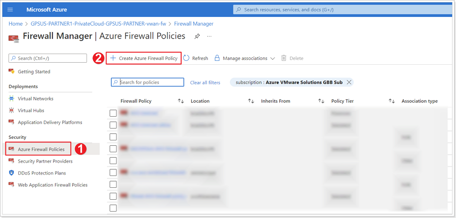
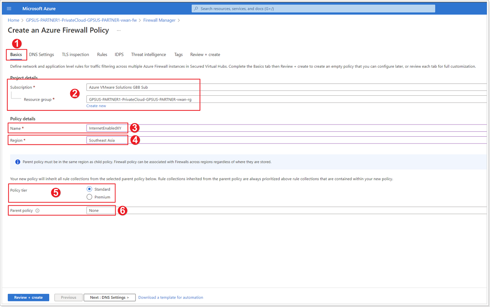
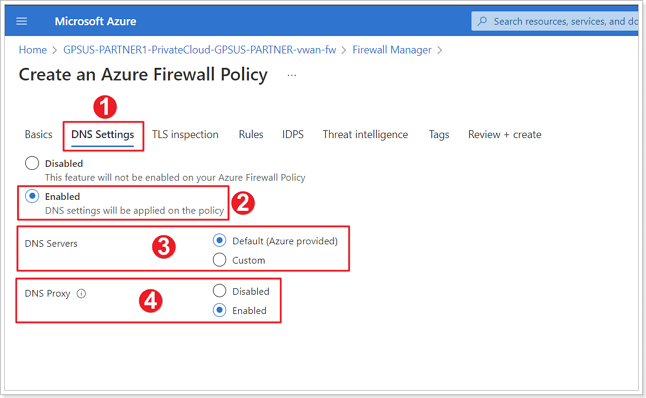
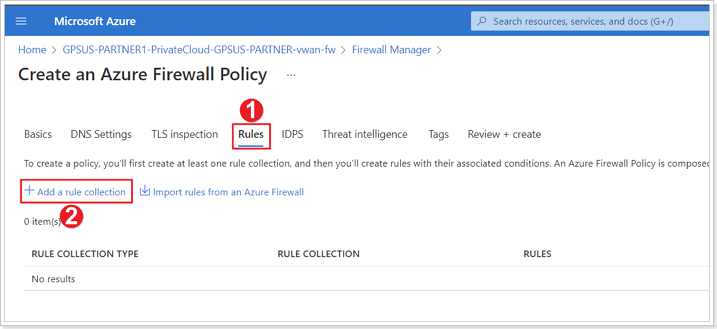
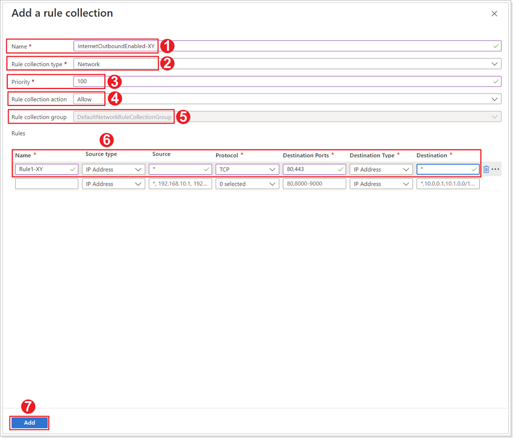

## **Azure Firewall Policies**

### **Exercise 1: Azure Firewall Policies**

#### Step 1: Navigate to Azure Firewall

1. In the Azure Portal search bar type **Firewalls**.
2. Click **Firewalls**.

#### Step 2: Select your Virtual WAN Firewall

Select your virtual WAN Firewall that should have been automatically created after the previous task.

#### Step 3: Azure Firewall Manager

1. Click **Firewall Manager**.
2. Click to **Visit Azure Firewall Manager to configure and manage this firewall**.

#### Step 4: Access Azure Firewall Policies

1. Click **Azure Firewall Policies**.
2. Click **+ Create Azure Firewall Policy**.

#### Step 5: Firewall Policies Basics Tab

1. Ensure you're in the **Basics** tab.
2. Leave the defaults for **Subscription** and **Resource group**.
3. Give your policy a name: InternetEnabled**XY**, where **X** is your group number and **Y** is your participant number.
4. Ensure to select your appropriate **Region**.
5. For **Policy tier** select **Standard**.
6. For **Parent policy** select **None**.

#### Step 6: Firewall Policies DNS Settings Tab

1. Click **DNS Settings** tab.
2. Select **Enabled** for DNS settings.
3. For **DNS Servers** ensure **Default (Azure provided)** is selected.
4. For **DNS Proxy** select **Enabled**.

#### Step 7: Firewall Policies Rules Tab

1. Select **Rules** tab.
2. Click **+ Add a rule collection**.

#### Step 8: Add a Rule Collection

1. Give the rule collection a name: InternetOuboundEnabled-**XY**, where **X** is your group number and **Y** is your participant number.
2. For **Rule collection type** select **Network**.
3. Give the rule collection a **Priority** - Should be a numeric valued between 100-65000.
4. For **Rule collection action** select **Allow**.
5. Leave the default for **Rule collection group**.
6. Use the following values for your **Rule**.

| Name | Source type | Source | Protocol | Destination Ports | Destination Type | Destination |
| :----: | :----: | :----: | :----: | :----: | :----: | :----: |
| Rule1-XY | IP Address | \* | TCP | 80,443 | IP Address| \* |

Click **Review + Create** and then the **Create** button.
